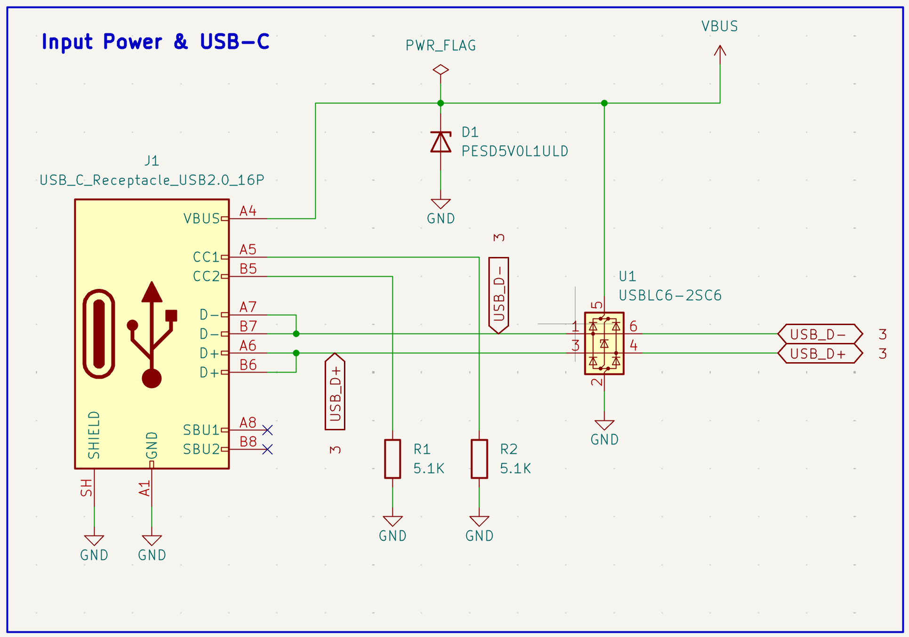

# 2.3 The USB-C receptacle

*The complete input-power sheet: the USB-C receptacle J1, the VBUS protection diode D1, the two CC resistors R1/R2, and the data-line protection IC U1.*

**What to look for in this drawing.** Three details on this one sheet are worth more attention than everything else on it:

1. **The connector symbol lists `D−` twice and `D+` twice** (pins A7/B7 and A6/B6), and in the drawing they are simply wired together. Section 2.4 explains why.
2. **`SBU1` and `SBU2` carry a blue ×** — the *no-connect flag*, placed with `Q`. This is not laziness; it is an explicit statement to ERC that leaving these pins unconnected is intentional. An unmarked floating pin is an ERC error; a marked one is documentation (section 2.14).
3. **`PWR_FLAG` sits on the VBUS net**, not on any component. Section 2.13 explains what it is for.

Also note the drawing hygiene: the protection components sit to the right of the connector, in the direction the signal travels. Signal flows left to right across the sheet, exactly as you read.

We use a **USB 2.0-only** 16-pin Type-C receptacle (GT-USB-7010ASV). A full USB-C connector has many pins because it supports cable flipping and USB 3.x, but since we only need USB 2.0 Full Speed, most of those pins are simply unused — the SuperSpeed lanes, SBU1 and SBU2.

The pins we do use:

| Pin function | Purpose |
|---|---|
| **VBUS** (×2, both orientations) | 5 V power in |
| **GND** (×2, plus shield) | return path |
| **CC1, CC2** | Configuration Channel — cable and orientation detection |
| **D+, D−** (×2, both orientations) | USB 2.0 data |
