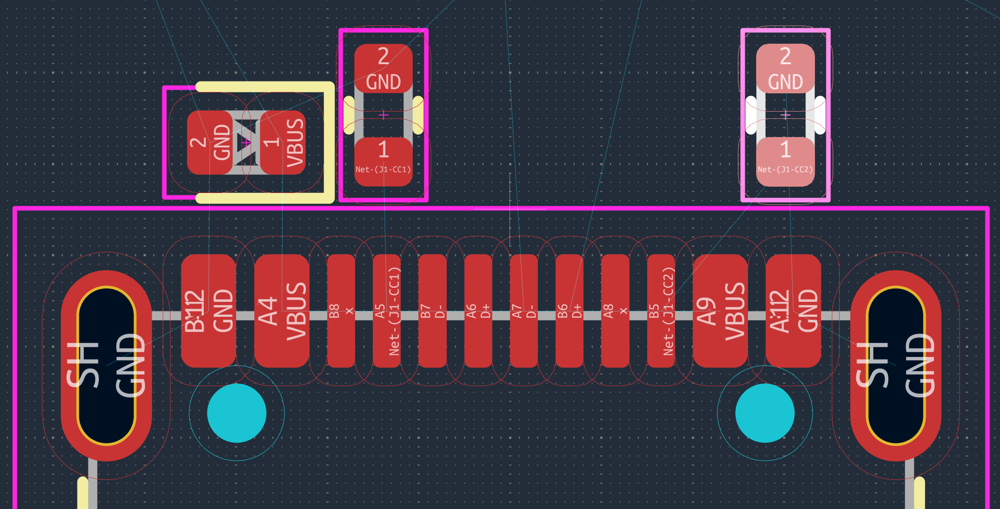

# 2.4 Why the receptacle has D+/D− in two places

This trips up almost everyone the first time.

It is not that we *choose* to duplicate the signal. The USB-C receptacle is **mechanically symmetric**, so it physically exposes two rows of contacts — the "A" row and the "B" row — and D+/D− exist at a specific position in *both* rows (A6/A7 and B6/B7), because that same physical position must make contact with the plug regardless of which way the cable is inserted.

Here is the part that resolves the confusion: the **plug** on the cable is built so that, *inside the plug itself*, pin A6 is permanently wired to B6, and A7 to B7. The cable's plug already ties the A-row and B-row data pins together internally, regardless of orientation. That is how a passive, reversible USB 2.0 cable works at all — the actual copper wires inside a basic cable carry only **one** physical D+/D− pair from end to end.

Because the plug already performs this bridging, it is standard, correct practice for **our receptacle-side PCB to mirror the same bridging** — tie A6↔B6 and A7↔B7 right at our connector. Whichever row ends up contacting the cable's real data wires (which depends entirely on insertion orientation, and is outside our control), the signal reaches the *same* board-side net.

This is why the digital sheet sees only **one** `USB_D+` and one `USB_D−` net, not four. We are doing exactly what the cable plug already does, on our side of the connection.

*Close-up of the USB-C footprint on the board, with the two 5.1 kΩ CC resistors and the PESD VBUS diode placed immediately above it.*

**What to look for.** This image is the physical counterpart of the previous schematic, and reading them together is the whole point:

- Along the connector's contact row you can read the pad names directly: `B12 GND`, `A4 VBUS`, `A5 Net-(J1-CC1)`, `B7 D−`, `A6 D+`, `A7 D−`, `B6 D+`, `B5 Net-(J1-CC2)`, `A9 VBUS`, `A12 GND`. **The two D+ and two D− pads are physically visible here** — this is what section 2.4 is talking about, made concrete.
- The two CC pads carry *different* net names (`Net-(J1-CC1)` and `Net-(J1-CC2)`). They are never tied together. Each has its own resistor.
- The three components sit **directly above the connector, as close as the footprints allow.** Note how short the path from a connector pad to the protection diode is. This is not aesthetics; it is the whole purpose of the protection (section 2.6).
- The large oval pads at each end marked `SH GND` are the **shield** tabs. They are mechanical anchors as much as electrical ones: they take the force every time somebody yanks the cable. A USB connector without properly soldered shield tabs will eventually tear off the board.
- The thin cyan lines are the **ratsnest** — unrouted connections. This snapshot was taken during placement, before routing.
