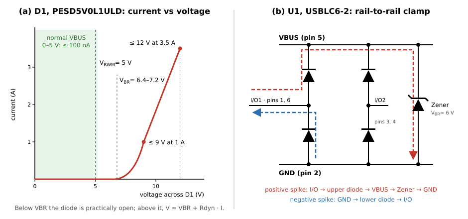

# 2.6 ESD protection, twice

When you walk across a carpet to your board, you carry a charge whose voltage can exceed 10 kV in dry air. On contact it discharges within nanoseconds. A modern SoC's I/O pins are rated for a few volts beyond their operating range.

The connector is the one point on the entire board that is physically exposed to the outside world and to direct human contact. That is where protection belongs — and on our board it is doubled:

| Component | Protects | Key figures |
|---|---|---|
| **U1 — USBLC6-2SC6** (SOT-23-6) | data lines D+ and D− | 2.5 pF per line, clamps 17 V at 5 A |
| **D1 — PESD5V0L1ULD** (SOD-882D) | the VBUS power rail | conducts from 6.4 V, clamps 12 V at 3.5 A |

## What an ESD strike looks like

The standard test for this, IEC 61000-4-2, models a charged person as a 150 pF capacitor discharging through 330 Ω. At its "level 4", 8 kV on direct contact, the peak current is roughly 8 kV / 330 Ω ≈ **24 A**, reached in about **1 ns** and over within about 100 ns. The energy is tiny, a few millijoules. What destroys a chip is not the energy but the peak: tens of amps and thousands of volts arriving at a pin whose silicon is a few nanometres thick.

A protection device cannot stop that current. What it can do is give it **a path to ground that is easier than the path through the chip**, and hold the voltage on the line as low as possible while the current flows.

## How a TVS diode works: D1 on VBUS

D1 is a **TVS diode** (*transient voltage suppressor*): a Zener-like diode with a large junction, built to survive short, very high currents. It does not "switch on" at a threshold. It has a current–voltage curve with a sharp knee, and four numbers describe it:

| Parameter | Meaning | D1 |
|---|---|---|
| VRWM, reverse working (stand-off) voltage | the highest voltage at which the diode is guaranteed to stay practically open | 5 V, leakage ≤ 100 nA |
| VBR, breakdown voltage | where it starts to conduct noticeably, measured at a small test current | 6.4–7.2 V at 5 mA |
| VCL, clamping voltage | the voltage across it while it carries a surge | ≤ 9 V at 1 A, ≤ 12 V at 3.5 A |
| IPPM, peak pulse current | the largest standard surge (8/20 µs) it survives | 3.5 A; ESD up to 26 kV |

*(a) The current–voltage curve of D1. (b) The internal structure of the USBLC6 and the path a positive and a negative spike take through it.*

**What to look for in (a).** In normal operation VBUS sits at 5 V, left of the knee, and D1 draws at most 100 nA: electrically it is not there. When a spike pushes VBUS past about 7 V, D1 starts to conduct, and the harder the spike pushes, the more current it takes. Above the knee the voltage rises only slowly with current, roughly V ≈ VBR + Rdyn · I, with a dynamic resistance Rdyn of about 0.7 Ω. A negative spike forward-biases the diode instead, and it clamps at about −1 V.

The gap between VRWM and VBR is deliberate. A USB host may supply up to 5.25 V, slightly above D1's 5 V stand-off rating. Leakage rises a little there, but the voltage is still well below the breakdown region, so the diode stays effectively open.

D1 is a *low-capacitance* type, 25 pF. On VBUS that property is irrelevant, since VBUS carries DC and has 10 µF of capacitance next to it anyway. What matters on VBUS is the stand-off voltage and the surge rating.

## How the USBLC6 works: U1 on D+ and D−

A single TVS diode like D1 on each data line would work electrically, but its junction capacitance would load the line. Generic 5 V TVS diodes have 100–200 pF; even D1's 25 pF would be a considerable load on a data line. The USBLC6 solves this with a **rail-to-rail** structure, shown in (b):

- Each data line has **two small steering diodes**: an upper one to the device's internal VBUS node and a lower one to GND.
- **One large Zener** sits between VBUS and GND and does the actual clamping, with VBR ≈ 6 V.

In normal operation D+ and D− swing between 0 and 3.3 V, always between GND and VBUS. Both steering diodes are reverse-biased and do nothing.

- **A positive spike** on D+ lifts the line above VBUS + 1.1 V. The upper diode conducts, the current flows into the VBUS node and through the Zener to GND (red path).
- **A negative spike** pulls the line below about −1 V. The lower diode conducts and GND supplies the current (blue path).

The trick is where the capacitance ends up. The data line only "sees" the two small steering diodes, which is why the capacitance per line is just **2.5 pF typical, 3.5 pF maximum**. The big Zener, with tens of picofarads, sits between VBUS and GND, where extra capacitance does no harm. The two lines are also matched to within 0.015 pF, which keeps D+ and D− balanced as a differential pair. The resulting figures: leakage ≤ 150 nA at 5.25 V, clamping ≤ 12 V at 1 A and ≤ 17 V at 5 A, rated for IEC 61000-4-2 level 4 (8 kV contact, 15 kV air).

**The six pins.** Pins 1 and 6 are the *same* line, I/O1, connected inside the package; pins 3 and 4 are I/O2. Pin 5 goes to VBUS and pin 2 to GND. The duplicated pins exist for **flow-through routing**: the line from the connector enters at pin 1 and leaves at pin 6 towards the module, so any spike must pass the clamp before it can continue. That is why the schematic has separate nets on either side (`D-` and `USB_D-`), and why you must not simply join pins 1 and 6 with a track on the PCB: the signal would then bypass the clamp.

## Clamped is not the same as safe

Look at the numbers again: 12 V, 17 V. The ESP32-C3's I/O pins tolerate barely more than 3.6 V. How does a clamp at 17 V protect anything?

By **dividing the current**. During a strike the USBLC6 and the chip's own pin are two paths in parallel. The protection device has a dynamic resistance of about half an ohm; the path into the chip, through the track and the pin's internal structures, is much harder to push current through. So the protection device takes almost all of the current, and the small remainder is handled by the ESD diodes built into every pin of the ESP32-C3, which are designed for small discharges. External protection does not make the spike harmless on its own. It takes the bulk away, so that what reaches the chip is within what the chip can absorb.

ST's datasheet for the USBLC6 works through the numbers for an 8 kV contact discharge with IP ≈ 24 A: the clamp itself holds a positive spike at about **+31 V** and a negative one at about **−13 V**. Then it adds the layout. If the tracks from the data line to the I/O pin and from the GND pin to the ground plane are each 10 mm long, about 6 nH each, the current rising at 24 A/ns adds **L · dI/dt = 6 nH × 24 A/ns = 144 V per track**. The clamping voltage the chip actually sees becomes about **+319 V**. The protection device is the same; only the tracks changed.

This is the `u = L · di/dt` from section 2.9 again, and it is why the layout rules below matter more than the choice of part.

## Why two parts, and is D1 redundant?

Strictly speaking, D1 is **partly redundant**. The USBLC6's internal Zener sits between its VBUS pin and GND, so it clamps VBUS as well, and ST lists VBUS protection among its features. Many commercial boards rely on it alone.

D1 is there as a second line for three reasons:

- **Position.** D1 sits directly at the connector's VBUS pads. The USBLC6's VBUS pin is reached through the VBUS island and two vias, and section *Clamped is not the same as safe* showed what a few nanohenries of extra path do to a clamp.
- **ESD rating.** D1 is rated for ESD up to 26 kV, the USBLC6 for 8 kV contact and 15 kV air discharge at device level.
- **Independence.** VBUS stays protected whatever happens to the data-line protection: a different part, a changed layout, or a USBLC6 left unfitted.

What D1 does *not* bring is a larger surge rating: 3.5 A against the USBLC6's 5 A. On a cost-optimised board D1 is the first part you could remove. On a workshop board that will be plugged in hundreds of times by many hands, a second clamp for a few cents is cheap insurance.

## Placement rules

These return in section 4:

- **Protection must be physically first on the signal path**, immediately after the connector. Protection placed halfway across the board is decoration — the surge has already done its work by the time it arrives.
- **Keep every connection to the protection device short**, above all its **GND** connection. The GND pin gets its own via straight down to the ground plane (section 4.4). A long ground track is the 144 V from the example above.
- **Route the data lines through the USBLC6** (connector → pin 1, pin 6 → module), never past it.
- **The VBUS pin needs a capacitor nearby.** The datasheet's USB application diagram does not ask for one explicitly, but its PCB layout figure shows a 100 nF capacitor at the VBUS pin, so that the internal VBUS node stays stiff while the Zener clamps. On our board that role is taken by C1, the 10 µF input capacitor on the same VBUS island.
