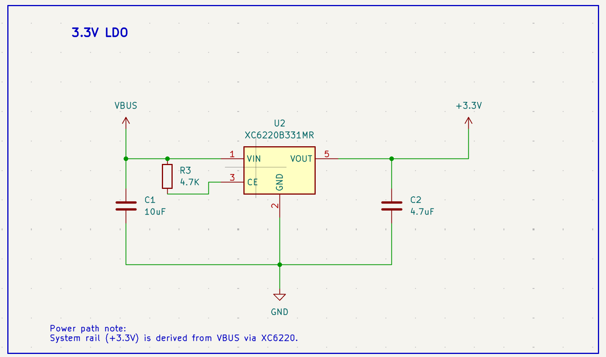
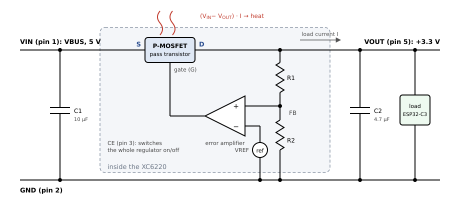

# 2.7 The LDO regulator



*The regulator sheet: VBUS in, +3.3 V out, with the enable pull-up R3 and the two compensation capacitors C1 and C2.*

**What to look for.** This is the smallest sheet in the project and the one with the most content per component:

- **`R3` (4.7 kΩ) pulls `CE` — chip enable — up to VBUS.** Without it, CE floats and the regulator may never turn on. A dead board with 0 V on the 3.3 V rail and a perfectly good regulator fitted is almost always a missing or wrong CE pull-up. The pull-up goes to **VBUS**, not to 3.3 V, for an obvious reason once you see it: 3.3 V does not exist until the regulator is enabled.
- **`C1` = 10 µF on the input, `C2` = 4.7 µF on the output.** These are not interchangeable and not guessed. Section 2.8 explains where they come from.
- Pin 4 is marked as unused. The regulator's `GND` pin sits on the symbol's bottom edge, so the ground path is drawn as a single clean node shared by both capacitors — the layout follows the drawing.
- The note in the corner — *"System rail (+3.3 V) is derived from VBUS via XC6220"* — is a text label, not a component. Free-text annotation of design intent costs nothing and is read by everyone who opens the file afterwards, including you in a year's time.

## What an LDO is

A **low-dropout linear regulator** takes a higher input voltage and produces a clean, fixed, lower output. It is the simplest possible way to get from USB's 5 V to the ESP32-C3's required 3.0–3.6 V: no inductors, no switching noise, no layout complexity — just two capacitors and the IC.

## How it regulates



*The building blocks inside the XC6220, and the two capacitors outside it. The pass transistor sits in the path of the load current; everything else only controls it.*

**What to look for.** Four blocks form a closed loop:

- **The pass transistor**, a P-channel MOSFET with its source (S) on VIN and its drain (D) on VOUT, carries the whole load current. Its gate voltage decides how strongly it conducts, so electrically it behaves like a **variable resistor** in series with the load. A P-channel transistor conducts more the further its gate is pulled *below* its source.
- **The divider R1/R2** scales the output down to a feedback voltage FB = V<sub>OUT</sub> · R2 / (R1 + R2).
- **The reference** is a precise, temperature-stable internal voltage, V<sub>REF</sub>.
- **The error amplifier** compares FB (on its + input) with V<sub>REF</sub> (on its − input) and drives the transistor's gate with the difference.

Follow one disturbance round the loop. The ESP32-C3 starts a Wi-Fi transmission and draws more current. V<sub>OUT</sub> sags a little, so FB drops below V<sub>REF</sub>. The amplifier's output falls, pulling the gate further below the source; the transistor conducts more, and V<sub>OUT</sub> rises back. If V<sub>OUT</sub> rises too far, the amplifier's output rises and throttles the transistor back. This is negative feedback, and it only works with the inputs this way round: with + and − swapped, a sagging output would switch the transistor *off* and the regulator would collapse instead of correcting.

**Why the feedback goes to the + input.** This looks wrong at first sight. With an ordinary op-amp circuit you learn that feedback must go to the − input, because feedback to the + input is positive feedback. That rule assumes the path from the amplifier's output back to its input does not invert the signal, as with a plain resistor network. Here the P-MOSFET sits in that path, and it **does** invert: raising its gate lowers its output. The sign of the whole loop is the product of the signs of its stages:

| Stage | When its input rises … | Sign |
|---|---|---|
| error amplifier, FB on + | its output rises | + |
| P-MOSFET, gate → V<sub>OUT</sub> | V<sub>SG</sub> shrinks, less current flows, V<sub>OUT</sub> falls | − |
| divider R1/R2, V<sub>OUT</sub> → FB | FB rises | + |
| **whole loop** | (+) · (−) · (+) | **− : negative feedback** |

Move FB to the − input and the first row becomes "−", the product becomes "+", and the loop turns into positive feedback. Because the transistor already inverts, the amplifier must not invert as well.

Two variants you will meet elsewhere:

- **Regulators with a follower transistor**, an NPN or an N-MOSFET with the output on its emitter or source, as in the classic 7805 or LM317. Such a transistor does *not* invert: raising its base raises the output. There the amplifier must invert, so V<sub>REF</sub> goes to the + input and FB to the −. This is the version most textbooks draw, which is why it feels familiar.
- **Datasheets of some P-MOSFET LDOs draw V<sub>REF</sub> on the + input.** Those parts usually have an extra inverting driver stage between the amplifier and the gate, which flips the sign once more.

The rule that always holds is the one in the table: **count the inversions around the loop. An odd number means negative feedback.** The loop settles where FB equals V<sub>REF</sub>, which fixes the output at

```
V_OUT = V_REF · (1 + R1/R2)
```

In a fixed-voltage part such as our XC6220B331, R1 and R2 are inside the chip and trimmed at the factory for 3.3 V. Adjustable regulators bring the FB node out to a pin and let you choose the resistors.

**Why the source is on VIN, not VOUT.** Source and drain of a MOSFET are not interchangeable, for two reasons:

- **The gate drive.** The gate controls the transistor through the voltage between gate and source. With the source on VIN, the amplifier can pull the gate anywhere between VIN and GND, so it can always turn the transistor fully on, even when V<sub>IN</sub> is only slightly above V<sub>OUT</sub>. That is exactly what makes a low dropout possible.
- **The body diode.** Every power MOSFET contains a parasitic diode between drain and source; in a P-channel device it conducts from drain to source. With the source on VIN it points from VOUT back to VIN and is normally reverse-biased: it only conducts if the output is ever higher than the input, for example when USB is unplugged while C2 is still charged. Turned the other way round, the diode would conduct from VIN straight to VOUT all the time, and the output would sit at V<sub>IN</sub> − 0.7 V whatever the gate did.

This is also why LDOs use a *P*-channel transistor. An N-channel transistor would need its source on VOUT and a gate voltage *above* V<sub>OUT</sub> by a volt or more. With 5 V in and 3.3 V out that leaves little room, and a truly low dropout would need a gate voltage above V<sub>IN</sub>, which only an extra charge pump can produce.

Two consequences follow directly from the picture:

- **A linear regulator can only take voltage away, never add it.** V<sub>OUT</sub> is always below V<sub>IN</sub>.
- **Input current equals output current**, plus a tiny quiescent current that runs the amplifier and the reference (8 µA for the XC6220). The regulator does not convert power; it burns the excess.

## What "low dropout" means

The **dropout voltage** is the smallest difference V<sub>IN</sub> − V<sub>OUT</sub> at which the regulator still regulates. Below it, the transistor is already fully on and cannot conduct any harder: the output simply follows the input, minus the drop across the transistor.

A P-channel MOSFET can be driven fully on, and then it behaves like a small resistor, R<sub>DS(on)</sub>. The dropout is therefore roughly proportional to current. The XC6220 drops 655 mV at 1 A, about 0.65 Ω, which means only about **0.23 V at 350 mA**. Older regulators with bipolar pass transistors, like the classic 7805 or the LM1117, need 1–2 V of headroom no matter how small the load. An LM1117-3.3 running from a sagging USB port at 4.5 V would already be at its limit.

Our margin is comfortable. USB guarantees at least 4.75 V at the host's port, and even after a few hundred millivolts lost in a long cable, VBUS stays well above the 3.3 V + 0.23 V the regulator needs at full Wi-Fi current.

## The price: efficiency and heat

Every volt the regulator removes is turned into heat in the pass transistor:

```
P = (V_IN − V_OUT) × I
η ≈ V_OUT / V_IN = 3.3 V / 5 V = 66 %
```

The efficiency does not depend on the current at all: a linear regulator from 5 V to 3.3 V always wastes about a third of the input power.

At a continuous 300 mA that is 0.51 W, and in a package as small as SOT-23-5 that is **not** negligible: small packages have a thermal resistance of the order of 150–250 °C/W, depending on how much copper they are soldered to, so 0.5 W would heat the chip by around 100 °C. Our board gets away with it for two reasons. First, the ESP32-C3 draws its 350 mA peaks only during short transmit bursts; its average current with Wi-Fi active is closer to 100 mA, or about 0.17 W. Second, the regulator's GND pin and pads connect through vias to the planes, and that copper spreads the heat — **the planes are its heatsink**. If you later power extra devices from the +3.3 V header pins (section 2.12), remember that their current heats this same small part.

## Why the loop needs help: fast load steps

The loop takes time to react, typically microseconds. The current step at the start of a Wi-Fi transmission is faster than that. For the first moments, the current comes not from the regulator but from the **output capacitor C2 and the module's decoupling capacitors** (section 2.9), which hold V<sub>OUT</sub> up until the loop catches up.

This is also why C2 is not an ordinary filter capacitor. It sits inside the feedback loop: its capacitance and its internal resistance shape how the loop responds. With the wrong value the loop can overshoot and ring, or even oscillate. Section 2.8 shows how the correct values are chosen.

## Built-in protection

The XC6220 also includes **current limiting** and **thermal shutdown**. A short circuit on the +3.3 V rail, for example a slipped probe on the header, makes the regulator limit its current instead of destroying itself. If the chip overheats, it switches off until it has cooled down. Neither is a design feature to rely on, but both turn many mistakes into a board that recovers instead of one that has to be repaired.

## Why XC6220B331 and not AP2112K-3.3

We compared two very common 3.3 V LDOs before choosing:

| Parameter | XC6220B331 (chosen) | AP2112K-3.3 |
|---|---|---|
| Max output current | 1 A | 600 mA |
| Quiescent current | 8 µA | ~55 µA |
| Dropout voltage | 655 mV @ 1 A | 250 mV @ 600 mA |
| Package | SOT-25 (= SOT-23-5) | SOT-23-5 |

The deciding factor was **current headroom**. The ESP32-C3's Wi-Fi transmitter draws current in short but significant bursts — up to roughly 350 mA peak per the module datasheet. The AP2112K's 600 mA ceiling leaves comparatively little margin once LED and peripheral current is added on top. The XC6220B331's 1 A rating gives a much safer margin, at the cost of a slightly higher dropout voltage, which is irrelevant here since we have a full 5 V → 3.3 V budget. Its far lower quiescent current is a bonus if the board is ever battery-powered in a future revision.

This comparison is worth studying not for its conclusion but for its shape: **two candidates, four parameters, one deciding factor, one accepted trade-off.** That is what component selection looks like.
