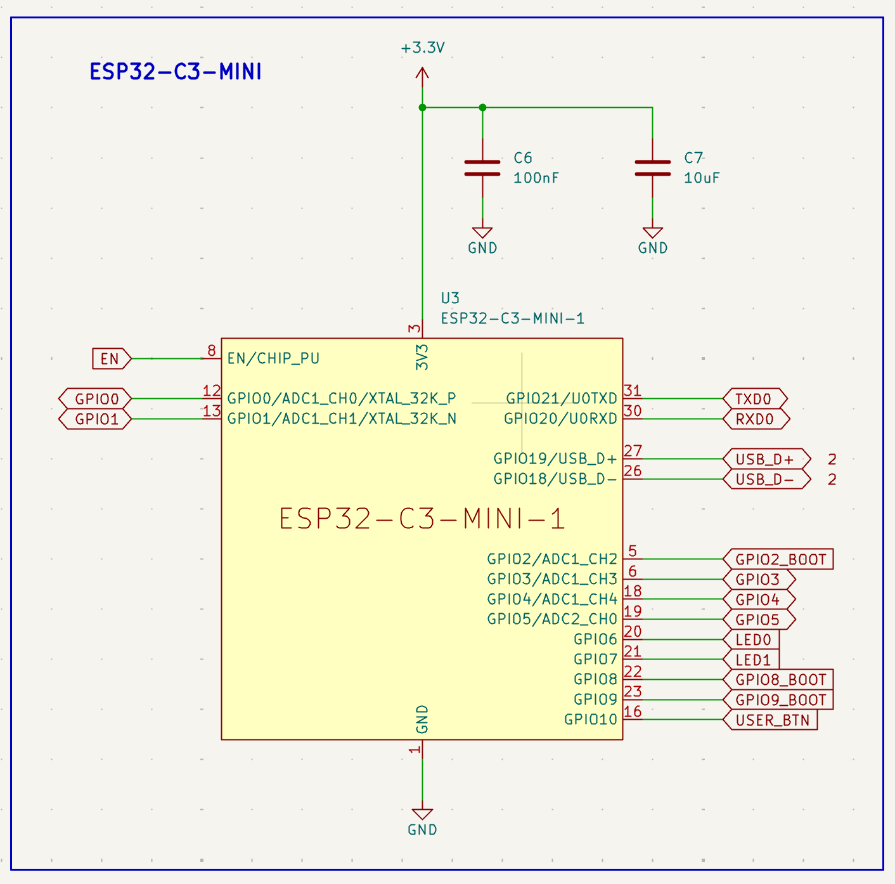

# 2.9 The module and its decoupling



*The module sheet: every signal leaves as a global label, and the supply pin carries two capacitors.*

**What to look for.** For a sheet holding the most complex component on the board, this drawing is strikingly plain — and that is the lesson:

- **The module has exactly one `3V3` pin (pin 3) and one `GND` pin in the symbol.** All the RF work, the crystal, the flash and the internal supply splitting happen inside the module, where we cannot see them and do not need to. This is the "module as a library" idea made visible.
- **`C6` (100 nF) and `C7` (10 µF) sit in parallel on that one supply pin.** Two capacitors, two jobs — explained in the subsections below.
- Every I/O leaves as a **global label**, not a wire. The sheet has no crossing lines at all. Compare this with what the same circuit would look like drawn with wires.
- The pin names carry their alternate functions — `GPIO0/ADC1_CH0/XTAL_32K_P`. When you later wonder whether a pin can do ADC, the answer is already on your own schematic.
- Note which pins are *not* broken out. GPIO11–GPIO17 do not appear: on the ESP32-C3 they are used internally for the SPI flash. Pins you must not touch are best left off the drawing entirely.

## First, a little physics: two components that resist change

Almost everything in this handbook about power delivery follows from two equations. They are worth ten minutes even if you have never studied electronics, because once you have them, decoupling stops being a rule you memorise and becomes something you can derive.

**A wire resists change in current.**

```
u = L · di/dt
```

A wire — and a PCB trace is a wire — has **inductance** *L*. The voltage that appears across it is proportional not to the current, but to how fast the current is **changing**.

Read what that means at the two extremes. If the current is steady, `di/dt = 0`, so `u = 0`: the wire behaves as though it were not there. A multimeter measuring a trace's resistance reads essentially zero, and it is telling the truth — about DC. But if the current changes abruptly, `di/dt` is enormous, and a voltage appears across that same piece of copper as though a resistor had suddenly materialised in the middle of it.

This "apparent resistance that depends on how fast things change" is not resistance. It is called **impedance**. The distinction matters: resistance is a fixed property of the material, while a trace's impedance grows with frequency — the faster the edge, the more the wire fights back.

How much? A rough figure for a PCB trace is about **1 nH per millimetre**. Take a 10 mm trace, so 10 nH, and a digital circuit that demands an extra 100 mA within a nanosecond as a block of logic switches:

```
u = 10 nH × (0.1 A / 1 ns) = 10×10⁻⁹ × 10⁸ = 1 V
```

**One volt**, dropped across a centimetre of copper, on a 3.3 V rail. Not measurable with a multimeter, because it lasts nanoseconds. Entirely sufficient to reset the chip.

**A capacitor resists change in voltage.**

```
i = C · du/dt
```

The mirror image. A capacitor stores energy as accumulated charge, and the current through it is proportional to how fast the voltage across it is **changing**.

Again, read the extremes. A constant voltage means `du/dt = 0`, so no current flows: to DC, a capacitor is an open circuit — a break in the wire. But the instant the voltage tries to move, current flows to oppose that movement. The faster the attempted change, the more current the capacitor delivers. Its impedance falls as frequency rises — the exact opposite behaviour to the inductor.

**Now put them together, and the whole thing falls out.**

The trace between the regulator and the chip is an inductance. When the chip demands a sudden burst of current, that inductance produces a voltage drop and the local supply sags. Now place a capacitor right at the chip's supply pin. The sag is a *change in voltage* — precisely what a capacitor opposes. It responds by delivering current locally, immediately, from the charge it holds, and the sag never fully develops.

> **L is the disease, C is the cure.** The inductance of the supply path is what makes fast current demands turn into voltage dips; the capacitance placed next to the load is what supplies those demands locally so the inductance is never asked to.

This is also why *proximity* is not a detail but the entire point. The capacitor helps only across the inductance that lies **between it and the chip**. Put it 2 mm away and it is fighting 2 nH; put it 20 mm away and it is fighting 20 nH, and it has become part of the problem it was meant to solve.

And it explains one more thing you will meet later in this handbook: whenever we say "use two vias in parallel," or "keep the return path directly underneath," or "never cut the ground plane," we are saying the same sentence in different words — **make L smaller.**

## Why decoupling capacitors exist

Every IC draws current in short, fast pulses as its internal logic switches — not as a smooth, constant draw. If the power pin reached the regulator only through a long trace, that trace's own inductance would prevent the current from responding instantly, and the local supply voltage would sag for a few nanoseconds on every switching edge. That sag is invisible to a multimeter and entirely sufficient to reset a microcontroller or corrupt a Wi-Fi packet.

A **decoupling capacitor** sits right next to the power pin and acts as a local energy reservoir: it supplies those fast pulses locally, so the chip never waits for current to travel from the regulator.

## One capacitor per VDD *pin*, not per IC

This is the rule most beginners get wrong, and it is worth stating precisely.

Many ICs expose *several separate* power pins — `VDDA`, `VDD3P3`, `VDD3P3_RTC`, `VDD3P3_CPU`, `VDD_SPI` — each feeding a different internal block. Each of these needs **its own local capacitor right next to it**, even though they are all nominally the same 3.3 V rail.

The reason is physical: a decoupling capacitor only helps the specific pin it is physically close to. The parasitic inductance of even a few millimetres of trace between two pins is enough that a capacitor sitting next to pin A does essentially nothing for the fast transients at pin B.

**On our board this rule is satisfied trivially, and that is worth understanding rather than glossing over.** The ESP32-C3-MINI-1 exposes a single `3V3` pin, because Espressif already did the per-pin decoupling *inside the module*, on the module's own tiny PCB. If you were designing with the bare ESP32-C3 SoC instead, you would be placing five or six capacitors around it, one per supply pin. The module bought you that work. When you design your next board around a bare IC, this rule will come back and it will not be trivial.

## Why 100 nF specifically

It is a deliberately chosen sweet spot, not a convention:

- It must be **physically small enough** that its own parasitic series inductance (ESL, from the package and mounting pads) stays low. A physically smaller capacitor has a shorter internal current path, hence lower ESL, hence a higher self-resonant frequency — so it remains a low impedance up into the tens of MHz where fast digital switching edges live.
- It must be **large enough** to hold a meaningful amount of charge to supply during a transient.

100 nF in a small package lands in the middle of that trade-off, which is why virtually every digital IC datasheet recommends it as the default local value.

## How far can the bulk capacitor sit?

`C7` (10 µF) has a different job. It is not reacting to nanosecond edges; it supplies the *slower*, larger current swings — an entire Wi-Fi transmit burst lasting microseconds to milliseconds — and smooths ripple at board level. Because it responds to a slower phenomenon, its placement is far less sensitive to trace inductance.

A good rule of thumb: **within roughly 1 cm of the pin or branch it serves is plenty.** It does not need to be millimetres away like the 100 nF, but it should not be on the opposite side of the board either. One bulk capacitor per power entry point or per cluster of ICs is normal; you do not need one per pin.
