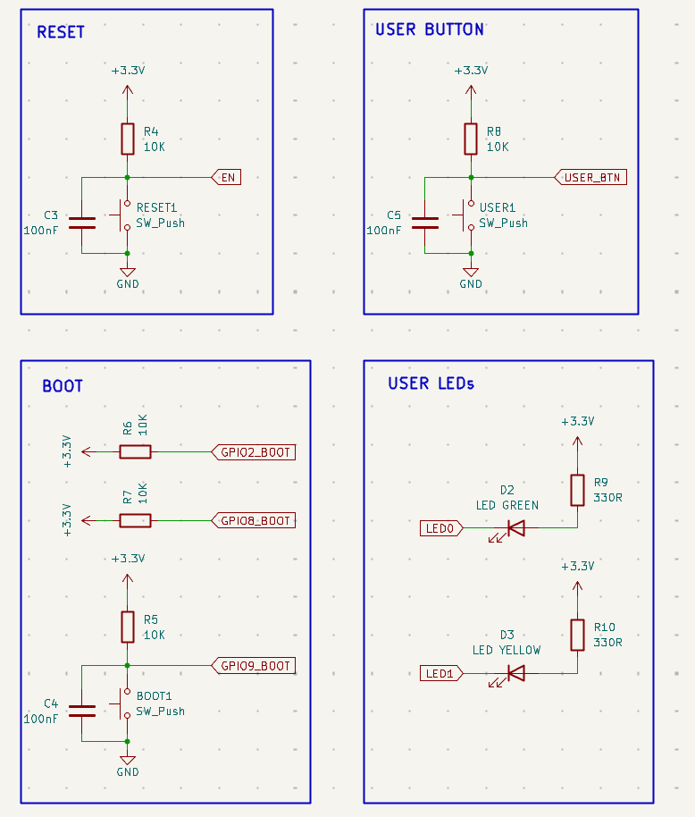

# 2.10 Buttons, strapping pins and the boot sequence



*Four functional blocks on one sheet: RESET, USER BUTTON, BOOT and USER LEDs.*

**What to look for.** This single image contains four of this handbook's most important ideas, and the grouping boxes are what make them legible:

- **RESET and USER BUTTON are electrically identical circuits** — 10 kΩ pull-up, 100 nF to ground, switch to ground. Only the net they drive differs: `EN` versus `USER_BTN`. One controls the chip's existence; the other is read by your program. Same electronics, entirely different meaning. This is worth sitting with.
- **The BOOT block contains three pull-ups but only one button.** `R6` and `R7` pull `GPIO2_BOOT` and `GPIO8_BOOT` high with nothing else attached; only `GPIO9_BOOT` gets a switch. The subsection *BOOT and the strapping pins* below explains why GPIO9 is the one that matters.
- **`GPIO2_BOOT` and `GPIO8_BOOT` have no 100 nF capacitor**, while every pin with a button does. The capacitor is there for the *switch*, not for the pin — see the debounce discussion below. Circuits without a mechanical contact do not need it.
- **In the USER LEDs block, the resistor goes to +3.3 V and the GPIO drives the cathode.** Read that connection carefully, then read section 2.11.
- The four boxes cost nothing electrically and are worth a great deal in readability. A reader identifies "this is the boot circuit" at a glance without tracing a single wire.

## RESET

The RESET button pulls the module's `EN` pin to ground. `EN` is the chip's power-on and reset control: pulling it low powers the chip down, releasing it restarts it. The datasheet is blunt about this pin:

> *"Do not leave the EN pin floating."*

Hence `R4`, 10 kΩ, holding it high by default so the chip runs normally unless the button is actively held.

## BOOT and the strapping pins

`GPIO2_BOOT`, `GPIO8_BOOT` and `GPIO9_BOOT` are the three **strapping pins** the ROM bootloader samples *only during the reset pulse*, to decide how to boot. From the ESP32-C3-MINI-1 datasheet, Table 4-3:

| Boot mode | GPIO2 | GPIO8 | GPIO9 |
|---|---|---|---|
| **SPI Boot** (normal) | 1 | any | **1** |
| **Joint Download Boot** (flashing) | 1 | 1 | **0** |

> Datasheet note: *"GPIO2 actually does not determine SPI Boot and Joint Download Boot mode, but it is recommended to pull this pin up due to glitches."*

In other words: **GPIO9 is the pin that actually matters.** GPIO8 only matters once GPIO9 is already low, and GPIO2 is pulled up purely for glitch immunity. All three get 10 kΩ pull-ups so that, with no button pressed, the module always boots straight into your firmware.

## Do you have to hold both buttons?

Not for the whole process — only at one specific instant. The strapping pins are sampled *once*, at the moment `EN` transitions from low back to high, subject to the datasheet's hold time (minimum 3 ms after `EN` goes high). The standard manual sequence is:

1. **Press and hold BOOT** — this pulls GPIO9 low.
2. **While still holding BOOT, press and release RESET** — `EN` goes low, then returns high through its pull-up. At the exact moment `EN` rises, the chip samples GPIO9 as low.
3. **Release BOOT.**

RESET only needs a brief pulse; you do not keep holding it. BOOT, however, must still be held at the moment RESET is released. Hence the familiar instruction: *hold BOOT, tap RESET, release BOOT.*

Many finished boards avoid this dance with an automatic reset circuit — extra transistors driven by a USB-serial adapter's DTR/RTS lines. Our board needs neither. The ESP32-C3's built-in USB Serial/JTAG controller can put the chip into download mode by itself, so flashing normally works without touching a button. The two-button sequence is the fallback for when that fails, typically when a firmware bug has disabled or crashed the USB peripheral.

## USER

An entirely ordinary GPIO input on GPIO10, with its own 10 kΩ pull-up. It has no meaning to the boot process; it is simply read by your application code. Electrically identical to the BOOT circuit, connected to a *non-strapping* pin.

> **A warning for your own designs.** On this board the strapping pins are deliberately kept off the headers (section 2.12). On a board where they are exposed, anything that holds `GPIO9` low at reset sends the chip into download mode instead of starting your firmware, and `GPIO2` and `GPIO8` should also stay pulled up. This is the classic source of *"my board suddenly died"* — it did not die, it is booting into the wrong mode.

## Why 10 kΩ, and not 1 kΩ or 1 MΩ

Every pull-up on this sheet has the same two jobs, and they pull in opposite directions:

- **Hold the pin firmly high** when nothing else is driving it, so that leakage currents and electrical noise cannot drag it towards a false low. This wants a **small** resistance.
- **Give way easily** when the button (or anything else) pulls the pin low, without wasting current. This wants a **large** resistance.

The value is a compromise between the two. Compare three candidates on a 3.3 V pin with the 100 nF debounce capacitor:

| Pull-up | Current while the button is held | τ with 100 nF | Resistance to leakage and noise |
|---|---|---|---|
| 1 kΩ | 3.3 mA | 0.1 ms | very good |
| **10 kΩ** | **0.33 mA** | **1 ms** | **good** |
| 1 MΩ | 3.3 µA | 100 ms | poor |

**Why not 1 kΩ?** It works, but it is needlessly strong. Every press burns 3.3 mA for as long as the button is held, and anything that has to pull the pin low against it, a button, a transistor, a programming adapter, must sink ten times more current than with 10 kΩ. With the same capacitor, the time constant also shrinks to 0.1 ms, too short to filter contact bounce well.

**Why not 1 MΩ?** It saves current, but the pin becomes a weak, high-impedance node:

- **Leakage turns into voltage.** Leakage currents from the pin, the capacitor and a slightly dirty board surface are tiny, but through 1 MΩ even 1 µA becomes a 1 V drop, a third of the way to a false low.
- **Noise couples in easily.** A high-impedance node picks up whatever is nearby by capacitive coupling: neighbouring traces, a finger, and on this board the module's own 2.4 GHz transmitter.
- **Edges become slow.** With 100 nF the time constant grows to 100 ms, so after a press the pin needs about half a second (5τ) to return high. On `EN` that stretches every reset; on a strapping pin it risks the ROM sampling the pin before it has risen.

**10 kΩ** sits comfortably between the two: a third of a milliamp while pressed, a firm enough hold against leakage and noise, and a 1 ms time constant with the debounce capacitor. For ordinary logic inputs, anything from about 4.7 kΩ to 47 kΩ works, and 10 kΩ is simply the conventional middle. Buses behave differently: I²C lines, for example, use stronger pull-ups of 2.2–4.7 kΩ, because the pull-up has to charge the whole bus capacitance fast enough for the bus speed.

**Why not the chip's internal pull-ups?** The ESP32-C3 has them, but they are weak (tens of kilohms), and firmware can reconfigure them. For the strapping pins and `EN`, which are read before any firmware runs, the level must be guaranteed by hardware. For the USER button an internal pull-up would work, but the external one makes the circuit independent of what the program does.

## Why 100 nF next to the switches

Mechanical switches do not produce a single clean transition. The metal contacts physically bounce for a few milliseconds, producing a rapid train of spurious transitions — *contact bounce*. Without filtering, firmware can read one press as several.

A 100 nF capacitor from the GPIO node to ground forms an **RC low-pass filter** together with the 10 kΩ pull-up already on that line:

```
τ = R × C = 10 kΩ × 100 nF = 1 ms
```

This ~1 ms time constant smooths out the fast electrical noise of contact bounce while remaining far shorter than a human press (typically 50–200 ms), so the button does not feel sluggish. This is *hardware* debouncing; it complements, but does not replace, a short software debounce in firmware.

**What "time constant" actually means.** In an RC circuit the capacitor voltage does not jump instantly to its new value; it follows an exponential curve. τ = R × C is defined as the time taken to cover **63.2%** of the remaining distance to the final value. It is *not* the time to arrive. After one τ you are at 63.2%, after two τ at about 86%, and by convention a circuit is considered settled after about **5τ** (over 99%).

So in our filter, τ = 1 ms means: within about 1 ms of a clean edge the filtered voltage has moved 63% of the way, and within roughly 5 ms it has essentially settled — comfortably faster than a human press, slow enough to average out microsecond-scale contact glitches.
