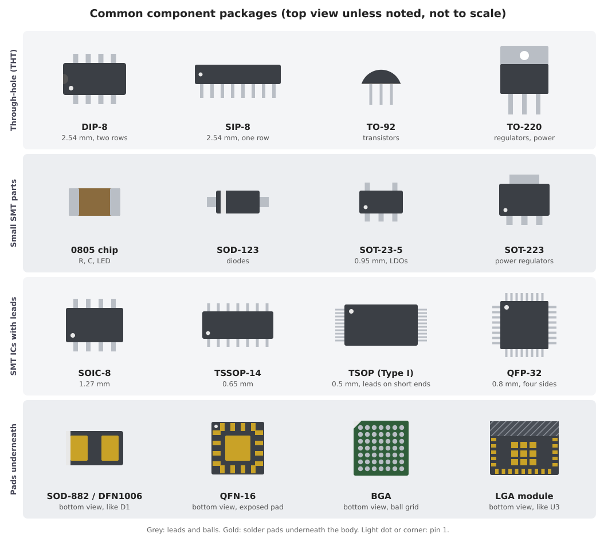

# 3.2 Package families: through-hole and surface mount

A **package** is the physical housing of a component: its body and the
terminals that connect it to the board. A footprint is the package's
image in copper, so the footprint must match the package exactly. The
same chip is often sold in several packages, and choosing one is a
decision about size, assembly method and how easily you can solder,
probe and repair the board.

## Two ways of mounting a part

**Through-hole (THT).** The leads pass through plated holes and are
soldered on the opposite side. Through-hole parts are mechanically
strong and easy to solder by hand, but every hole goes through all four
layers and leaves an antipad in every plane it crosses (section 4.2).
Today THT is used mainly where mechanical strength matters: connectors,
headers, large switches, heavy parts. On our board: the headers J2 and
J3, and the shell pegs of the USB-C receptacle.

**Surface mount (SMT, SMD).** The terminals sit on pads on the surface.
SMT parts are much smaller, can be placed on both sides of the board and
are designed for machine placement and reflow soldering. Everything else
on our board is SMT.

Connectors often combine the two. Our USB-C receptacle has SMT signal
pins for precision and through-hole shell pegs for strength, because
every plug insertion pulls on the connector.

## The common package families

*The package families from the table below, drawn schematically and not
to scale. The bottom row shows the parts from underneath, because that is
where their terminals are.*

| Family | Mounting | Terminals and pitch | Typical use | By hand | On our board |
|---|---|---|---|---|---|
| **DIP** (DIL) | THT | two rows, 2.54 mm pitch, rows 7.62 mm apart | classic logic ICs, microcontrollers for breadboards | easy | — |
| **SIP** | THT | one row, 2.54 mm | resistor networks, small modules | easy | the pin headers follow the same idea |
| **TO-92, TO-220** | THT | 3 leads | transistors, linear regulators | easy | — |
| **Chip passives** (0402, 0603, 0805 …) | SMT | two end terminals, size code | resistors, capacitors, LEDs | 0805 easy, 0402 hard | all R, C and LEDs (section 3.3) |
| **SOD-123, SOD-323, SOD-882** | SMT | two terminals | diodes, ESD protection | 123/323 fine, 882 hard | D1 (SOD-882D) |
| **SOT-23** (3, 5, 6 pins), **SOT-223** | SMT | gull-wing leads, 0.95 mm pitch | transistors, small regulators, ESD arrays | fine | U1 (SOT-23-6), U2 (SOT-23-5) |
| **SOIC / SOP** | SMT | gull-wing leads on two sides, 1.27 mm | general-purpose ICs, SPI flash | fine | — |
| **SSOP, TSSOP, MSOP** | SMT | gull-wing, 0.65 or 0.5 mm | the same ICs in less area | with practice | — |
| **TSOP** | SMT | gull-wing, 0.5 mm, leads on the short ends (Type I) or long sides (Type II) | parallel flash, SRAM, SDRAM | with practice | — |
| **QFP** (LQFP, TQFP) | SMT | gull-wing on all four sides, 0.8–0.4 mm | microcontrollers, FPGAs | with practice | — |
| **QFN, DFN** | SMT | pads under the body edge, plus a large exposed pad | modern ICs, power parts | hot air or reflow | the ESP32-C3 chip inside the module |
| **BGA, WLCSP** | SMT | solder balls in a grid under the body | processors, memory, large FPGAs | no; needs reflow and X-ray inspection | — |
| **LGA module** | SMT | flat pads under the body | radio modules | no | U3, the ESP32-C3-MINI-1 |

Two trends run down the table: pitch shrinks, and the terminals move
from the sides of the package to underneath it. Gull-wing leads can be
seen, probed and reworked with an iron. Pads underneath a QFN, a BGA or
our module cannot be inspected by eye at all. That is why an assembler
X-rays such parts, and why you cannot fix a bad joint under the module
with a soldering iron.

## Naming traps

- **One package, several names.** SOT-23-5 is also called SOT-25 (the
  name in the Torex regulator datasheet) or SC-74A. Some vendors call a
  six-pin SOT-23 variant **TSOP-6**, which has nothing to do with the
  TSOP memory packages. Compare dimensions and pin numbering in the
  datasheet, not the name.
- **Imperial and metric chip codes.** The passive size codes are
  imperial: 0402 means 0.04 × 0.02 inch, which is 1.0 × 0.5 mm, or
  **1005** in metric. A *metric* 0402 (0.4 × 0.2 mm) is the imperial
  **01005**, a part four times smaller. KiCad's footprint names carry
  both codes to avoid exactly this confusion: `R_0402_1005Metric`.
- **Same package, different pinout.** Two regulators in SOT-23-5 fit the
  same footprint and can still have their pins in a different order. The
  package tells you the shape; only the datasheet tells you the pinout.

KiCad's library footprint names encode the package, its body size and
the pitch, for example `SOIC-8_3.9x4.9mm_P1.27mm` or
`SOT-23-5`. Reading that name is usually enough to tell whether a
footprint matches the datasheet drawing, but check the drawing anyway.
