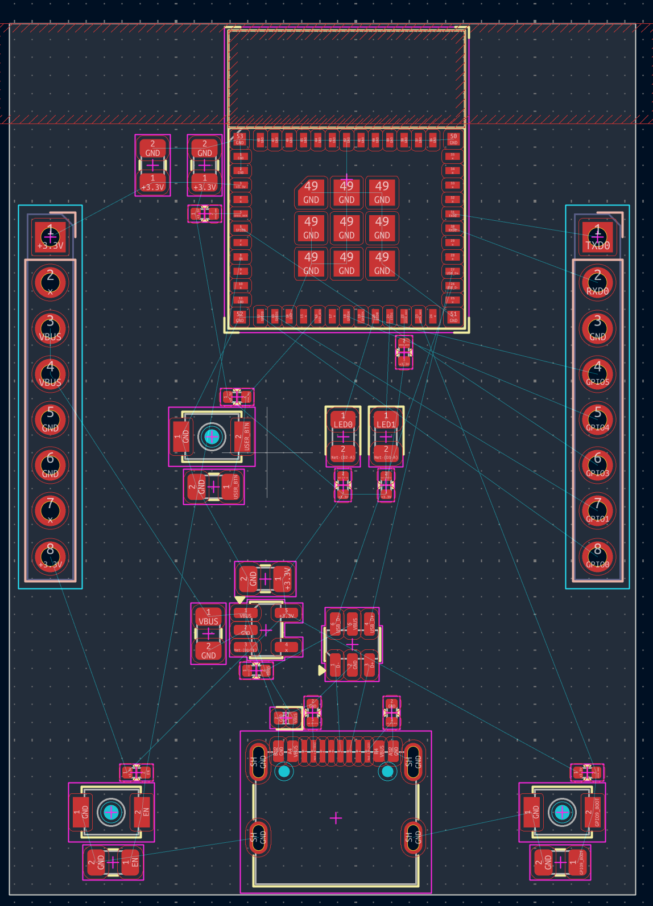
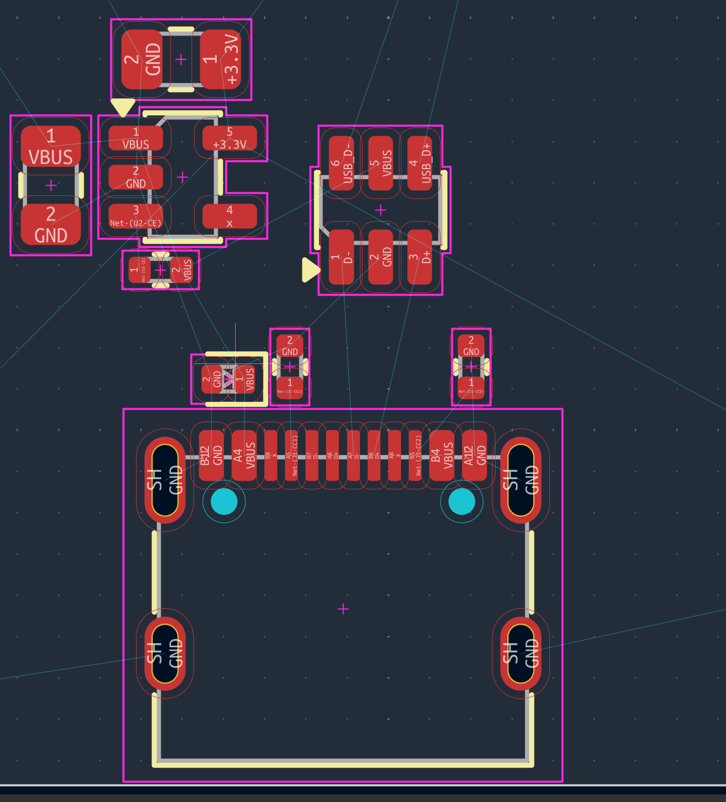
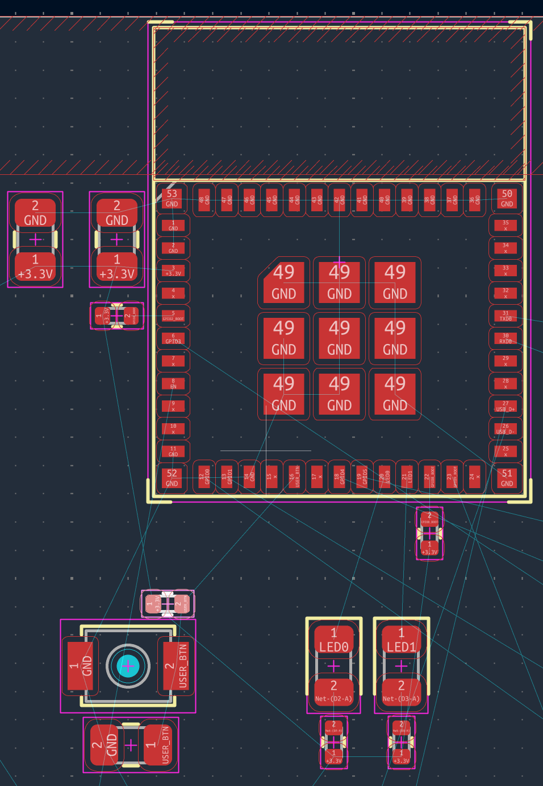

# 4.1 Placement strategy

Placement is where most of a board's quality is decided. Routing only
connects what placement has already arranged: a well-placed board almost
routes itself, and a badly placed one cannot be rescued by clever routing.

## How to read the layout screenshots

All screenshots in this section show KiCad's PCB editor after placement
and before routing. The colours (KiCad's default theme) carry meaning:

| What you see | KiCad layer / object | Meaning |
|---|---|---|
| red pads with labels | `F.Cu` pads | copper; label = pad number and net name |
| magenta rectangle | `F.Courtyard` | space the part claims; courtyards must not overlap |
| cyan rectangle | `B.Courtyard` | the same, for parts on the **back** side |
| yellow lines, triangles | `F.Silkscreen` | printed outline and pin-1 marker |
| grey outline | `F.Fab` | physical body of the part; documentation only, not manufactured |
| thin cyan lines | ratsnest | connections that still have to be routed |
| filled cyan circles | non-plated holes | locating pegs of the USB-C connector |
| hatched red area | rule area (keepout) | no copper allowed |

Nothing in these screenshots is routed yet: there are no traces and no
vias. Every connection is still a ratsnest line.

## The order of placement

1. **Fixed components**: parts whose position is dictated by the outside
   world. The USB-C connector goes on an edge, the headers along the long
   edges, buttons and LEDs where fingers and eyes can reach them.
   (Our board has no mounting holes; if yours does, they belong here too.)
2. **The module**, with its antenna at the board edge and the keepout
   beside it.
3. **The power chain**, in the order the current flows: protection at
   the connector, then the regulator, then its capacitors.
4. **Decoupling capacitors**, each right beside the supply pin it serves,
   typically within 2 mm.
5. **Everything else**: pull-ups, RC networks, LED resistors.

The guiding principle throughout: **components follow the path of the
signal.** If the signal travels from left to right in the schematic, let
it travel from left to right on the board. A board that looks like its
schematic routes almost by itself.

*The whole board with every footprint placed and nothing routed yet.*

**What to look for.** This is the most informative image in the handbook,
because it shows the board at the moment when every decision has been
made and nothing has been committed:

- **The hatched red band across the top is the antenna keepout.** The
  module sits at the top with its antenna end flush with the board edge,
  and the keepout spans the full width of the board. No copper is allowed
  there on *any* layer: no pours, no plane, nothing on the inner layers.
  Copper near the antenna detunes it and costs range. Everything else on
  the board was arranged around this constraint, not the other way round.
- **The two 1×8 headers run down the left and right edges.** J2 carries
  power, J3 carries signals (section 2.12). They are placed on the **back**
  side (cyan courtyard), so the pins point down into a breadboard while
  the components face up. What makes the board breadboard-compatible is
  not the distance between the headers itself, but that it is an exact
  multiple of 2.54 mm: only then do both rows land on the breadboard grid.
- **The USB-C connector sits centred on the bottom edge**, with the power
  cluster immediately above it. Power flows from bottom to top, and the
  module sits at the top. The physical layout mirrors the schematic.
- **RESET (the EN pin) is at bottom left and BOOT (GPIO9) at bottom
  right.** Thanks to the built-in USB Serial/JTAG you rarely need them.
  But when a firmware bug locks up the USB port, holding BOOT and tapping
  RESET is the only way back, and that is much easier with the buttons in
  opposite corners than with the buttons 5 mm apart.
- **Each button has two small companions**: a pull-up resistor next to it
  and a capacitor below it. On EN this RC network delays the chip's start
  until the supply has settled; on the other buttons it filters contact
  bounce.
- **The ratsnest lines fan out from the module in all directions.** Their
  number and length are your placement feedback: long, crossing lines mean
  components in the wrong place. Fix that here, not with clever routing
  later.
- **Small parts sit beside the pins they serve**, not tidily lined up
  along an edge. Tidiness is not the goal; proximity is.

*The power cluster: connector, protection, regulator and capacitors, in
the order the current travels.*

**What to look for.** This is step 3 of the placement order made concrete:

- **Trace the order upward from the connector**: the USB-C pads, then the
  VBUS protection diode and the two 5.1 kΩ CC resistors, then the LDO
  (left) and the USBLC6 (right), then the regulator's output capacitor.
  Current enters at the bottom and leaves at the top as +3.3 V. Nothing
  doubles back.
- **The protection diode sits directly at the VBUS pad (A4).** Protection
  must be the first thing a voltage spike meets, before it reaches
  anything it could damage.
- **Each CC resistor sits directly above its own pin**: CC1 above A5,
  CC2 above B5 (section 2.5).
- **D+ and D− appear twice on the connector** (A6/B6 and A7/B7), because
  the plug is reversible. The two copies of each are joined before they
  reach the USBLC6.
- **The USBLC6 faces the connector with pads 1 (D−), 2 (GND) and 3 (D+)**,
  and faces the module with pads 6 (USB_D−), 5 (VBUS) and 4 (USB_D+).
  The data lines enter one side and leave the other. Rotated by 180° the
  part would still work electrically, but the traces would have to cross.
- **The LDO's pads are readable here**: `1 VBUS`, `2 GND`, `3 CE`,
  `4` unused, `5 +3.3V`. Compare them with the schematic in section 2.7:
  the same five pins and the same connections, now with physical
  positions. Moving fluently between these two views is most of what PCB
  design is.
- **The input capacitor (10 µF, VBUS to GND) sits directly left of pins 1
  and 2; the output capacitor (4.7 µF, +3.3 V to GND) sits directly above
  pin 5.** Each is within a couple of millimetres of the pin it serves,
  as the datasheet's layout note requires.
- **The small resistor just below the LDO ties CE to VBUS**: the
  regulator switches on whenever USB power is present.

*The module footprint with its decoupling capacitors, strapping
pull-ups, the two LEDs and the user button.*

**What to look for.** This is where the decoupling discussion of
section 2.9 becomes physical:

- **The pads carry their net names, so you can read the pinout directly
  off the layout**: pin 3 `+3.3V`, 5 `GPIO2_BOOT`, 6 `GPIO3`, 8 `EN`,
  12 `GPIO0`, 13 `GPIO1`, 16 `USER_BTN`, 18 `GPIO4`, 19 `GPIO5`,
  20 `LED0`, 21 `LED1`, 22 `GPIO8_BOOT`, 23 `GPIO9_BOOT`, 26 `USB_D−`,
  27 `USB_D+`, 30 `RXD0`, 31 `TXD0`. Pads marked `x` are unused; the
  rest are GND.
- **The nine large pads marked `49 GND` in the centre** are the module's
  ground and thermal pad array. During routing it gets several vias down
  to the ground plane (section 4.4). Together they are the module's main return
  path and its main route for heat.
- **The two capacitors at the upper left connect `+3.3V` to `GND`** right
  at pin 3, the module's only supply pin. That short distance is the whole
  point: a few millimetres further and the inductance of the connection
  would start to matter.
- **Two tiny resistors next to the module are the strapping pull-ups**:
  one beside pin 5 (GPIO2), one below the module at pin 22 (GPIO8). The
  ESP32-C3 reads these pins at reset to decide how to boot, so their
  pull-ups belong close to the pins.
- **Each LED has its series resistor immediately below it**, forming an
  obvious visual pair. The resistors go to `+3.3V` and the LED cathodes
  go to the GPIO, so the LEDs are **active-low**: they light when the pin
  is driven low. That is why the firmware uses `LED_ON`/`LED_OFF` macros.
- **The user button is placed well clear of the module**, with room for a
  finger, its pull-up above and its debounce capacitor below. Ergonomics
  is a layout constraint like any other.
- Note again the hatched keepout at the top and the complete absence of
  anything beneath the antenna.
