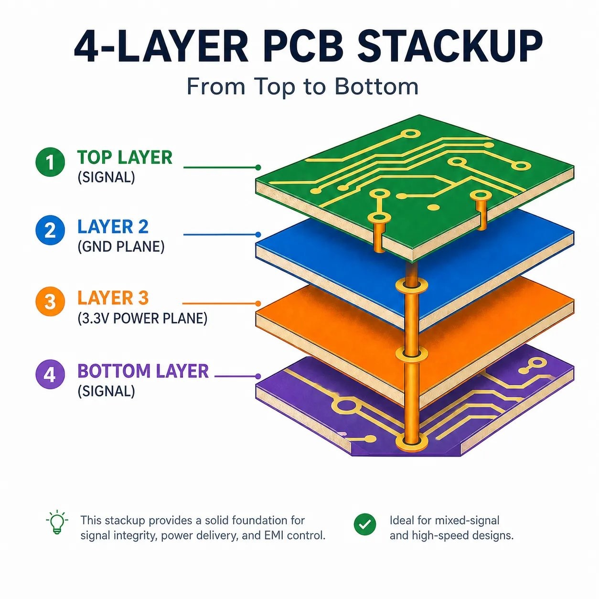

# 4.2 Why four layers

*The classic four-layer arrangement: signals outside, planes inside.*

**What to look for.** The exploded view makes visible what is otherwise
buried inside 1.6 mm of fibreglass:

- **The two inner layers are solid sheets, not traces.** That is the
  entire difference between a two-layer and a four-layer board. Layers 2
  and 3 are not "more room for routing". They are continuous copper, and
  their value comes precisely from being uninterrupted.
- **The vertical copper barrels are vias.** On our board every via is a
  through via, drilled through the whole stack. (The illustration is
  schematic about this; blind and buried vias exist, but they cost extra.)
  A via passes through every layer, but it **connects only to copper of
  its own net**. Where a plane of another net lies in its way, KiCad cuts
  a small clearance ring around it, called an **antipad**. A `+3.3V` via
  therefore joins the +3.3 V island on `In2.Cu` automatically, without
  any routing, and passes through the GND plane on `In1.Cu` without
  touching it.
- **Layer 2 (GND) lies directly beneath layer 1**, separated by a thin
  dielectric, typically 0.1–0.2 mm on a standard 1.6 mm board. Every trace
  on the top layer therefore has its return path a fraction of a
  millimetre below it (see the next subsection).
- **The illustration labels layer 3 as a single 3.3 V plane. Ours is
  different:** `In2.Cu` carries *two* separate islands, `VBUS` before the
  regulator and `+3.3V` after it. Section 4.3 explains how they coexist
  without touching.

| Layer | Our board |
|---|---|
| `F.Cu` (1) | components and signals, GND pour |
| `In1.Cu` (2) | **solid GND plane** |
| `In2.Cu` (3) | power islands: `VBUS` and `+3.3V` |
| `B.Cu` (4) | signals, GND pour |

## What the planes buy: a return path under every trace

Current flowing along a signal trace must return to its source, and it
returns through ground. At low frequencies it takes the path of least
resistance. At high frequencies, including the fast edges of any digital
signal, it takes the path of least *inductance*, which is **directly
beneath the signal trace**. If `In1.Cu` is a solid, uninterrupted plane,
every signal on `F.Cu` has that return path available. The loop formed by
signal and return is small, so its inductance is small (section 2.9), so
it radiates little and picks up little.

**Cutting the ground plane destroys exactly that.** A trace routed
through the ground layer creates a slot. Every signal crossing the slot
must send its return current around the obstruction, and the loop grows
by the size of the detour.

> This is why `In1.Cu` carries no signal traces. None.

A slot can also appear without any trace. Each via through the plane
leaves an antipad, and a tight row of vias can merge their antipads into
one long gap. Keep vias spaced apart rather than lined up shoulder to
shoulder.

The same reasoning applies to `B.Cu`, whose nearest plane is `In2.Cu`:
the power layer. A plane at a steady DC voltage serves as a return path
just as well as ground, provided it is continuous. But `In2.Cu` is split
into two islands, and a bottom-layer trace that crosses the gap between
them loses its return path at that gap. Keep bottom-layer traces over a
single island where you can, and keep the USB pair on `F.Cu`, above the
solid ground.

## Two layers versus four

On a two-layer board there are no inner layers at all. Signals, power
and ground all share the top and bottom copper. Ground becomes a
patchwork of hand-drawn traces and poured fragments, threaded between
whatever else needed to cross the board.

| | Two layers | Four layers |
|---|---|---|
| Ground | traces and fragmented pours, routed by hand | one continuous plane |
| Return path | wherever copper happens to be, often a long detour | directly beneath every trace |
| Loop area, hence *L* | large and unpredictable | small and consistent |
| Power distribution | narrow, meandering traces | a wide, low-impedance plane |
| Routing space | congested; power and ground consume it | freed up, since power and ground moved inside |
| EMI | radiates more, picks up more | substantially better |
| Cost | cheaper | more expensive, though not dramatically at small sizes |

Every line in the right-hand column is the same physics: a small loop
means small *L*, and a plane distributes power with far lower resistance
and inductance than any trace of practical width.

## And yet: this board would work on two layers

It is worth being honest about this rather than pretending otherwise.

Our board has around thirty components and some forty nets. The
ESP32-C3's 160 MHz clock never leaves the module. The fastest signal on
the PCB itself is USB Full Speed at 12 Mbit/s, which is genuinely slow by
modern standards. A competent designer could route this board on two
layers, and it would work.

**We chose four layers anyway, for two reasons.**

The first is technical, and modest. The board carries a Wi-Fi radio and
a differential pair. Both benefit from a clean ground reference, and both
are exactly the kind of thing that behaves *almost* correctly on a
compromised ground. The failure mode is not a dead board but reduced
range or occasional enumeration failures, which are miserable to
diagnose. Given the choice, we removed the variable.

The second reason is the honest one: **you are here to learn.**

Four-layer stackups, ground planes, power islands and via stitching are
standard practice on essentially every real embedded board you will meet
afterwards. Learn them here, on a small, forgiving board with thirty
components, where a mistake costs nothing and the whole design fits in
your head. Learning to lay out a ground plane for the first time on a
dense, fast board is a much worse experience.

So the fourth layer is partly for the signals and partly for you. When
the project is a workshop, that is a legitimate engineering decision.
Recognise it as a decision, not a technical necessity: knowing *which* of
your design choices are forced and which are chosen is itself part of
the craft.
