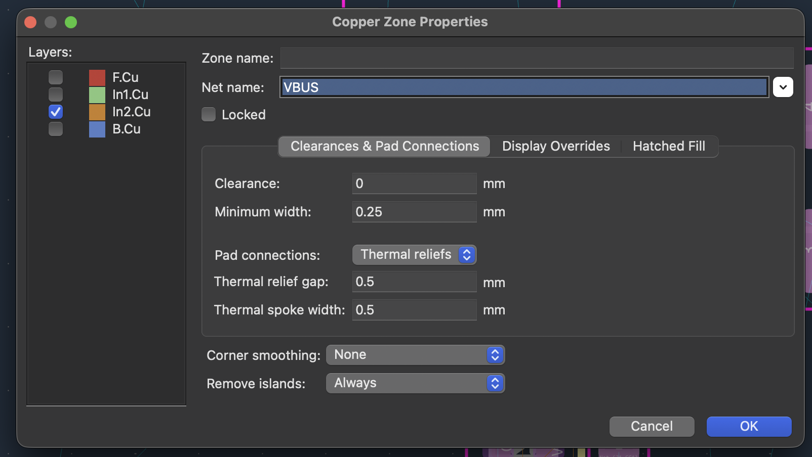
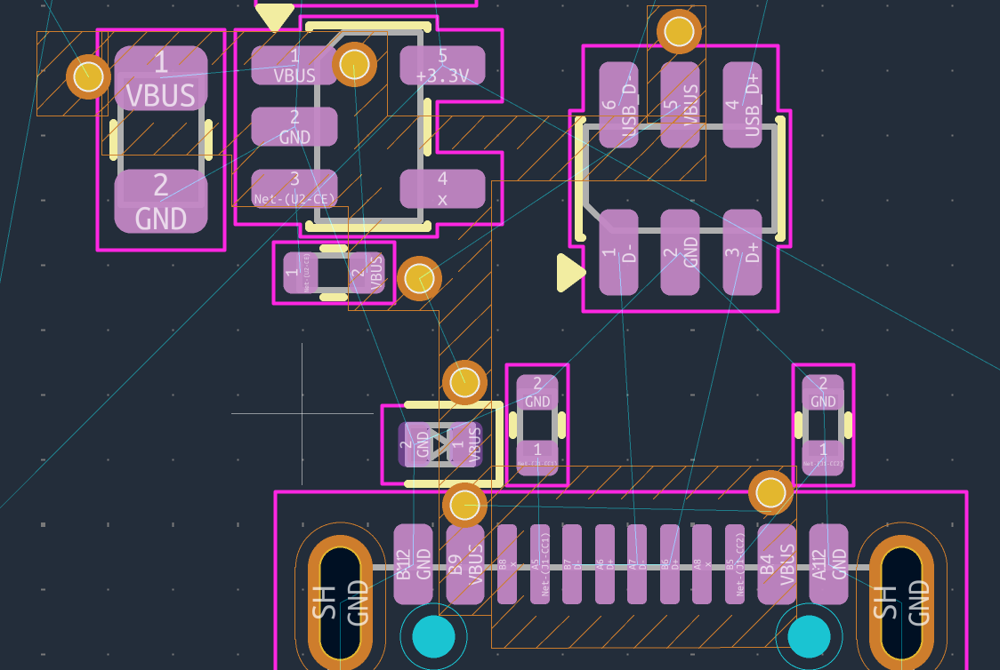
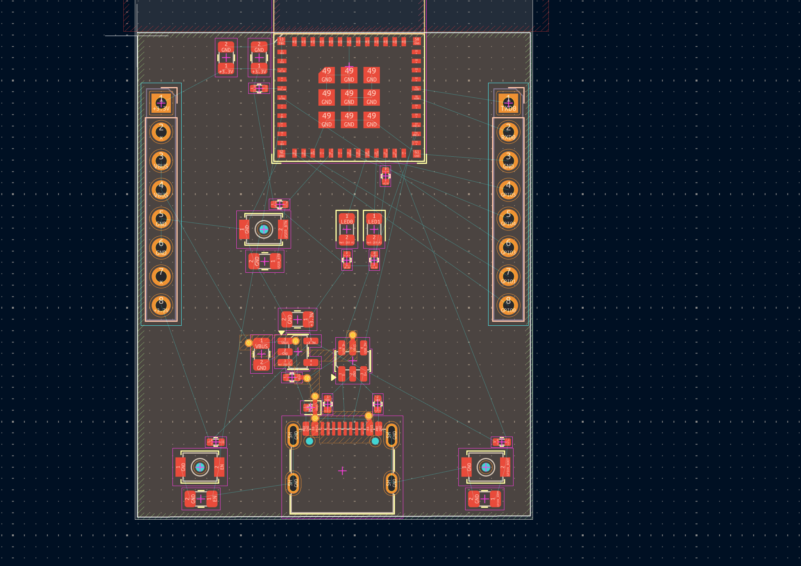
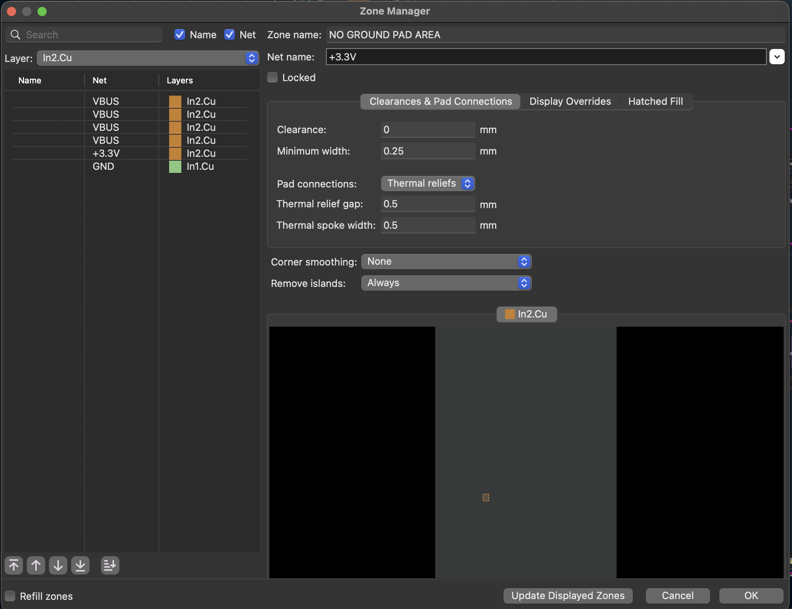
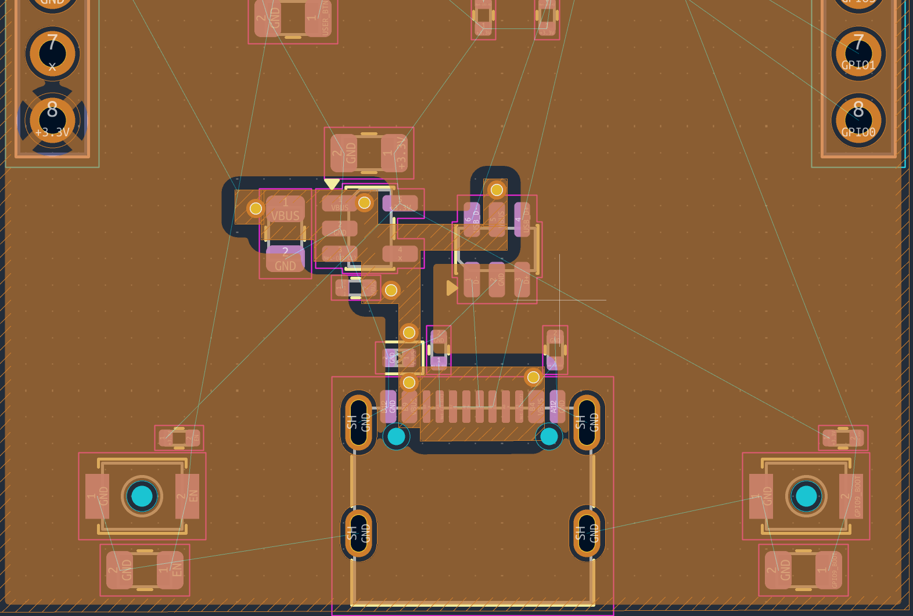

# 4.3 Two islands on one layer, and zone priority

Rather than routing VBUS and +3.3 V as traces, we pour them as **copper
zones** directly on `In2.Cu`: a small `VBUS` island covering the path
from the connector through the protection diode to the regulator input,
and a large `+3.3V` island covering the rest of the board. KiCad keeps
the two apart according to your clearance rule. The result is two
independent copper islands on the same physical layer that never touch.

The same tool also creates the solid GND plane on `In1.Cu` and the GND
pours on the outer layers, `F.Cu` and `B.Cu`.

## Drawing a zone in KiCad 10

1. **Start the tool.** Click *Add Filled Zone* in the right toolbar, or
   press `Ctrl`+`Shift`+`Z`.
2. **Click the first corner.** Before you draw anything else, the
   *Copper Zone Properties* dialog opens. Set:
   - **Layer**: tick `In2.Cu` only. (One zone can span several layers,
     but all its layers share one net. A GND zone can therefore cover
     `F.Cu`, `In1.Cu` and `B.Cu` at once; a power island should not.)
   - **Net**: `VBUS` for the first zone.
   - **Zone name**: something readable, for example `VBUS_1`. You
     will need it in the Zone Manager.
   - **Pad connections**: *Solid* for the VBUS island, *Thermal reliefs*
     for the +3.3 V island (see below). Leave clearance and minimum width
     at their defaults.
3. **Click the remaining corners.** The outline follows the current line
   mode (45° by default; `Shift`+`Space` switches between modes).
   `Backspace` removes the last corner if you misclick.
4. **Close the outline** by double-clicking, or by clicking on the first
   corner again.
5. **Fill the zones** with `B`. KiCad does not refill zones automatically
   while you edit, so what you see can be out of date. Press `B` after
   every change you want to judge by eye; `Ctrl`+`B` removes the fill
   again. The left toolbar can switch between showing filled zones and
   outlines only, which makes overlapping outlines easier to see.

*The dialog that opens on the first click of a new zone. Net `VBUS`,
clearance 0.5 mm, pad connections solid, islands removed. Note the layer
list on the left: the dialog preselects the layer that was active when
you started, here `In1.Cu`.*

**What to look for.** The layer tick is the one setting in this dialog
that is easy to get wrong and expensive to miss. Untick `In1.Cu` and tick
`In2.Cu` before pressing OK. A `VBUS` zone left on `In1.Cu` would carve a
5 V island out of the middle of the ground plane: exactly the slot that
section 4.2 warns about, and one that DRC will not report, because
nothing about it breaks a rule.

- **There is no priority field.** In KiCad 10, priority is set only in
  the Zone Manager (below).
- **Pad connections** decides how pads of the zone's net join the
  copper. *Solid* joins them with full copper. *Thermal reliefs* joins
  them through a few narrow spokes, so that the plane does not pull heat
  away from the joint while you solder it. On `In2.Cu` this only matters
  for through-hole pads, because SMD pads sit on the outer layers and
  reach the plane through vias, which always connect solidly. The VBUS
  island contains no through-hole pads, so *Solid* is fine. The
  +3.3 V island contains the header pins J2-1 and J2-8, which you solder
  by hand, so it uses *Thermal reliefs*.
- **Remove islands: Always** deletes any piece of the fill that is not
  connected to anything of its net. That is why an island without vias
  vanishes (see *Common problems* below).

## Drawing the VBUS island

The VBUS island does not have to be drawn as one polygon. The easiest
way to get its shape is to draw several simple rectangles on `In2.Cu`,
each covering one group of VBUS pads. Ours is four:

*The finished VBUS outlines, shown hatched: one around the input
capacitor and the regulator's pin 1, a vertical strip down to the
connector, one along the connector's VBUS pads, and one under the
USBLC6's pin 5. The orange circles are the VBUS fanout vias.*

**What to look for.**

- **Every rectangle contains at least one via**: next to the input
  capacitor, the LDO's pin 1, the CE resistor, the USBLC6's pin 5, the
  protection diode, and both of the connector's VBUS pad groups (B9 and
  B4). Without them the island would be connected to nothing and the
  fill would remove it. Section 4.4 describes how these vias are placed.
- **The rectangles overlap.** Zones of the *same* net that overlap fill
  as one continuous piece of copper, so four easy rectangles give the
  same copper as one fiddly polygon.
- **Nothing on `In2.Cu` is drawn around the data lines.** D+ and D−
  stay on `F.Cu`, above the GND plane, and do not care what lies on
  `In2.Cu`.

The header's VBUS pins, J2-3 and J2-4, lie far from this cluster, on
the left edge of the board. They are not part of the island and are
connected to VBUS by a track.

**Keep the island small and close to the VBUS pads.** It might seem
safer to make it generous, but a large VBUS island is worse in three
ways:

- **It takes area from the +3.3 V island**, which matters more, because
  it feeds the module. VBUS carries a few hundred milliamps to the
  regulator, and a copper strip a few millimetres wide is ample for that.
- **Its boundary gets longer.** The gap between VBUS and +3.3 V is a
  break in the reference plane for every signal on `B.Cu` (section 4.2).
  The longer that gap, the more likely a bottom-layer trace is to cross
  it.
- **It tempts you to stretch it towards distant pins.** A pin far from
  the cluster, such as J2-3 and J2-4, is better reached by a track than
  by an island reaching halfway across the board.

Two things to watch while you shape it:

- **Do not make it too narrow.** Where the island links two groups of
  vias, like our vertical strip from the regulator down to the connector,
  keep it at least 1–2 mm wide.
- **Do not enclose pockets of +3.3 V copper.** If the VBUS island
  surrounds a piece of the +3.3 V zone on all sides, that piece is cut
  off from the rest of its net and *Remove islands: Always* deletes it.
  On our board the pocket around the CC resistors stays open to the
  right, so it survives. Check this again whenever you move an outline.

One branch of our island exists only to reach the USBLC6's pin 5, which
needs VBUS as a reference and draws almost no current. It could equally
be replaced by a short track on `F.Cu` to the nearest VBUS pad, which
would make the island more compact and its boundary shorter. Both
solutions work.

**Four zones, one island.** The rectangles remain four separate zones
in KiCad, even though they fill as one piece of copper. This has one
consequence, in the Zone Manager: each of them is listed there, and
**each must sit above the +3.3 V zone**. Name them `VBUS_1` to `VBUS_4`
so that they are easy to recognise in the list. If you prefer a single
zone, draw the island as one polygon instead, following the outline the
rectangles give you; the copper is the same either way.

## Drawing the +3.3 V island

Repeat the procedure for the second zone: `In2.Cu`, net `+3.3V`, name
`3V3_plane`.

*The +3.3 V outline runs around the entire board just inside the edge,
straight across the VBUS rectangles.*

**What to look for.**

- **The outline ignores the VBUS rectangles completely.** It is drawn
  across them on purpose. Zone priority, set in the next step, decides
  which copper wins where they overlap.
- **It does not follow the board edge precisely**, because the fill
  always keeps the copper-to-edge clearance away from `Edge.Cuts`.
- **It does not avoid the antenna either.** The keepout rule area at the
  top removes copper there on every layer, whatever the zone outline
  says.

To edit a zone later, click its outline and press `E` for its
properties, or drag the square handles to move corners.

## What if the two outlines overlap?

This is what **zone priority** is for. When two zones on the same layer
overlap, KiCad fills the **higher-priority** zone first. It then fills
the lower-priority zone everywhere *except* inside the higher-priority
zone's area plus clearance. The lower-priority copper is carved away
automatically.

So every `VBUS` zone must have **higher** priority than the large
`+3.3V` zone. You can then draw the `+3.3V` outline roughly across the
whole board, including over the VBUS area, and KiCad keeps `VBUS` intact
and clears the 3.3 V copper away from it. No pixel-perfect hand-drawing
required.

Priority only matters between zones on the **same layer** that
**overlap**. The GND plane on `In1.Cu` and the islands on `In2.Cu` never
interact, whatever their priorities are.

## Setting the priority in KiCad 10: the Zone Manager

KiCad 10 no longer has a priority field in the zone properties dialog.
Priority is now simply the **order of the zones in the Zone Manager**:
the higher a zone is in the list, the higher its priority.

*The Zone Manager. Left: the list of zones, here filtered to `In2.Cu`.
Right: the properties of the selected zone, with a preview underneath.*

**What to look for.**

- **The order of the list is the priority.** The `VBUS` zones are at
  the top and the `+3.3V` zone below them, which is exactly the order we
  need. All four must stay above `+3.3V`: a single rectangle left below
  it would be flooded by 3.3 V copper. The GND zone on `In1.Cu` at the bottom does not matter here,
  because it lies on a different layer.
- **The buttons under the list move the selected zone**: ⤒ to the top,
  ↑ one place up, ↓ one place down, ⤓ to the bottom.
- **The *Layer* filter at the top** shows only the zones on one layer.
  Priority only matters within a layer, so this is the view to work in.
- **The right-hand side is the same set of properties** as the Copper
  Zone Properties dialog, so you can check nets, clearances and pad
  connections of all zones in one place without closing the manager.
- **The *Name* column is empty** because these zones were never named.
  On a small board that is still readable; on a board with twenty zones,
  names like `VBUS_1` and `3V3_plane` are what make the list
  usable.

The procedure:

1. Open **Tools → Zone Manager**. (The zone properties dialog also has a
   button that opens it.)
2. Set the *Layer* filter to `In2.Cu`.
3. Select each VBUS zone in turn and press ⤒, until all four are above
   `3V3_plane`.
4. Tick **Refill zones** and press **OK**, or press OK and then `B`.

Every zone in KiCad 10 has its own place in the list, even zones on
different layers or nets. You do not need to arrange them all. Only the
relative order of zones that overlap on the same layer has any effect.

> **KiCad 9 and earlier** had a numeric **Priority** field directly in
> the zone properties dialog (default 0). There you would simply give
> the VBUS zones priority 1 and leave `3V3_plane` at 0. If you open
> an older tutorial and cannot find the field, this is why.

## The result

*`In2.Cu` after pressing `B`. Orange copper is the +3.3 V island; the
VBUS island sits in the middle of it, surrounded by a dark clearance
gap.*

**What to look for.**

- **The VBUS rectangles have filled as one island**, with one outline
  of clearance around it. Nowhere does it touch the +3.3 V copper.
- **The +3.3 V copper flows around the VBUS island** instead of across
  it. That is priority at work: the +3.3 V outline still runs over the
  VBUS area, but its fill gives way.
- **Dark rings around the through-hole pads** that belong to other nets
  (the USB-C shield slots, the button pegs, header pin J2-7) are
  antipads: the plane is cut back so it does not touch them.
- **Header pin J2-8 (+3.3 V) is joined by four thin spokes**, not by
  solid copper. These are the thermal reliefs set in the zone
  properties.

## Common problems

- **The VBUS island disappears after filling.** An inner-layer zone
  connects only to what reaches it through vias. If nothing on the `VBUS`
  net has a via into `In2.Cu` yet, KiCad treats the whole fill as an
  unconnected island and removes it. Place the fanout vias first
  (section 4.4), then refill.
- **The +3.3 V copper floods over the VBUS area**, or over part of it.
  The order in the Zone Manager is the wrong way round. Move the VBUS
  zone above the +3.3 V zone and refill. If only part of the island is
  flooded, one of the VBUS rectangles is still below `+3.3V` in the
  list: move it up.
- **A piece of +3.3 V copper has vanished.** The VBUS island has closed
  it off on all sides, and island removal deleted it. Reshape the VBUS
  outline so the pocket opens to the rest of the +3.3 V zone.
- **A zone ended up on the wrong layer.** Check the *Layers* column in
  the Zone Manager. It is quicker than inspecting the board layer by
  layer.
- **Overlapping zones of the same net leave odd notches or DRC
  warnings.** Check that the rectangles genuinely overlap rather than
  just touching at an edge. If the notches persist, redraw the island as
  one polygon.
- **Something looks wrong but DRC is clean**, or the other way round.
  Press `B` first. An unrefilled zone shows the state before your last
  edit.
