# Build Your Own ESP32 Computer

## A KiCad PCB Design Handbook

### ESP32-C3-MINI-1 Development Board

### Workshop handbook ###
### Pa3cio, Faculty of Computer and Information Science, University of Ljubljana ###

---

> **How to use this handbook**
>
> These are not step-by-step instructions. During the workshop we draw everything together, and every step is explained as we go.
>
> This handbook is for *afterwards*: for the moment you sit in front of an empty project on your own and wonder why something was the way it was. It explains **why**, not **how**.
>
> Read it during or after the workshop, not before.

---

## Contents

- **[0. What we are building](#sec-0)**
  - [Signal assignment](#sec-0-signal-assignment)
- **[1. Vocabulary](#sec-1)**
- **[2. The schematic](#sec-2)**
  - [2.1 What a schematic is, and what it is not](#sec-2-1)
  - [2.2 The power chain](#sec-2-2)
  - [2.3 The USB-C receptacle](#sec-2-3)
  - [2.4 Why the receptacle has D+/D− in two places](#sec-2-4)
  - [2.5 CC1 / CC2 — why exactly 5.1 kΩ](#sec-2-5)
  - [2.6 ESD protection, twice](#sec-2-6)
  - [2.7 The LDO regulator](#sec-2-7)
  - [2.8 Regulator capacitors — do not improvise these values](#sec-2-8)
  - [2.9 The module and its decoupling](#sec-2-9)
  - [2.10 Buttons, strapping pins and the boot sequence](#sec-2-10)
  - [2.11 LEDs and the active-low trap](#sec-2-11)
  - [2.12 Breakout headers, and why the board is not a finished product](#sec-2-12)
  - [2.13 Schematic grouping and PWR_FLAG](#sec-2-13)
  - [2.14 ERC](#sec-2-14)
- **[3. Footprints and board outline](#sec-3)**
  - [3.1 Footprints: where logic meets physics](#sec-3-1)
  - [3.2 Package families: through-hole and surface mount](#sec-3-2)
  - [3.3 Package sizes: 0402 vs 0603 vs 0805](#sec-3-3)
  - [3.4 Board outline](#sec-3-4)
- **[4. Layers and placement](#sec-4)**
  - [4.1 Placement strategy](#sec-4-1)
  - [4.2 Why four layers](#sec-4-2)
  - [4.3 Two islands on one layer, and zone priority](#sec-4-3)
  - [4.4 Vias: connecting pins, layers and planes](#sec-4-4)
- **[5. Routing](#sec-5)**
  - [5.1 Net classes](#sec-5-1)
  - [5.2 Differential pair routing](#sec-5-2)
  - [5.3 Routing order](#sec-5-3)
  - [5.4 Pours and stitching vias](#sec-5-4)
  - [5.5 DRC](#sec-5-5)
- **[6. Manufacturing outputs](#sec-6)**
  - [6.1 What the fabricator receives](#sec-6-1)
  - [6.2 Export](#sec-6-2)
  - [6.3 Look at what you are sending](#sec-6-3)
  - [6.4 The BOM](#sec-6-4)
  - [6.5 DFM: talking to the fabricator](#sec-6-5)
- **[7. Bringing the board up](#sec-7)**
  - [7.1 Before plugging in USB](#sec-7-1)
  - [7.2 Sequence](#sec-7-2)
  - [7.3 First program](#sec-7-3)
- **[Appendix A: Common mistakes](#appendix-a)**
- **[Appendix B: How to select a capacitor](#appendix-b)**
  - [B.1 Capacitance](#appendix-b-1)
  - [B.2 Voltage rating — and why to derate](#appendix-b-2)
  - [B.3 Dielectric class](#appendix-b-3)
  - [B.4 Checklist before adding a part to the BOM](#appendix-b-4)
- **[Appendix C: Bill of materials](#appendix-c)**
- **[Appendix D: Where to go next](#appendix-d)**
- **[Appendix E: Reference material](#appendix-e)**

---

<a id="sec-0"></a>
## 0. What we are building

A small development board, about 35 × 48.5 mm, four copper layers, built around the **ESP32-C3-MINI-1-N4** module: a 32-bit RISC-V core at 160 MHz, 400 KB SRAM, 4 MB flash, Wi-Fi 4 and Bluetooth 5 LE.

| Block | Components |
|---|---|
| Power input | USB-C receptacle, LDO XC6220B331MR |
| Protection | USBLC6-2SC6 (data lines), PESD5V0L1ULD (VBUS) |
| The computer | ESP32-C3-MINI-1-N4 module |
| Control | RESET, BOOT and USER tactile switches |
| Indication | Green and yellow LEDs |
| Expansion | Two 1×8 headers exposing free GPIOs |

The design is deliberately restricted to **digital logic plus one linear regulator** — no RF matching network, no crystal, no external flash chip. All of that is already solved *inside* the module. That is precisely why we chose a module rather than the bare SoC: it lets first-time PCB designers concentrate on power distribution, decoupling, protection and layout discipline, without needing to understand RF design first.

The schematic is split across two sheets:

| Sheet | Contents |
|---|---|
| `power.kicad_sch` | USB-C connector, ESD protection, LDO regulator |
| `digital.kicad_sch` | ESP32-C3-MINI-1 module, LEDs, buttons, breakout headers |

Splitting a schematic into sheets is the same discipline as splitting a program into modules: one sheet, one job.

<a id="sec-0-signal-assignment"></a>
### Signal assignment

| Signal | Module pin | Note |
|---|---|---|
| `LED0` (green) | GPIO6 | **active LOW** |
| `LED1` (yellow) | GPIO7 | **active LOW** |
| `USER_BTN` | GPIO10 | active LOW |
| `USB_D−` | GPIO18 | native USB |
| `USB_D+` | GPIO19 | native USB |
| `TXD0` / `RXD0` | GPIO21 / GPIO20 | on header |
| `GPIO2_BOOT`, `GPIO8_BOOT`, `GPIO9_BOOT` | GPIO2, 8, 9 | strapping pins |
| `EN` | pin 8 | reset |
| `GPIO0`, `GPIO1`, `GPIO3`–`GPIO5` | — | free, on header J3 |

Note the naming convention: every strapping pin carries the `_BOOT` suffix directly in its net label. This is a good habit — anyone reading the schematic immediately knows *"this net affects boot behaviour, don't casually repurpose it."*

---

<a id="sec-1"></a>
## 1. Vocabulary

You are computer scientists, not electrical engineers. These are the terms this handbook assumes, defined once.

| Term | Meaning |
|---|---|
| schematic | the logical design: what is connected to what |
| symbol | a component's graphical representation in the schematic |
| footprint | the physical copper pads on the board for one component |
| package | the physical housing of a component and its terminals (section 3.2) |
| THT / SMT | through-hole and surface-mount: leads through holes, or pads on the surface |
| pitch | the centre-to-centre distance between neighbouring pins |
| net | a set of pins that are electrically connected |
| net class | a group of nets sharing rules (width, clearance) |
| track / trace | a copper connection on the board |
| via | a plated hole connecting copper on different layers |
| pour / zone | a large copper area, usually GND |
| stackup | what is on which layer, and how thick |
| silkscreen | the printed white text and outlines |
| solder mask | the green protective coating |
| ERC | Electrical Rules Checker — schematic-level checking |
| DRC | Design Rules Checker — board-level checking |
| Gerber | the standard file format sent to the fabricator |
| BOM | Bill of Materials — the component list for purchasing |
| decoupling capacitor | a capacitor placed at a power pin |
| differential pair | two traces carrying the same signal in opposite phase |
| fanout | the short stub and via from a pad down to an inner plane; with planes, this is how power and ground pins are connected |

---

<a id="sec-2"></a>
## 2. The schematic

<a id="sec-2-1"></a>
### 2.1 What a schematic is, and what it is not

A schematic is **not** a map of the board. It contains no distances, no sizes, no physics. It is a statement of connectivity: *this pin is connected to that pin.* Nothing more.

That is why the same schematic can be realised as a hundred different boards, all electrically identical — and only some of them will work. The difference between them is the subject of sections 4 and 5.

You make connections two ways:

- **with a wire** (`W`) — a visible line between pins,
- **with a label** (`L` for a local label, `Ctrl`+`L` for a global label that crosses sheets) — two pins carrying the same label are connected even though no line is drawn.

Use labels. A schematic with twenty crossing lines is unreadable; a schematic with labels like `SDA`, `LED0`, `GPIO9_BOOT` reads like code.

---

<a id="sec-2-2"></a>
### 2.2 The power chain

```
USB-C  ──►  PESD (VBUS)  ──►  LDO 5 V→3.3 V  ──►  module
  │                                +3.3 V
  └── D+/D− ──► USBLC6 ────────────────────────►  GPIO19/GPIO18
```

The ESP32-C3-MINI-1 requires **3.3 V** and does **not** tolerate 5 V. At 5 V it is permanently destroyed. The regulator is therefore not a choice but a precondition.

---

<a id="sec-2-3"></a>
### 2.3 The USB-C receptacle

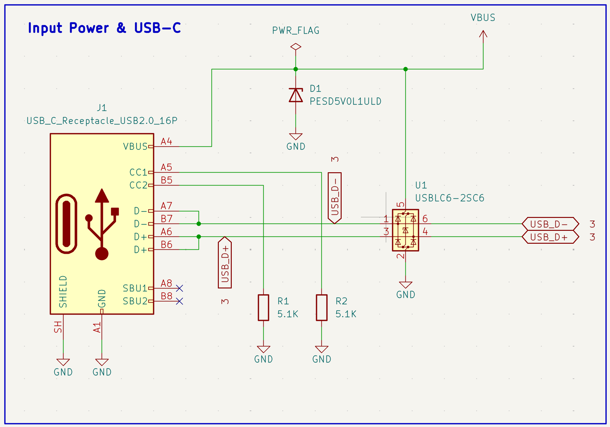

*The complete input-power sheet: the USB-C receptacle J1, the VBUS protection diode D1, the two CC resistors R1/R2, and the data-line protection IC U1.*

**What to look for in this drawing.** Three details on this one sheet are worth more attention than everything else on it:

1. **The connector symbol lists `D−` twice and `D+` twice** (pins A7/B7 and A6/B6), and in the drawing they are simply wired together. Section 2.4 explains why.
2. **`SBU1` and `SBU2` carry a blue ×** — the *no-connect flag*, placed with `Q`. This is not laziness; it is an explicit statement to ERC that leaving these pins unconnected is intentional. An unmarked floating pin is an ERC error; a marked one is documentation (section 2.14).
3. **`PWR_FLAG` sits on the VBUS net**, not on any component. Section 2.13 explains what it is for.

Also note the drawing hygiene: the protection components sit to the right of the connector, in the direction the signal travels. Signal flows left to right across the sheet, exactly as you read.

We use a **USB 2.0-only** 16-pin Type-C receptacle (GT-USB-7010ASV). A full USB-C connector has many pins because it supports cable flipping and USB 3.x, but since we only need USB 2.0 Full Speed, most of those pins are simply unused — the SuperSpeed lanes, SBU1 and SBU2.

The pins we do use:

| Pin function | Purpose |
|---|---|
| **VBUS** (×2, both orientations) | 5 V power in |
| **GND** (×2, plus shield) | return path |
| **CC1, CC2** | Configuration Channel — cable and orientation detection |
| **D+, D−** (×2, both orientations) | USB 2.0 data |

---

<a id="sec-2-4"></a>
### 2.4 Why the receptacle has D+/D− in two places

This trips up almost everyone the first time.

It is not that we *choose* to duplicate the signal. The USB-C receptacle is **mechanically symmetric**, so it physically exposes two rows of contacts — the "A" row and the "B" row — and D+/D− exist at a specific position in *both* rows (A6/A7 and B6/B7), because that same physical position must make contact with the plug regardless of which way the cable is inserted.

Here is the part that resolves the confusion: the **plug** on the cable is built so that, *inside the plug itself*, pin A6 is permanently wired to B6, and A7 to B7. The cable's plug already ties the A-row and B-row data pins together internally, regardless of orientation. That is how a passive, reversible USB 2.0 cable works at all — the actual copper wires inside a basic cable carry only **one** physical D+/D− pair from end to end.

Because the plug already performs this bridging, it is standard, correct practice for **our receptacle-side PCB to mirror the same bridging** — tie A6↔B6 and A7↔B7 right at our connector. Whichever row ends up contacting the cable's real data wires (which depends entirely on insertion orientation, and is outside our control), the signal reaches the *same* board-side net.

This is why the digital sheet sees only **one** `USB_D+` and one `USB_D−` net, not four. We are doing exactly what the cable plug already does, on our side of the connection.

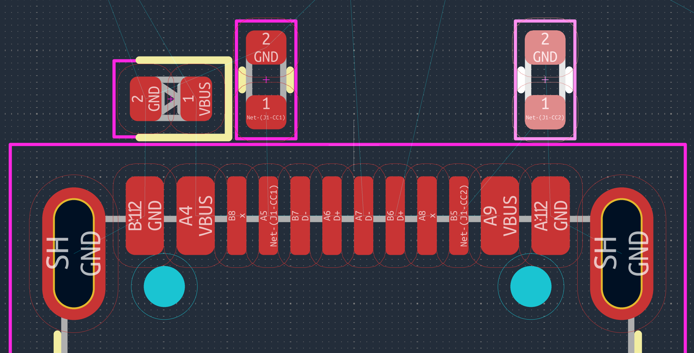

*Close-up of the USB-C footprint on the board, with the two 5.1 kΩ CC resistors and the PESD VBUS diode placed immediately above it.*

**What to look for.** This image is the physical counterpart of the previous schematic, and reading them together is the whole point:

- Along the connector's contact row you can read the pad names directly: `B12 GND`, `A4 VBUS`, `A5 Net-(J1-CC1)`, `B7 D−`, `A6 D+`, `A7 D−`, `B6 D+`, `B5 Net-(J1-CC2)`, `A9 VBUS`, `A12 GND`. **The two D+ and two D− pads are physically visible here** — this is what section 2.4 is talking about, made concrete.
- The two CC pads carry *different* net names (`Net-(J1-CC1)` and `Net-(J1-CC2)`). They are never tied together. Each has its own resistor.
- The three components sit **directly above the connector, as close as the footprints allow.** Note how short the path from a connector pad to the protection diode is. This is not aesthetics; it is the whole purpose of the protection (section 2.6).
- The large oval pads at each end marked `SH GND` are the **shield** tabs. They are mechanical anchors as much as electrical ones: they take the force every time somebody yanks the cable. A USB connector without properly soldered shield tabs will eventually tear off the board.
- The thin cyan lines are the **ratsnest** — unrouted connections. This snapshot was taken during placement, before routing.

---

<a id="sec-2-5"></a>
### 2.5 CC1 / CC2 — why exactly 5.1 kΩ

USB-C decides *whether* to power a cable, *which way round* the plug is,
and *how much current* is on offer, using nothing more than resistors on
the two CC lines. Both ends measure the CC voltage, but for different reasons.


*Further reading: Texas Instruments, "USB Type-C Configuration Channel (CC)
Controller Selection Guide", SDAA284, March 2026.*

The **source** (host, charger) pulls CC up through a resistor **Rp**. The
**sink** (our board) pulls CC down to GND through **Rd = 5.1 kΩ**, a value
fixed by the specification. The two form a voltage divider.

**What the source measures — "is anyone there?"**
A USB-C source keeps VBUS switched *off* until it sees a valid Rd on one of
its CC pins. It distinguishes three cases: open (nothing attached), Rd (a
sink, so VBUS is enabled) and Ra ≈ 1 kΩ (an e-marked cable or audio
adapter, not a sink). The pin on which Rd appears also tells the source the
plug orientation.

**What the sink measures — "how much may I draw?"**
The source advertises its current capability by its choice of Rp. It does
not adjust anything for the sink. A sink that cares measures the voltage
across its own Rd:

| Source Rp (to 5 V) | CC voltage across 5.1 kΩ | Sink band | Sink may draw |
|---|---|---|---|
| 56 kΩ | ≈ 0.42 V | 0.20 – 0.66 V | default (500/900 mA) |
| 22 kΩ | ≈ 0.94 V | 0.66 – 1.23 V | 1.5 A |
| 10 kΩ | ≈ 1.69 V | 1.23 – 2.04 V | 3.0 A |
| — | < 0.20 V | — | no source attached |

Our board never reads CC: the ESP32-C3 draws far less than 500 mA, so the
advertised current is irrelevant to us. **On our board the resistors exist
for one reason only: so that the source recognises a sink and turns VBUS on.**

**Without them, VBUS never appears on a USB-C ↔ USB-C cable.** The board
stays dead and looks exactly like a faulty chip. This is the most common
first-board failure. Confusingly, the same board *works* with a USB-A → C
cable, because that cable has Rp built in and USB-A always supplies VBUS.

Use two separate resistors, one per CC pin, and never tie CC1 and CC2
together. Only one CC pin meets the cable's CC wire (depending on
orientation). Our board has Rd on both CC pins, but the cable carries only one CC wire,
so at any moment only one of them is actually connected to the source's Rp.
The source sees Rd on one of its own CC pins and nothing on the other;
which one tells it how the plug sits in *its* receptacle. Our board sees
the same thing from its side: one CC pin at the divider voltage, the other
at 0 V. Flip the plug and the two pins swap roles, which is exactly why
both Rd resistors must be fitted.


#### Other USB-C port roles

"Sink" is only one of several roles a USB-C port can take:

- **UFP** (Upstream-Facing Port) — the *data* role our board plays: a peripheral, as opposed to a host. Usually paired with being a power sink.
- **DFP** (Downstream-Facing Port) — the data role a host plays; on the power side a DFP is normally a **source** (Rp instead of Rd).
- **DRP** (Dual-Role Port) — a port, e.g. on a phone or laptop, that dynamically switches between source and sink by toggling its CC resistor between Rp and Rd until it detects what is on the other end. This is how a phone can both charge and power accessories through the same port.
- **VCONN source** — relevant only for *active* cables, which contain their own chip and need power on the cable's dedicated VCONN pin. Irrelevant for our passive connection.

Our board is deliberately the simplest possible case: a **fixed sink**, Rd only, never toggling.

---

<a id="sec-2-6"></a>
### 2.6 ESD protection, twice

When you walk across a carpet to your board, you carry a charge whose voltage can exceed 10 kV in dry air. On contact it discharges within nanoseconds. A modern SoC's I/O pins are rated for a few volts beyond their operating range.

The connector is the one point on the entire board that is physically exposed to the outside world and to direct human contact. That is where protection belongs — and on our board it is doubled:

| Component | Protects | Key figures |
|---|---|---|
| **U1 — USBLC6-2SC6** (SOT-23-6) | data lines D+ and D− | 2.5 pF per line, clamps 17 V at 5 A |
| **D1 — PESD5V0L1ULD** (SOD-882D) | the VBUS power rail | conducts from 6.4 V, clamps 12 V at 3.5 A |

#### What an ESD strike looks like

The standard test for this, IEC 61000-4-2, models a charged person as a 150 pF capacitor discharging through 330 Ω. At its "level 4", 8 kV on direct contact, the peak current is roughly 8 kV / 330 Ω ≈ **24 A**, reached in about **1 ns** and over within about 100 ns. The energy is tiny, a few millijoules. What destroys a chip is not the energy but the peak: tens of amps and thousands of volts arriving at a pin whose silicon is a few nanometres thick.

A protection device cannot stop that current. What it can do is give it **a path to ground that is easier than the path through the chip**, and hold the voltage on the line as low as possible while the current flows.

#### How a TVS diode works: D1 on VBUS

D1 is a **TVS diode** (*transient voltage suppressor*): a Zener-like diode with a large junction, built to survive short, very high currents. It does not "switch on" at a threshold. It has a current–voltage curve with a sharp knee, and four numbers describe it:

| Parameter | Meaning | D1 |
|---|---|---|
| V<sub>RWM</sub>, reverse working (stand-off) voltage | the highest voltage at which the diode is guaranteed to stay practically open | 5 V, leakage ≤ 100 nA |
| V<sub>BR</sub>, breakdown voltage | where it starts to conduct noticeably, measured at a small test current | 6.4–7.2 V at 5 mA |
| V<sub>CL</sub>, clamping voltage | the voltage across it while it carries a surge | ≤ 9 V at 1 A, ≤ 12 V at 3.5 A |
| I<sub>PPM</sub>, peak pulse current | the largest standard surge (8/20 µs) it survives | 3.5 A; ESD up to 26 kV |

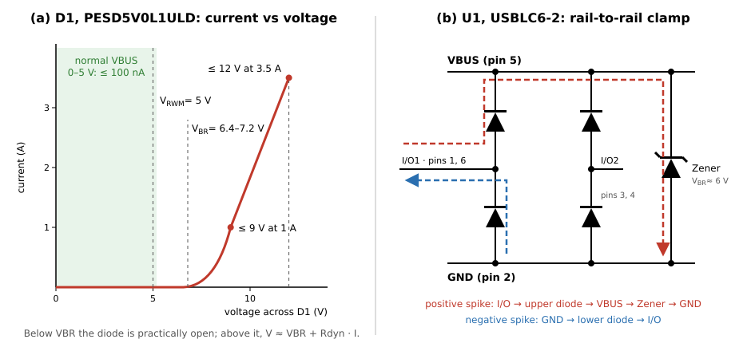

*(a) The current–voltage curve of D1. (b) The internal structure of the USBLC6 and the path a positive and a negative spike take through it.*

**What to look for in (a).** In normal operation VBUS sits at 5 V, left of the knee, and D1 draws at most 100 nA: electrically it is not there. When a spike pushes VBUS past about 7 V, D1 starts to conduct, and the harder the spike pushes, the more current it takes. Above the knee the voltage rises only slowly with current, roughly V ≈ V<sub>BR</sub> + R<sub>dyn</sub> · I, with a dynamic resistance R<sub>dyn</sub> of about 0.7 Ω. A negative spike forward-biases the diode instead, and it clamps at about −1 V.

The gap between V<sub>RWM</sub> and V<sub>BR</sub> is deliberate. A USB host may supply up to 5.25 V, slightly above D1's 5 V stand-off rating. Leakage rises a little there, but the voltage is still well below the breakdown region, so the diode stays effectively open.

D1 is a *low-capacitance* type, 25 pF. On VBUS that property is irrelevant, since VBUS carries DC and has 10 µF of capacitance next to it anyway. What matters on VBUS is the stand-off voltage and the surge rating.

#### How the USBLC6 works: U1 on D+ and D−

A single TVS diode like D1 on each data line would work electrically, but its junction capacitance would load the line. Generic 5 V TVS diodes have 100–200 pF; even D1's 25 pF would be a considerable load on a data line. The USBLC6 solves this with a **rail-to-rail** structure, shown in (b):

- Each data line has **two small steering diodes**: an upper one to the device's internal VBUS node and a lower one to GND.
- **One large Zener** sits between VBUS and GND and does the actual clamping, with V<sub>BR</sub> ≈ 6 V.

In normal operation D+ and D− swing between 0 and 3.3 V, always between GND and VBUS. Both steering diodes are reverse-biased and do nothing.

- **A positive spike** on D+ lifts the line above VBUS + 1.1 V. The upper diode conducts, the current flows into the VBUS node and through the Zener to GND (red path).
- **A negative spike** pulls the line below about −1 V. The lower diode conducts and GND supplies the current (blue path).

The trick is where the capacitance ends up. The data line only "sees" the two small steering diodes, which is why the capacitance per line is just **2.5 pF typical, 3.5 pF maximum**. The big Zener, with tens of picofarads, sits between VBUS and GND, where extra capacitance does no harm. The two lines are also matched to within 0.015 pF, which keeps D+ and D− balanced as a differential pair. The resulting figures: leakage ≤ 150 nA at 5.25 V, clamping ≤ 12 V at 1 A and ≤ 17 V at 5 A, rated for IEC 61000-4-2 level 4 (8 kV contact, 15 kV air).

**The six pins.** Pins 1 and 6 are the *same* line, I/O1, connected inside the package; pins 3 and 4 are I/O2. Pin 5 goes to VBUS and pin 2 to GND. The duplicated pins exist for **flow-through routing**: the line from the connector enters at pin 1 and leaves at pin 6 towards the module, so any spike must pass the clamp before it can continue. That is why the schematic has separate nets on either side (`D-` and `USB_D-`), and why you must not simply join pins 1 and 6 with a track on the PCB: the signal would then bypass the clamp.

#### Clamped is not the same as safe

Look at the numbers again: 12 V, 17 V. The ESP32-C3's I/O pins tolerate barely more than 3.6 V. How does a clamp at 17 V protect anything?

By **dividing the current**. During a strike the USBLC6 and the chip's own pin are two paths in parallel. The protection device has a dynamic resistance of about half an ohm; the path into the chip, through the track and the pin's internal structures, is much harder to push current through. So the protection device takes almost all of the current, and the small remainder is handled by the ESD diodes built into every pin of the ESP32-C3, which are designed for small discharges. External protection does not make the spike harmless on its own. It takes the bulk away, so that what reaches the chip is within what the chip can absorb.

ST's datasheet for the USBLC6 works through the numbers for an 8 kV contact discharge with I<sub>P</sub> ≈ 24 A: the clamp itself holds a positive spike at about **+31 V** and a negative one at about **−13 V**. Then it adds the layout. If the tracks from the data line to the I/O pin and from the GND pin to the ground plane are each 10 mm long, about 6 nH each, the current rising at 24 A/ns adds **L · dI/dt = 6 nH × 24 A/ns = 144 V per track**. The clamping voltage the chip actually sees becomes about **+319 V**. The protection device is the same; only the tracks changed.

This is the `u = L · di/dt` from section 2.9 again, and it is why the layout rules below matter more than the choice of part.

#### Why two parts, and is D1 redundant?

Strictly speaking, D1 is **partly redundant**. The USBLC6's internal Zener sits between its VBUS pin and GND, so it clamps VBUS as well, and ST lists VBUS protection among its features. Many commercial boards rely on it alone.

D1 is there as a second line for three reasons:

- **Position.** D1 sits directly at the connector's VBUS pads. The USBLC6's VBUS pin is reached through the VBUS island and two vias, and section *Clamped is not the same as safe* showed what a few nanohenries of extra path do to a clamp.
- **ESD rating.** D1 is rated for ESD up to 26 kV, the USBLC6 for 8 kV contact and 15 kV air discharge at device level.
- **Independence.** VBUS stays protected whatever happens to the data-line protection: a different part, a changed layout, or a USBLC6 left unfitted.

What D1 does *not* bring is a larger surge rating: 3.5 A against the USBLC6's 5 A. On a cost-optimised board D1 is the first part you could remove. On a workshop board that will be plugged in hundreds of times by many hands, a second clamp for a few cents is cheap insurance.

#### Placement rules

These return in section 4:

- **Protection must be physically first on the signal path**, immediately after the connector. Protection placed halfway across the board is decoration — the surge has already done its work by the time it arrives.
- **Keep every connection to the protection device short**, above all its **GND** connection. The GND pin gets its own via straight down to the ground plane (section 4.4). A long ground track is the 144 V from the example above.
- **Route the data lines through the USBLC6** (connector → pin 1, pin 6 → module), never past it.
- **The VBUS pin needs a capacitor nearby.** The datasheet's USB application diagram does not ask for one explicitly, but its PCB layout figure shows a 100 nF capacitor at the VBUS pin, so that the internal VBUS node stays stiff while the Zener clamps. On our board that role is taken by C1, the 10 µF input capacitor on the same VBUS island.

<a id="sec-2-7"></a>
### 2.7 The LDO regulator

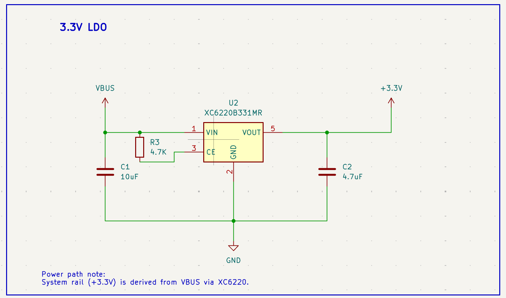

*The regulator sheet: VBUS in, +3.3 V out, with the enable pull-up R3 and the two compensation capacitors C1 and C2.*

**What to look for.** This is the smallest sheet in the project and the one with the most content per component:

- **`R3` (4.7 kΩ) pulls `CE` — chip enable — up to VBUS.** Without it, CE floats and the regulator may never turn on. A dead board with 0 V on the 3.3 V rail and a perfectly good regulator fitted is almost always a missing or wrong CE pull-up. The pull-up goes to **VBUS**, not to 3.3 V, for an obvious reason once you see it: 3.3 V does not exist until the regulator is enabled.
- **`C1` = 10 µF on the input, `C2` = 4.7 µF on the output.** These are not interchangeable and not guessed. Section 2.8 explains where they come from.
- Pin 4 is marked as unused. The regulator's `GND` pin sits on the symbol's bottom edge, so the ground path is drawn as a single clean node shared by both capacitors — the layout follows the drawing.
- The note in the corner — *"System rail (+3.3 V) is derived from VBUS via XC6220"* — is a text label, not a component. Free-text annotation of design intent costs nothing and is read by everyone who opens the file afterwards, including you in a year's time.

#### What an LDO is

A **low-dropout linear regulator** takes a higher input voltage and produces a clean, fixed, lower output. It is the simplest possible way to get from USB's 5 V to the ESP32-C3's required 3.0–3.6 V: no inductors, no switching noise, no layout complexity — just two capacitors and the IC.

#### How it regulates

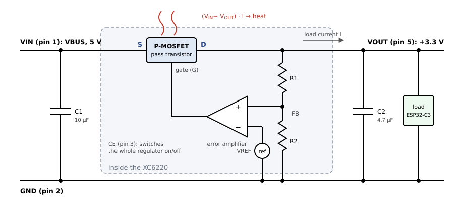

*The building blocks inside the XC6220, and the two capacitors outside it. The pass transistor sits in the path of the load current; everything else only controls it.*

**What to look for.** Four blocks form a closed loop:

- **The pass transistor**, a P-channel MOSFET with its source (S) on VIN and its drain (D) on VOUT, carries the whole load current. Its gate voltage decides how strongly it conducts, so electrically it behaves like a **variable resistor** in series with the load. A P-channel transistor conducts more the further its gate is pulled *below* its source.
- **The divider R1/R2** scales the output down to a feedback voltage FB = V<sub>OUT</sub> · R2 / (R1 + R2).
- **The reference** is a precise, temperature-stable internal voltage, V<sub>REF</sub>.
- **The error amplifier** compares FB (on its + input) with V<sub>REF</sub> (on its − input) and drives the transistor's gate with the difference.

Follow one disturbance round the loop. The ESP32-C3 starts a Wi-Fi transmission and draws more current. V<sub>OUT</sub> sags a little, so FB drops below V<sub>REF</sub>. The amplifier's output falls, pulling the gate further below the source; the transistor conducts more, and V<sub>OUT</sub> rises back. If V<sub>OUT</sub> rises too far, the amplifier's output rises and throttles the transistor back. This is negative feedback, and it only works with the inputs this way round: with + and − swapped, a sagging output would switch the transistor *off* and the regulator would collapse instead of correcting. The loop settles where FB equals V<sub>REF</sub>, which fixes the output at

```
V_OUT = V_REF · (1 + R1/R2)
```

In a fixed-voltage part such as our XC6220B331, R1 and R2 are inside the chip and trimmed at the factory for 3.3 V. Adjustable regulators bring the FB node out to a pin and let you choose the resistors.

**Why the source is on VIN, not VOUT.** Source and drain of a MOSFET are not interchangeable, for two reasons:

- **The gate drive.** The gate controls the transistor through the voltage between gate and source. With the source on VIN, the amplifier can pull the gate anywhere between VIN and GND, so it can always turn the transistor fully on, even when V<sub>IN</sub> is only slightly above V<sub>OUT</sub>. That is exactly what makes a low dropout possible.
- **The body diode.** Every power MOSFET contains a parasitic diode between drain and source; in a P-channel device it conducts from drain to source. With the source on VIN it points from VOUT back to VIN and is normally reverse-biased: it only conducts if the output is ever higher than the input, for example when USB is unplugged while C2 is still charged. Turned the other way round, the diode would conduct from VIN straight to VOUT all the time, and the output would sit at V<sub>IN</sub> − 0.7 V whatever the gate did.

This is also why LDOs use a *P*-channel transistor. An N-channel transistor would need its source on VOUT and a gate voltage *above* V<sub>OUT</sub> by a volt or more. With 5 V in and 3.3 V out that leaves little room, and a truly low dropout would need a gate voltage above V<sub>IN</sub>, which only an extra charge pump can produce.

Two consequences follow directly from the picture:

- **A linear regulator can only take voltage away, never add it.** V<sub>OUT</sub> is always below V<sub>IN</sub>.
- **Input current equals output current**, plus a tiny quiescent current that runs the amplifier and the reference (8 µA for the XC6220). The regulator does not convert power; it burns the excess.

#### What "low dropout" means

The **dropout voltage** is the smallest difference V<sub>IN</sub> − V<sub>OUT</sub> at which the regulator still regulates. Below it, the transistor is already fully on and cannot conduct any harder: the output simply follows the input, minus the drop across the transistor.

A P-channel MOSFET can be driven fully on, and then it behaves like a small resistor, R<sub>DS(on)</sub>. The dropout is therefore roughly proportional to current. The XC6220 drops 655 mV at 1 A, about 0.65 Ω, which means only about **0.23 V at 350 mA**. Older regulators with bipolar pass transistors, like the classic 7805 or the LM1117, need 1–2 V of headroom no matter how small the load. An LM1117-3.3 running from a sagging USB port at 4.5 V would already be at its limit.

Our margin is comfortable. USB guarantees at least 4.75 V at the host's port, and even after a few hundred millivolts lost in a long cable, VBUS stays well above the 3.3 V + 0.23 V the regulator needs at full Wi-Fi current.

#### The price: efficiency and heat

Every volt the regulator removes is turned into heat in the pass transistor:

```
P = (V_IN − V_OUT) × I
η ≈ V_OUT / V_IN = 3.3 V / 5 V = 66 %
```

The efficiency does not depend on the current at all: a linear regulator from 5 V to 3.3 V always wastes about a third of the input power.

At a continuous 300 mA that is 0.51 W, and in a package as small as SOT-23-5 that is **not** negligible: small packages have a thermal resistance of the order of 150–250 °C/W, depending on how much copper they are soldered to, so 0.5 W would heat the chip by around 100 °C. Our board gets away with it for two reasons. First, the ESP32-C3 draws its 350 mA peaks only during short transmit bursts; its average current with Wi-Fi active is closer to 100 mA, or about 0.17 W. Second, the regulator's GND pin and pads connect through vias to the planes, and that copper spreads the heat — **the planes are its heatsink**. If you later power extra devices from the +3.3 V header pins (section 2.12), remember that their current heats this same small part.

#### Why the loop needs help: fast load steps

The loop takes time to react, typically microseconds. The current step at the start of a Wi-Fi transmission is faster than that. For the first moments, the current comes not from the regulator but from the **output capacitor C2 and the module's decoupling capacitors** (section 2.9), which hold V<sub>OUT</sub> up until the loop catches up.

This is also why C2 is not an ordinary filter capacitor. It sits inside the feedback loop: its capacitance and its internal resistance shape how the loop responds. With the wrong value the loop can overshoot and ring, or even oscillate. Section 2.8 shows how the correct values are chosen.

#### Built-in protection

The XC6220 also includes **current limiting** and **thermal shutdown**. A short circuit on the +3.3 V rail, for example a slipped probe on the header, makes the regulator limit its current instead of destroying itself. If the chip overheats, it switches off until it has cooled down. Neither is a design feature to rely on, but both turn many mistakes into a board that recovers instead of one that has to be repaired.

#### Why XC6220B331 and not AP2112K-3.3

We compared two very common 3.3 V LDOs before choosing:

| Parameter | XC6220B331 (chosen) | AP2112K-3.3 |
|---|---|---|
| Max output current | 1 A | 600 mA |
| Quiescent current | 8 µA | ~55 µA |
| Dropout voltage | 655 mV @ 1 A | 250 mV @ 600 mA |
| Package | SOT-25 (= SOT-23-5) | SOT-23-5 |

The deciding factor was **current headroom**. The ESP32-C3's Wi-Fi transmitter draws current in short but significant bursts — up to roughly 350 mA peak per the module datasheet. The AP2112K's 600 mA ceiling leaves comparatively little margin once LED and peripheral current is added on top. The XC6220B331's 1 A rating gives a much safer margin, at the cost of a slightly higher dropout voltage, which is irrelevant here since we have a full 5 V → 3.3 V budget. Its far lower quiescent current is a bonus if the board is ever battery-powered in a future revision.

This comparison is worth studying not for its conclusion but for its shape: **two candidates, four parameters, one deciding factor, one accepted trade-off.** That is what component selection looks like.

---

<a id="sec-2-8"></a>
### 2.8 Regulator capacitors — do not improvise these values

The XC6220 series requires a *specific, tested* combination of input capacitor (C<sub>IN</sub>) and output capacitor (C<sub>L</sub>) for **phase compensation**. The output capacitor is not a filter that you can size by feel — it is **part of the regulation loop**. Its capacitance and internal resistance (ESR) determine whether the loop is stable or whether the regulator oscillates and delivers something other than DC on its output.

The datasheet is explicit:

> *"The values needed for phase compensation are shown in the table below. If there is a loss of capacitance, a stable phase compensation might not be achieved."*

Torex's recommended table for the 3.00–3.50 V output versions, which includes our part:

| C<sub>IN</sub> | C<sub>L</sub> |
|---|---|
| 4.7 µF | 47 µF |
| **10 µF** | **4.7 µF** |
| 22 µF | 4.7 µF |

Our board uses **C1 = 10 µF, C2 = 4.7 µF** — the middle row, a directly tested combination.

What is **not** safe is deviating downward: picking a small C<sub>IN</sub> without scaling C<sub>L</sub> up to the required 47 µF, or using a symmetric 4.7 µF / 4.7 µF pair, which sits in a gap the datasheet never tested and can reduce the loop's phase margin.

> **Rule for the workshop:** always start from a documented, tested capacitor pair in the datasheet. If you deviate, deviate only by *increasing* capacitance, never by decreasing it below a tested value.

Both capacitors go as physically close as possible to the VIN and VOUT pins, per the datasheet's own layout note.

---

<a id="sec-2-9"></a>
### 2.9 The module and its decoupling

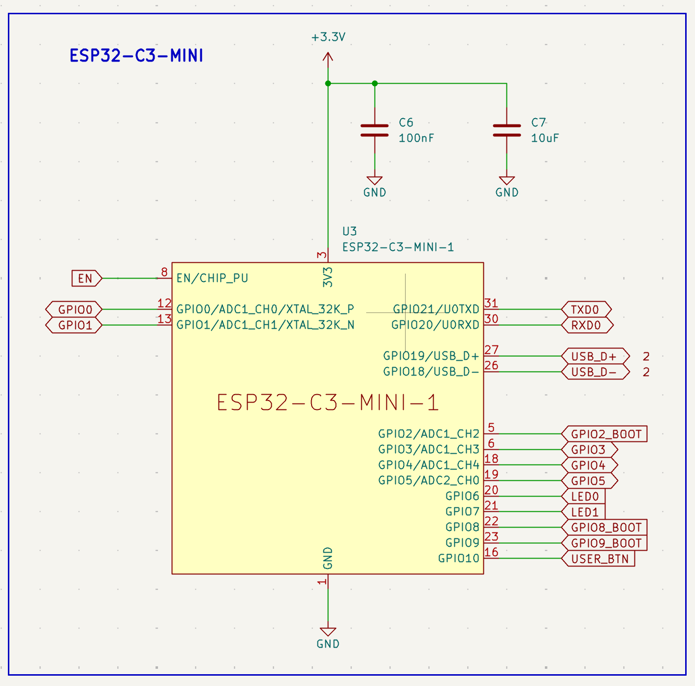

*The module sheet: every signal leaves as a global label, and the supply pin carries two capacitors.*

**What to look for.** For a sheet holding the most complex component on the board, this drawing is strikingly plain — and that is the lesson:

- **The module has exactly one `3V3` pin (pin 3) and one `GND` pin in the symbol.** All the RF work, the crystal, the flash and the internal supply splitting happen inside the module, where we cannot see them and do not need to. This is the "module as a library" idea made visible.
- **`C6` (100 nF) and `C7` (10 µF) sit in parallel on that one supply pin.** Two capacitors, two jobs — explained in the subsections below.
- Every I/O leaves as a **global label**, not a wire. The sheet has no crossing lines at all. Compare this with what the same circuit would look like drawn with wires.
- The pin names carry their alternate functions — `GPIO0/ADC1_CH0/XTAL_32K_P`. When you later wonder whether a pin can do ADC, the answer is already on your own schematic.
- Note which pins are *not* broken out. GPIO11–GPIO17 do not appear: on the ESP32-C3 they are used internally for the SPI flash. Pins you must not touch are best left off the drawing entirely.

#### First, a little physics: two components that resist change

Almost everything in this handbook about power delivery follows from two equations. They are worth ten minutes even if you have never studied electronics, because once you have them, decoupling stops being a rule you memorise and becomes something you can derive.

**A wire resists change in current.**

```
u = L · di/dt
```

A wire — and a PCB trace is a wire — has **inductance** *L*. The voltage that appears across it is proportional not to the current, but to how fast the current is **changing**.

Read what that means at the two extremes. If the current is steady, `di/dt = 0`, so `u = 0`: the wire behaves as though it were not there. A multimeter measuring a trace's resistance reads essentially zero, and it is telling the truth — about DC. But if the current changes abruptly, `di/dt` is enormous, and a voltage appears across that same piece of copper as though a resistor had suddenly materialised in the middle of it.

This "apparent resistance that depends on how fast things change" is not resistance. It is called **impedance**. The distinction matters: resistance is a fixed property of the material, while a trace's impedance grows with frequency — the faster the edge, the more the wire fights back.

How much? A rough figure for a PCB trace is about **1 nH per millimetre**. Take a 10 mm trace, so 10 nH, and a digital circuit that demands an extra 100 mA within a nanosecond as a block of logic switches:

```
u = 10 nH × (0.1 A / 1 ns) = 10×10⁻⁹ × 10⁸ = 1 V
```

**One volt**, dropped across a centimetre of copper, on a 3.3 V rail. Not measurable with a multimeter, because it lasts nanoseconds. Entirely sufficient to reset the chip.

**A capacitor resists change in voltage.**

```
i = C · du/dt
```

The mirror image. A capacitor stores energy as accumulated charge, and the current through it is proportional to how fast the voltage across it is **changing**.

Again, read the extremes. A constant voltage means `du/dt = 0`, so no current flows: to DC, a capacitor is an open circuit — a break in the wire. But the instant the voltage tries to move, current flows to oppose that movement. The faster the attempted change, the more current the capacitor delivers. Its impedance falls as frequency rises — the exact opposite behaviour to the inductor.

**Now put them together, and the whole thing falls out.**

The trace between the regulator and the chip is an inductance. When the chip demands a sudden burst of current, that inductance produces a voltage drop and the local supply sags. Now place a capacitor right at the chip's supply pin. The sag is a *change in voltage* — precisely what a capacitor opposes. It responds by delivering current locally, immediately, from the charge it holds, and the sag never fully develops.

> **L is the disease, C is the cure.** The inductance of the supply path is what makes fast current demands turn into voltage dips; the capacitance placed next to the load is what supplies those demands locally so the inductance is never asked to.

This is also why *proximity* is not a detail but the entire point. The capacitor helps only across the inductance that lies **between it and the chip**. Put it 2 mm away and it is fighting 2 nH; put it 20 mm away and it is fighting 20 nH, and it has become part of the problem it was meant to solve.

And it explains one more thing you will meet later in this handbook: whenever we say "use two vias in parallel," or "keep the return path directly underneath," or "never cut the ground plane," we are saying the same sentence in different words — **make L smaller.**

#### Why decoupling capacitors exist

Every IC draws current in short, fast pulses as its internal logic switches — not as a smooth, constant draw. If the power pin reached the regulator only through a long trace, that trace's own inductance would prevent the current from responding instantly, and the local supply voltage would sag for a few nanoseconds on every switching edge. That sag is invisible to a multimeter and entirely sufficient to reset a microcontroller or corrupt a Wi-Fi packet.

A **decoupling capacitor** sits right next to the power pin and acts as a local energy reservoir: it supplies those fast pulses locally, so the chip never waits for current to travel from the regulator.

#### One capacitor per VDD *pin*, not per IC

This is the rule most beginners get wrong, and it is worth stating precisely.

Many ICs expose *several separate* power pins — `VDDA`, `VDD3P3`, `VDD3P3_RTC`, `VDD3P3_CPU`, `VDD_SPI` — each feeding a different internal block. Each of these needs **its own local capacitor right next to it**, even though they are all nominally the same 3.3 V rail.

The reason is physical: a decoupling capacitor only helps the specific pin it is physically close to. The parasitic inductance of even a few millimetres of trace between two pins is enough that a capacitor sitting next to pin A does essentially nothing for the fast transients at pin B.

**On our board this rule is satisfied trivially, and that is worth understanding rather than glossing over.** The ESP32-C3-MINI-1 exposes a single `3V3` pin, because Espressif already did the per-pin decoupling *inside the module*, on the module's own tiny PCB. If you were designing with the bare ESP32-C3 SoC instead, you would be placing five or six capacitors around it, one per supply pin. The module bought you that work. When you design your next board around a bare IC, this rule will come back and it will not be trivial.

#### Why 100 nF specifically

It is a deliberately chosen sweet spot, not a convention:

- It must be **physically small enough** that its own parasitic series inductance (ESL, from the package and mounting pads) stays low. A physically smaller capacitor has a shorter internal current path, hence lower ESL, hence a higher self-resonant frequency — so it remains a low impedance up into the tens of MHz where fast digital switching edges live.
- It must be **large enough** to hold a meaningful amount of charge to supply during a transient.

100 nF in a small package lands in the middle of that trade-off, which is why virtually every digital IC datasheet recommends it as the default local value.

#### How far can the bulk capacitor sit?

`C7` (10 µF) has a different job. It is not reacting to nanosecond edges; it supplies the *slower*, larger current swings — an entire Wi-Fi transmit burst lasting microseconds to milliseconds — and smooths ripple at board level. Because it responds to a slower phenomenon, its placement is far less sensitive to trace inductance.

A good rule of thumb: **within roughly 1 cm of the pin or branch it serves is plenty.** It does not need to be millimetres away like the 100 nF, but it should not be on the opposite side of the board either. One bulk capacitor per power entry point or per cluster of ICs is normal; you do not need one per pin.

---

<a id="sec-2-10"></a>
### 2.10 Buttons, strapping pins and the boot sequence

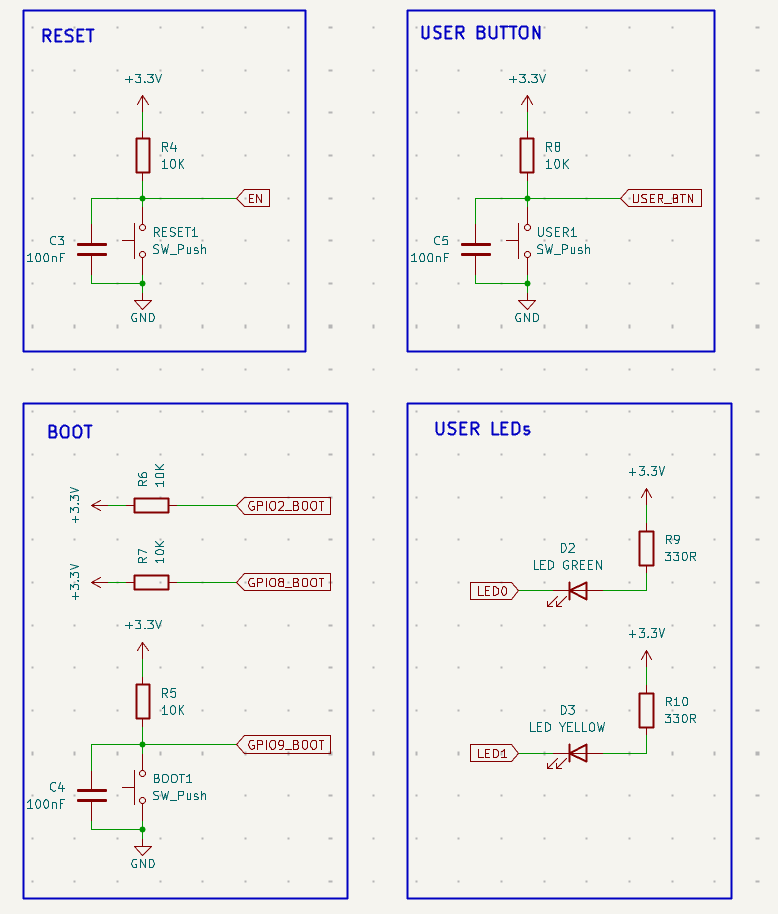

*Four functional blocks on one sheet: RESET, USER BUTTON, BOOT and USER LEDs.*

**What to look for.** This single image contains four of this handbook's most important ideas, and the grouping boxes are what make them legible:

- **RESET and USER BUTTON are electrically identical circuits** — 10 kΩ pull-up, 100 nF to ground, switch to ground. Only the net they drive differs: `EN` versus `USER_BTN`. One controls the chip's existence; the other is read by your program. Same electronics, entirely different meaning. This is worth sitting with.
- **The BOOT block contains three pull-ups but only one button.** `R6` and `R7` pull `GPIO2_BOOT` and `GPIO8_BOOT` high with nothing else attached; only `GPIO9_BOOT` gets a switch. The subsection *BOOT and the strapping pins* below explains why GPIO9 is the one that matters.
- **`GPIO2_BOOT` and `GPIO8_BOOT` have no 100 nF capacitor**, while every pin with a button does. The capacitor is there for the *switch*, not for the pin — see the debounce discussion below. Circuits without a mechanical contact do not need it.
- **In the USER LEDs block, the resistor goes to +3.3 V and the GPIO drives the cathode.** Read that connection carefully, then read section 2.11.
- The four boxes cost nothing electrically and are worth a great deal in readability. A reader identifies "this is the boot circuit" at a glance without tracing a single wire.

#### RESET

The RESET button pulls the module's `EN` pin to ground. `EN` is the chip's power-on and reset control: pulling it low powers the chip down, releasing it restarts it. The datasheet is blunt about this pin:

> *"Do not leave the EN pin floating."*

Hence `R4`, 10 kΩ, holding it high by default so the chip runs normally unless the button is actively held.

#### BOOT and the strapping pins

`GPIO2_BOOT`, `GPIO8_BOOT` and `GPIO9_BOOT` are the three **strapping pins** the ROM bootloader samples *only during the reset pulse*, to decide how to boot. From the ESP32-C3-MINI-1 datasheet, Table 4-3:

| Boot mode | GPIO2 | GPIO8 | GPIO9 |
|---|---|---|---|
| **SPI Boot** (normal) | 1 | any | **1** |
| **Joint Download Boot** (flashing) | 1 | 1 | **0** |

> Datasheet note: *"GPIO2 actually does not determine SPI Boot and Joint Download Boot mode, but it is recommended to pull this pin up due to glitches."*

In other words: **GPIO9 is the pin that actually matters.** GPIO8 only matters once GPIO9 is already low, and GPIO2 is pulled up purely for glitch immunity. All three get 10 kΩ pull-ups so that, with no button pressed, the module always boots straight into your firmware.

#### Do you have to hold both buttons?

Not for the whole process — only at one specific instant. The strapping pins are sampled *once*, at the moment `EN` transitions from low back to high, subject to the datasheet's hold time (minimum 3 ms after `EN` goes high). The standard manual sequence is:

1. **Press and hold BOOT** — this pulls GPIO9 low.
2. **While still holding BOOT, press and release RESET** — `EN` goes low, then returns high through its pull-up. At the exact moment `EN` rises, the chip samples GPIO9 as low.
3. **Release BOOT.**

RESET only needs a brief pulse; you do not keep holding it. BOOT, however, must still be held at the moment RESET is released. Hence the familiar instruction: *hold BOOT, tap RESET, release BOOT.*

Many finished boards avoid this dance with an automatic reset circuit — extra transistors driven by a USB-serial adapter's DTR/RTS lines. Our board needs neither. The ESP32-C3's built-in USB Serial/JTAG controller can put the chip into download mode by itself, so flashing normally works without touching a button. The two-button sequence is the fallback for when that fails, typically when a firmware bug has disabled or crashed the USB peripheral.

#### USER

An entirely ordinary GPIO input on GPIO10, with its own 10 kΩ pull-up. It has no meaning to the boot process; it is simply read by your application code. Electrically identical to the BOOT circuit, connected to a *non-strapping* pin.

> **A warning for your own designs.** On this board the strapping pins are deliberately kept off the headers (section 2.12). On a board where they are exposed, anything that holds `GPIO9` low at reset sends the chip into download mode instead of starting your firmware, and `GPIO2` and `GPIO8` should also stay pulled up. This is the classic source of *"my board suddenly died"* — it did not die, it is booting into the wrong mode.

#### Why 100 nF next to the switches

Mechanical switches do not produce a single clean transition. The metal contacts physically bounce for a few milliseconds, producing a rapid train of spurious transitions — *contact bounce*. Without filtering, firmware can read one press as several.

A 100 nF capacitor from the GPIO node to ground forms an **RC low-pass filter** together with the 10 kΩ pull-up already on that line:

```
τ = R × C = 10 kΩ × 100 nF = 1 ms
```

This ~1 ms time constant smooths out the fast electrical noise of contact bounce while remaining far shorter than a human press (typically 50–200 ms), so the button does not feel sluggish. This is *hardware* debouncing; it complements, but does not replace, a short software debounce in firmware.

**What "time constant" actually means.** In an RC circuit the capacitor voltage does not jump instantly to its new value; it follows an exponential curve. τ = R × C is defined as the time taken to cover **63.2%** of the remaining distance to the final value. It is *not* the time to arrive. After one τ you are at 63.2%, after two τ at about 86%, and by convention a circuit is considered settled after about **5τ** (over 99%).

So in our filter, τ = 1 ms means: within about 1 ms of a clean edge the filtered voltage has moved 63% of the way, and within roughly 5 ms it has essentially settled — comfortably faster than a human press, slow enough to average out microsecond-scale contact glitches.

---

<a id="sec-2-11"></a>
### 2.11 LEDs and the active-low trap

Both LEDs are wired **active LOW**: the anode goes through a resistor to +3.3 V, and the cathode connects to the GPIO. **The LED lights when the GPIO is driven to logic 0.**

```
+3.3 V ──[330 Ω]──▶|── GPIO
```

This is not a designer's whim. The output stages of most SoCs can *sink* more current than they can *source*, so this arrangement is the more reliable one.

For you as a programmer it means that writing a logic 1 will **turn the LED off**. Always hide the inversion behind a macro rather than remembering it:

```c
#define LED0        6    /* green  */
#define LED1        7    /* yellow */

#define LED_ON(pin)   gpio_set_level((pin), 0)
#define LED_OFF(pin)  gpio_set_level((pin), 1)
```

**Why 330 Ω?** From Ohm's law, with a typical LED forward voltage around 2.0–2.2 V:

```
I = (3.3 V − V_f) / R  ≈  (3.3 − 2.0) / 330  ≈  4 mA
```

Plenty bright for an indicator with modern LEDs, and comfortably below the ESP32-C3's per-pin limit. The chip can handle far more, but good practice keeps indicator LEDs in the low single-digit milliamps — it saves power and avoids stressing the output stage for no visible gain.

---

<a id="sec-2-12"></a>
### 2.12 Breakout headers, and why the board is not a finished product


Two 8-pin headers (`Conn_01x08`, 2.54 mm pitch) bring the board's power
rails and all spare GPIOs out to the edge. This is a deliberate decision.
Without them the board would be a device that blinks two LEDs. With them
it is a **development board**: you can attach a sensor, a display, a relay
module, a logic analyser. When the workshop is over, the board remains
useful.

The 2.54 mm (0.1") pitch is the universal hobby standard: it fits
breadboards, perfboards, Dupont jumper wires and most sensor breakout
modules.

#### What is on the headers

J2 carries power only:

| J2 pin | Signal | Notes |
|---|---|---|
| 1, 8 | +3.3 V | output of the on-board LDO |
| 3, 4 | VBUS | 5 V straight from the USB connector |
| 5, 6 | GND | |
| 2, 7 | — | not connected; marked with no-connect flags (`Q`), see section 2.14 |

J3 carries signals:

| J3 pin | Signal | Notes |
|---|---|---|
| 1 | TXD0 (GPIO21) | UART0 transmit |
| 2 | RXD0 (GPIO20) | UART0 receive |
| 3 | GND | |
| 4 | GPIO5 | digital only in practice (see below) |
| 5 | GPIO4 | ADC1 channel 4 |
| 6 | GPIO3 | ADC1 channel 3 |
| 7 | GPIO1 | ADC1 channel 1 |
| 8 | GPIO0 | ADC1 channel 0 |

The order of J3 is not accidental. TXD0, RXD0 and GND sit on three
adjacent pins, so a USB-to-serial adapter plugs onto pins 1–3 with a
single 3-way jumper cable.

#### Why these GPIOs and not others

The ESP32-C3 has three **strapping pins** (GPIO2, GPIO8 and GPIO9) whose
level at reset decides how the chip boots. A sensor or a relay module
that pulls one of them the wrong way at power-up can stop the board from
booting, or worse, briefly switch a relay while it starts. None of the
strapping pins is on the headers. The LEDs and buttons use the remaining
pins, and everything free and safe to use comes out on J3.

A few properties are worth knowing before you connect something:

- **GPIO0, GPIO1, GPIO3 and GPIO4** are ADC1 inputs, so use them for
  analogue sensors (potentiometers, photoresistors, analogue temperature
  sensors).
- **GPIO5** belongs to ADC2, which ESP-IDF does not support on the
  ESP32-C3. Treat it as a digital pin.
- **TXD0/RXD0** are UART0. The boot ROM prints its start-up messages on
  TXD0 at 115200 baud, so a device listening on that pin will receive
  some text at every reset. If you do not need the UART, both pins can
  be used as ordinary GPIOs.

#### Electrical limits

- **All signals are 3.3 V.** The ESP32-C3 is not 5 V tolerant. A 5 V
  module driving a GPIO will damage the chip over time or at once. Use a
  level shifter or a resistor divider.
- **VBUS is raw USB 5 V**, intended for 5 V peripherals such as relay
  modules or LED strips. It is limited by what the USB host provides,
  typically 500 mA for the whole board.
- **+3.3 V** comes from the same LDO that powers the ESP32-C3, whose
  Wi-Fi transmissions draw current peaks of a few hundred milliamps. Keep
  external 3.3 V loads modest (sensors, small displays) and power
  anything heavier from VBUS.
- **Never connect an external supply** to VBUS or +3.3 V while the board
  is plugged into USB. Two supplies fighting each other can back-feed the
  host's USB port or the LDO.

#### Why the headers are marked DNP

The red crosses in the schematic mean the symbols carry KiCad's
**DNP (Do Not Populate)** attribute. Their footprints are on the PCB, but
they are left out of the assembly BOM and placement file, so the
manufacturer does not fit them. You solder the headers yourself.

There are three reasons for this:

- **Choice.** You decide what to fit: straight male pins for a
  breadboard, angled pins, female sockets, or nothing at all if the
  board is going to be glued flat inside an enclosure.
- **Cost.** Through-hole parts are assembled separately from SMD parts
  and add to the price of every board.
- **Practice.** Soldering a 2.54 mm header is the easiest possible
  through-hole job, which makes it a good first soldering exercise.

---

<a id="sec-2-13"></a>
### 2.13 Schematic grouping and PWR_FLAG

**Grouping.** You will have noticed that both sheets place related components inside visual boxes — one around the USB-C connector with its CC resistors and protection, another around the regulator and its capacitors, four around the button and LED circuits. This costs nothing electrically and is worth a great deal:

- a reader identifies a functional block at a glance, without tracing wires;
- it documents *design intent* — grouping tells the next person which components form one unit;
- it makes cross-checking a block against a datasheet's application circuit easy, one box at a time.

This is a habit worth carrying into every schematic you draw afterwards.

**PWR_FLAG.** The power sheet contains `PWR_FLAG` symbols. These are not real components; they exist purely for ERC. ERC expects every power net to be *driven* by a pin explicitly marked as a power output — a regulator's output pin, for instance. But a net like `VBUS`, which originates at a plain connector pin (electrically just "passive" as far as KiCad's pin-type system is concerned), has no such driver, so without a flag ERC would report *"power net has no driver"* as an error.

Placing a `PWR_FLAG` is you telling ERC explicitly: *this net is genuinely powered from outside the schematic — a cable, a battery, a connector — stop warning me.*

---

<a id="sec-2-14"></a>
### 2.14 ERC

`Inspect → Electrical Rules Checker`

ERC does not check whether your circuit will work. It checks the schematic's **internal consistency**, independent of any physical layout:

- two outputs driving the same net — a short circuit waiting to happen;
- an input pin left entirely unconnected;
- a power net with no driving source (exactly what `PWR_FLAG` resolves);
- pins of mismatched types connected in a way that is likely a mistake.

| Message | Meaning | Fix |
|---|---|---|
| *Input Power pin not driven by any Output Power pins* | a power net has no source; on our board this is `VBUS`, which comes from a passive connector pin | add `PWR_FLAG` to that net (section 2.13) |
| *Pin not connected* | a pin is floating | connect it, or mark it with a no-connect flag (`Q`) |

**Run ERC before you begin layout.** Fixing a wiring mistake in the schematic takes thirty seconds; discovering the same mistake after half the board is routed is a different afternoon entirely.

The workshop rule: **zero ERC errors** before moving to layout. Warnings should be reviewed individually — some are genuinely benign — but never wave away an error you do not understand.

#### Unconnected pins: the no-connect flag (`Q`)

Every pin of every symbol must be either connected or explicitly declared unused. A pin that is neither triggers ERC's *pin not connected* error, because ERC cannot tell a pin you forgot from a pin you meant to leave open.

To declare a pin unused, press `Q` (or **Place → No Connect Flag**) and click on the end of the pin. A blue × appears. That × is a statement in the schematic: *leaving this pin open is intentional.*

Our schematic has exactly four of them:

| Where | Pins | Why they are unused |
|---|---|---|
| J1, USB-C receptacle | `SBU1` (A8), `SBU2` (B8) | *sideband use* pins, needed only for alternate modes such as DisplayPort; USB 2.0 never uses them |
| J2, power header | pins 2 and 7 | free positions on the header |

Pins that the symbol itself declares as unconnected, such as the regulator's pin 4 and the module's NC pins, need no flag: the symbol already says so.

Two rules keep the flag honest:

- **Flag only pins you have actually decided about.** A × on a pin that should have been connected silences exactly the error that would have caught the mistake.
- **Never leave a flag on a pin that is also wired.** ERC reports this too. It usually means a wire was added later and the old flag was forgotten.

---

<a id="sec-3"></a>
## 3. Footprints and board outline

<a id="sec-3-1"></a>
### 3.1 Footprints: where logic meets physics

A symbol has no size. A footprint does. Every component must be assigned one — the actual pattern of copper pads it will be soldered to.

`Tools → Assign Footprints`

> **Warning.** A wrong footprint is the most expensive mistake in this project. Once the boards are made, it cannot be fixed. Check every footprint against the dimensions in the datasheet, especially the regulator, the ESD parts and the USB-C connector.

The USB-C connector deserves particular care: the footprint must match **exactly the connector you will buy** (here GT-USB-7010ASV). USB-C receptacles from different manufacturers are not interchangeable, despite looking identical from the outside.

<a id="sec-3-2"></a>
### 3.2 Package families: through-hole and surface mount

A **package** is the physical housing of a component: its body and the
terminals that connect it to the board. A footprint is the package's
image in copper, so the footprint must match the package exactly. The
same chip is often sold in several packages, and choosing one is a
decision about size, assembly method and how easily you can solder,
probe and repair the board.

#### Two ways of mounting a part

**Through-hole (THT).** The leads pass through plated holes and are
soldered on the opposite side. Through-hole parts are mechanically
strong and easy to solder by hand, but every hole goes through all four
layers and leaves an antipad in every plane it crosses (section 4.2).
Today THT is used mainly where mechanical strength matters: connectors,
headers, large switches, heavy parts. On our board: the headers J2 and
J3, and the shell pegs of the USB-C receptacle.

**Surface mount (SMT, SMD).** The terminals sit on pads on the surface.
SMT parts are much smaller, can be placed on both sides of the board and
are designed for machine placement and reflow soldering. Everything else
on our board is SMT.

Connectors often combine the two. Our USB-C receptacle has SMT signal
pins for precision and through-hole shell pegs for strength, because
every plug insertion pulls on the connector.

#### The common package families

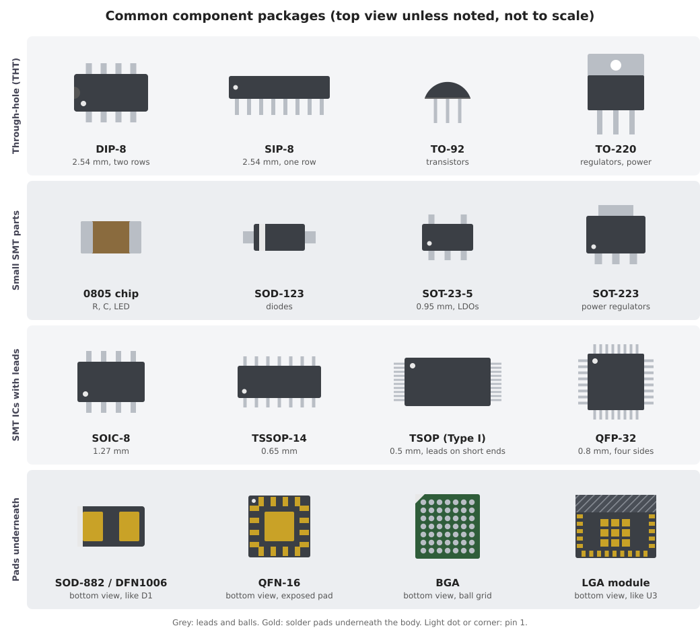

*The package families from the table below, drawn schematically and not
to scale. The bottom row shows the parts from underneath, because that is
where their terminals are.*

| Family | Mounting | Terminals and pitch | Typical use | By hand | On our board |
|---|---|---|---|---|---|
| **DIP** (DIL) | THT | two rows, 2.54 mm pitch, rows 7.62 mm apart | classic logic ICs, microcontrollers for breadboards | easy | — |
| **SIP** | THT | one row, 2.54 mm | resistor networks, small modules | easy | the pin headers follow the same idea |
| **TO-92, TO-220** | THT | 3 leads | transistors, linear regulators | easy | — |
| **Chip passives** (0402, 0603, 0805 …) | SMT | two end terminals, size code | resistors, capacitors, LEDs | 0805 easy, 0402 hard | all R, C and LEDs (section 3.3) |
| **SOD-123, SOD-323, SOD-882** | SMT | two terminals | diodes, ESD protection | 123/323 fine, 882 hard | D1 (SOD-882D) |
| **SOT-23** (3, 5, 6 pins), **SOT-223** | SMT | gull-wing leads, 0.95 mm pitch | transistors, small regulators, ESD arrays | fine | U1 (SOT-23-6), U2 (SOT-23-5) |
| **SOIC / SOP** | SMT | gull-wing leads on two sides, 1.27 mm | general-purpose ICs, SPI flash | fine | — |
| **SSOP, TSSOP, MSOP** | SMT | gull-wing, 0.65 or 0.5 mm | the same ICs in less area | with practice | — |
| **TSOP** | SMT | gull-wing, 0.5 mm, leads on the short ends (Type I) or long sides (Type II) | parallel flash, SRAM, SDRAM | with practice | — |
| **QFP** (LQFP, TQFP) | SMT | gull-wing on all four sides, 0.8–0.4 mm | microcontrollers, FPGAs | with practice | — |
| **QFN, DFN** | SMT | pads under the body edge, plus a large exposed pad | modern ICs, power parts | hot air or reflow | the ESP32-C3 chip inside the module |
| **BGA, WLCSP** | SMT | solder balls in a grid under the body | processors, memory, large FPGAs | no; needs reflow and X-ray inspection | — |
| **LGA module** | SMT | flat pads under the body | radio modules | no | U3, the ESP32-C3-MINI-1 |

Two trends run down the table: pitch shrinks, and the terminals move
from the sides of the package to underneath it. Gull-wing leads can be
seen, probed and reworked with an iron. Pads underneath a QFN, a BGA or
our module cannot be inspected by eye at all. That is why an assembler
X-rays such parts, and why you cannot fix a bad joint under the module
with a soldering iron.

#### Naming traps

- **One package, several names.** SOT-23-5 is also called SOT-25 (the
  name in the Torex regulator datasheet) or SC-74A. Some vendors call a
  six-pin SOT-23 variant **TSOP-6**, which has nothing to do with the
  TSOP memory packages. Compare dimensions and pin numbering in the
  datasheet, not the name.
- **Imperial and metric chip codes.** The passive size codes are
  imperial: 0402 means 0.04 × 0.02 inch, which is 1.0 × 0.5 mm, or
  **1005** in metric. A *metric* 0402 (0.4 × 0.2 mm) is the imperial
  **01005**, a part four times smaller. KiCad's footprint names carry
  both codes to avoid exactly this confusion: `R_0402_1005Metric`.
- **Same package, different pinout.** Two regulators in SOT-23-5 fit the
  same footprint and can still have their pins in a different order. The
  package tells you the shape; only the datasheet tells you the pinout.

KiCad's library footprint names encode the package, its body size and
the pitch, for example `SOIC-8_3.9x4.9mm_P1.27mm` or
`SOT-23-5`. Reading that name is usually enough to tell whether a
footprint matches the datasheet drawing, but check the drawing anyway.

<a id="sec-3-3"></a>
### 3.3 Package sizes: 0402 vs 0603 vs 0805

| Package | Metric | Size (L×W) | Hand-solderable? | Notes |
|---|---|---|---|---|
| 0402 | 1005 | 1.0 × 0.5 mm | difficult for beginners | preferred for machine assembly; easy to lose, hard to probe by hand |
| 0603 | 1608 | 1.6 × 0.8 mm | manageable with practice | good middle ground |
| 0805 | 2012 | 2.0 × 1.25 mm | **comfortable by hand** | large pads, easy to inspect visually, still compact |

**On this board the resistors are 0402 and the capacitors and LEDs are 0805.** That mix is not an oversight — it reflects the intended assembly method. The boards are machine-assembled at the fabricator, where 0402 is entirely routine and takes less space.

If your own next board is to be **hand-soldered**, revisit this before ordering: move the resistors up to 0603 or 0805 so you are not fighting 1.0 × 0.5 mm parts with a soldering iron.

This is the real lesson: **the intended assembly method should drive footprint choice**, not a vague preference for "smaller is more modern."

<a id="sec-3-4"></a>
### 3.4 Board outline

The outline is drawn on the `Edge.Cuts` layer. The board will be cut along that line. Ours is **34.9 × 48.5 mm**.

Recommendations: rounded corners with a 1–2 mm radius, since sharp corners chip; the USB-C connector at the edge, aligned with the outline; mounting holes ⌀3.2 mm for M3 screws, at least 5 mm from the edge. (Our board has none: it is meant to sit in a breadboard.)

---

<a id="sec-4"></a>
## 4. Layers and placement

<a id="sec-4-1"></a>
### 4.1 Placement strategy

Placement is where most of a board's quality is decided. Routing only
connects what placement has already arranged: a well-placed board almost
routes itself, and a badly placed one cannot be rescued by clever routing.

#### How to read the layout screenshots

All screenshots in this section show KiCad's PCB editor after placement
and before routing. The colours (KiCad's default theme) carry meaning:

| What you see | KiCad layer / object | Meaning |
|---|---|---|
| red pads with labels | `F.Cu` pads | copper; label = pad number and net name |
| magenta rectangle | `F.Courtyard` | space the part claims; courtyards must not overlap |
| cyan rectangle | `B.Courtyard` | the same, for parts on the **back** side |
| yellow lines, triangles | `F.Silkscreen` | printed outline and pin-1 marker |
| grey outline | `F.Fab` | physical body of the part; documentation only, not manufactured |
| thin cyan lines | ratsnest | connections that still have to be routed |
| filled cyan circles | non-plated holes | locating pegs of the USB-C connector |
| hatched red area | rule area (keepout) | no copper allowed |

Nothing in these screenshots is routed yet: there are no traces and no
vias. Every connection is still a ratsnest line.

#### The order of placement

1. **Fixed components**: parts whose position is dictated by the outside
   world. The USB-C connector goes on an edge, the headers along the long
   edges, buttons and LEDs where fingers and eyes can reach them.
   (Our board has no mounting holes; if yours does, they belong here too.)
2. **The module**, with its antenna at the board edge and the keepout
   beside it.
3. **The power chain**, in the order the current flows: protection at
   the connector, then the regulator, then its capacitors.
4. **Decoupling capacitors**, each right beside the supply pin it serves,
   typically within 2 mm.
5. **Everything else**: pull-ups, RC networks, LED resistors.

The guiding principle throughout: **components follow the path of the
signal.** If the signal travels from left to right in the schematic, let
it travel from left to right on the board. A board that looks like its
schematic routes almost by itself.

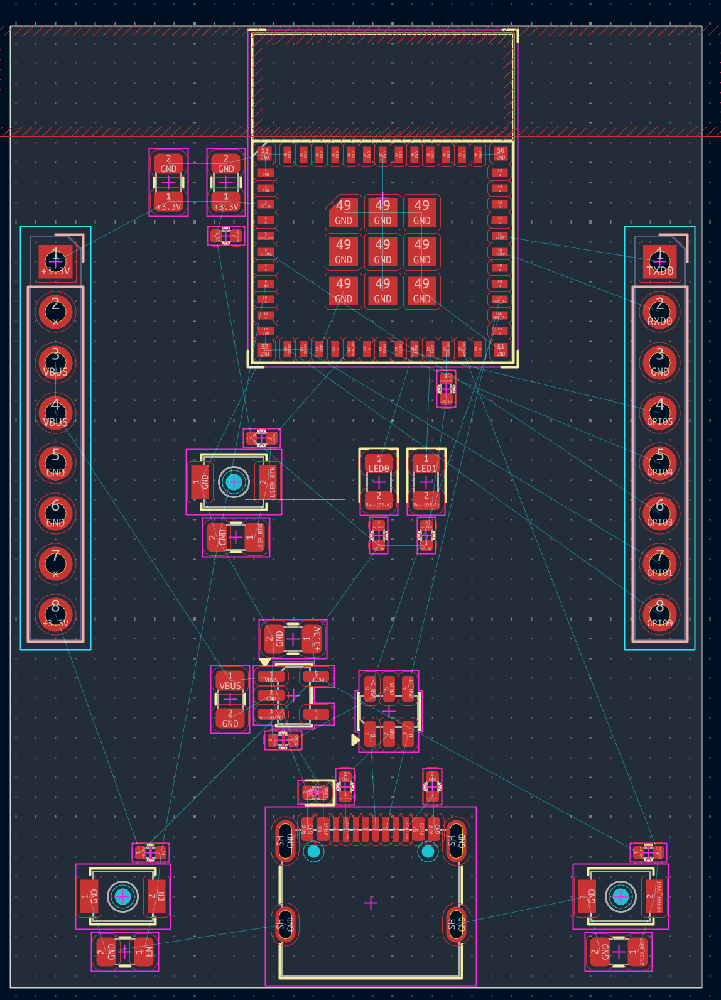

*The whole board with every footprint placed and nothing routed yet.*

**What to look for.** This is the most informative image in the handbook,
because it shows the board at the moment when every decision has been
made and nothing has been committed:

- **The hatched red band across the top is the antenna keepout.** The
  module sits at the top with its antenna end flush with the board edge,
  and the keepout spans the full width of the board. No copper is allowed
  there on *any* layer: no pours, no plane, nothing on the inner layers.
  Copper near the antenna detunes it and costs range. Everything else on
  the board was arranged around this constraint, not the other way round.
- **The two 1×8 headers run down the left and right edges.** J2 carries
  power, J3 carries signals (section 2.12). They are placed on the **back**
  side (cyan courtyard), so the pins point down into a breadboard while
  the components face up. What makes the board breadboard-compatible is
  not the distance between the headers itself, but that it is an exact
  multiple of 2.54 mm: only then do both rows land on the breadboard grid.
- **The USB-C connector sits centred on the bottom edge**, with the power
  cluster immediately above it. Power flows from bottom to top, and the
  module sits at the top. The physical layout mirrors the schematic.
- **RESET (the EN pin) is at bottom left and BOOT (GPIO9) at bottom
  right.** Thanks to the built-in USB Serial/JTAG you rarely need them.
  But when a firmware bug locks up the USB port, holding BOOT and tapping
  RESET is the only way back, and that is much easier with the buttons in
  opposite corners than with the buttons 5 mm apart.
- **Each button has two small companions**: a pull-up resistor next to it
  and a capacitor below it. On EN this RC network delays the chip's start
  until the supply has settled; on the other buttons it filters contact
  bounce.
- **The ratsnest lines fan out from the module in all directions.** Their
  number and length are your placement feedback: long, crossing lines mean
  components in the wrong place. Fix that here, not with clever routing
  later.
- **Small parts sit beside the pins they serve**, not tidily lined up
  along an edge. Tidiness is not the goal; proximity is.

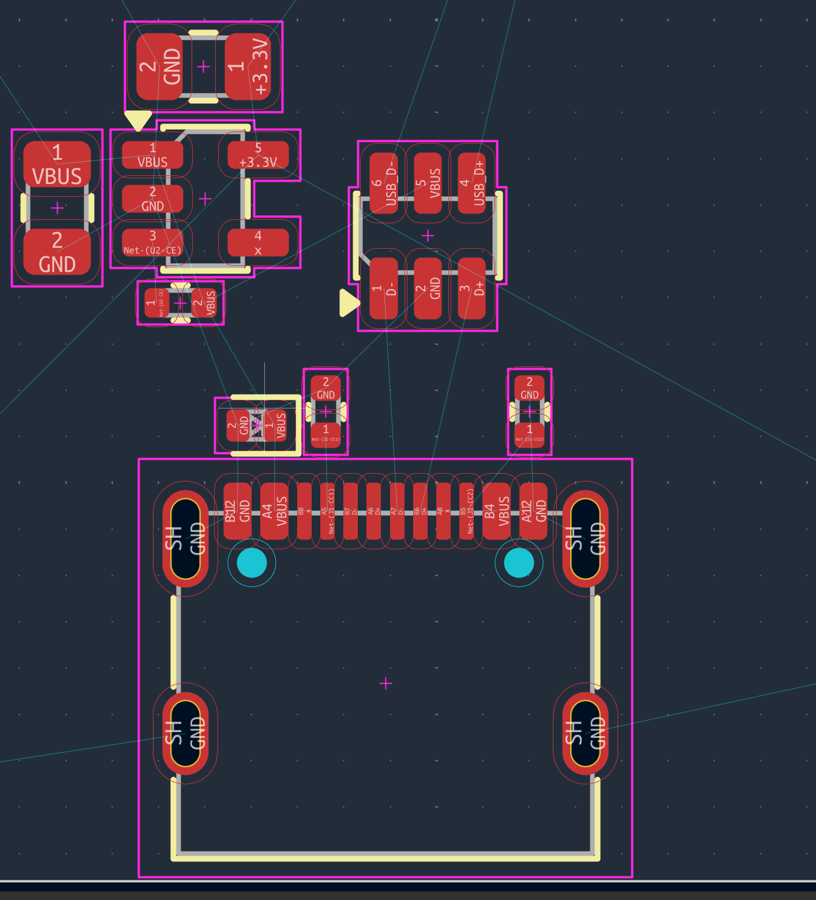

*The power cluster: connector, protection, regulator and capacitors, in
the order the current travels.*

**What to look for.** This is step 3 of the placement order made concrete:

- **Trace the order upward from the connector**: the USB-C pads, then the
  VBUS protection diode and the two 5.1 kΩ CC resistors, then the LDO
  (left) and the USBLC6 (right), then the regulator's output capacitor.
  Current enters at the bottom and leaves at the top as +3.3 V. Nothing
  doubles back.
- **The protection diode sits directly at the VBUS pad (A4).** Protection
  must be the first thing a voltage spike meets, before it reaches
  anything it could damage.
- **Each CC resistor sits directly above its own pin**: CC1 above A5,
  CC2 above B5 (section 2.5).
- **D+ and D− appear twice on the connector** (A6/B6 and A7/B7), because
  the plug is reversible. The two copies of each are joined before they
  reach the USBLC6.
- **The USBLC6 faces the connector with pads 1 (D−), 2 (GND) and 3 (D+)**,
  and faces the module with pads 6 (USB_D−), 5 (VBUS) and 4 (USB_D+).
  The data lines enter one side and leave the other. Rotated by 180° the
  part would still work electrically, but the traces would have to cross.
- **The LDO's pads are readable here**: `1 VBUS`, `2 GND`, `3 CE`,
  `4` unused, `5 +3.3V`. Compare them with the schematic in section 2.7:
  the same five pins and the same connections, now with physical
  positions. Moving fluently between these two views is most of what PCB
  design is.
- **The input capacitor (10 µF, VBUS to GND) sits directly left of pins 1
  and 2; the output capacitor (4.7 µF, +3.3 V to GND) sits directly above
  pin 5.** Each is within a couple of millimetres of the pin it serves,
  as the datasheet's layout note requires.
- **The small resistor just below the LDO ties CE to VBUS**: the
  regulator switches on whenever USB power is present.

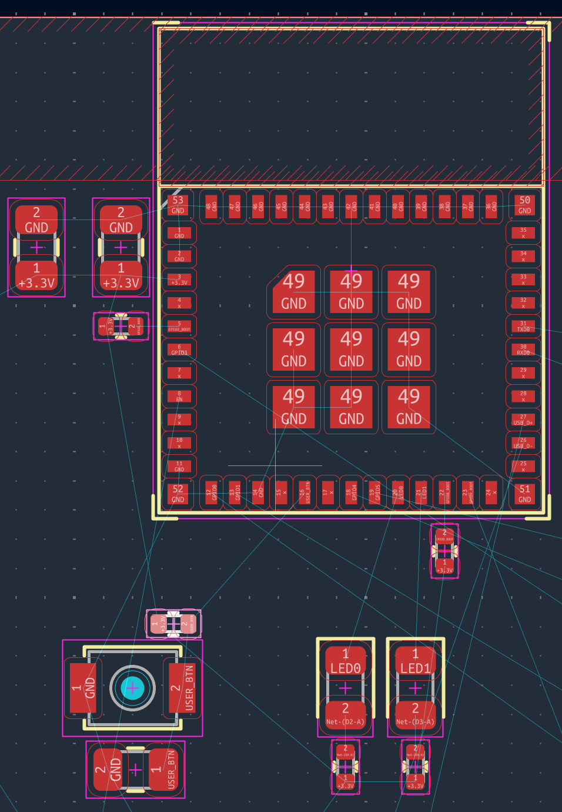

*The module footprint with its decoupling capacitors, strapping
pull-ups, the two LEDs and the user button.*

**What to look for.** This is where the decoupling discussion of
section 2.9 becomes physical:

- **The pads carry their net names, so you can read the pinout directly
  off the layout**: pin 3 `+3.3V`, 5 `GPIO2_BOOT`, 6 `GPIO3`, 8 `EN`,
  12 `GPIO0`, 13 `GPIO1`, 16 `USER_BTN`, 18 `GPIO4`, 19 `GPIO5`,
  20 `LED0`, 21 `LED1`, 22 `GPIO8_BOOT`, 23 `GPIO9_BOOT`, 26 `USB_D−`,
  27 `USB_D+`, 30 `RXD0`, 31 `TXD0`. Pads marked `x` are unused; the
  rest are GND.
- **The nine large pads marked `49 GND` in the centre** are the module's
  ground and thermal pad array. During routing it gets several vias down
  to the ground plane (section 4.4). Together they are the module's main return
  path and its main route for heat.
- **The two capacitors at the upper left connect `+3.3V` to `GND`** right
  at pin 3, the module's only supply pin. That short distance is the whole
  point: a few millimetres further and the inductance of the connection
  would start to matter.
- **Two tiny resistors next to the module are the strapping pull-ups**:
  one beside pin 5 (GPIO2), one below the module at pin 22 (GPIO8). The
  ESP32-C3 reads these pins at reset to decide how to boot, so their
  pull-ups belong close to the pins.
- **Each LED has its series resistor immediately below it**, forming an
  obvious visual pair. The resistors go to `+3.3V` and the LED cathodes
  go to the GPIO, so the LEDs are **active-low**: they light when the pin
  is driven low. That is why the firmware uses `LED_ON`/`LED_OFF` macros.
- **The user button is placed well clear of the module**, with room for a
  finger, its pull-up above and its debounce capacitor below. Ergonomics
  is a layout constraint like any other.
- Note again the hatched keepout at the top and the complete absence of
  anything beneath the antenna.

---

<a id="sec-4-2"></a>
### 4.2 Why four layers

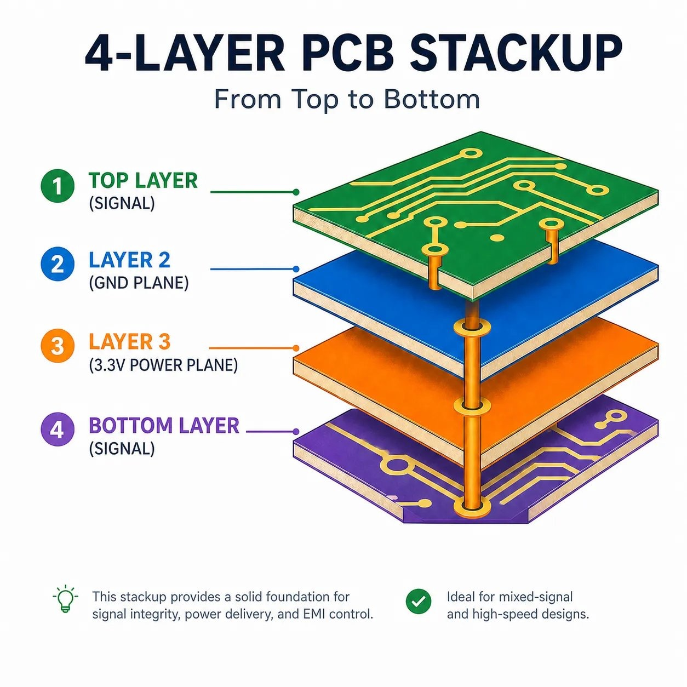

*The classic four-layer arrangement: signals outside, planes inside.*

**What to look for.** The exploded view makes visible what is otherwise
buried inside 1.6 mm of fibreglass:

- **The two inner layers are solid sheets, not traces.** That is the
  entire difference between a two-layer and a four-layer board. Layers 2
  and 3 are not "more room for routing". They are continuous copper, and
  their value comes precisely from being uninterrupted.
- **The vertical copper barrels are vias.** On our board every via is a
  through via, drilled through the whole stack. (The illustration is
  schematic about this; blind and buried vias exist, but they cost extra.)
  A via passes through every layer, but it **connects only to copper of
  its own net**. Where a plane of another net lies in its way, KiCad cuts
  a small clearance ring around it, called an **antipad**. A `+3.3V` via
  therefore joins the +3.3 V island on `In2.Cu` automatically, without
  any routing, and passes through the GND plane on `In1.Cu` without
  touching it.
- **Layer 2 (GND) lies directly beneath layer 1**, separated by a thin
  dielectric, typically 0.1–0.2 mm on a standard 1.6 mm board. Every trace
  on the top layer therefore has its return path a fraction of a
  millimetre below it (see the next subsection).
- **The illustration labels layer 3 as a single 3.3 V plane. Ours is
  different:** `In2.Cu` carries *two* separate islands, `VBUS` before the
  regulator and `+3.3V` after it. Section 4.3 explains how they coexist
  without touching.

| Layer | Our board |
|---|---|
| `F.Cu` (1) | components and signals, GND pour |
| `In1.Cu` (2) | **solid GND plane** |
| `In2.Cu` (3) | power islands: `VBUS` and `+3.3V` |
| `B.Cu` (4) | signals, GND pour |

#### What the planes buy: a return path under every trace

Current flowing along a signal trace must return to its source, and it
returns through ground. At low frequencies it takes the path of least
resistance. At high frequencies, including the fast edges of any digital
signal, it takes the path of least *inductance*, which is **directly
beneath the signal trace**. If `In1.Cu` is a solid, uninterrupted plane,
every signal on `F.Cu` has that return path available. The loop formed by
signal and return is small, so its inductance is small (section 2.9), so
it radiates little and picks up little.

**Cutting the ground plane destroys exactly that.** A trace routed
through the ground layer creates a slot. Every signal crossing the slot
must send its return current around the obstruction, and the loop grows
by the size of the detour.

> This is why `In1.Cu` carries no signal traces. None.

A slot can also appear without any trace. Each via through the plane
leaves an antipad, and a tight row of vias can merge their antipads into
one long gap. Keep vias spaced apart rather than lined up shoulder to
shoulder.

The same reasoning applies to `B.Cu`, whose nearest plane is `In2.Cu`:
the power layer. A plane at a steady DC voltage serves as a return path
just as well as ground, provided it is continuous. But `In2.Cu` is split
into two islands, and a bottom-layer trace that crosses the gap between
them loses its return path at that gap. Keep bottom-layer traces over a
single island where you can, and keep the USB pair on `F.Cu`, above the
solid ground.

#### Two layers versus four

On a two-layer board there are no inner layers at all. Signals, power
and ground all share the top and bottom copper. Ground becomes a
patchwork of hand-drawn traces and poured fragments, threaded between
whatever else needed to cross the board.

| | Two layers | Four layers |
|---|---|---|
| Ground | traces and fragmented pours, routed by hand | one continuous plane |
| Return path | wherever copper happens to be, often a long detour | directly beneath every trace |
| Loop area, hence *L* | large and unpredictable | small and consistent |
| Power distribution | narrow, meandering traces | a wide, low-impedance plane |
| Routing space | congested; power and ground consume it | freed up, since power and ground moved inside |
| EMI | radiates more, picks up more | substantially better |
| Cost | cheaper | more expensive, though not dramatically at small sizes |

Every line in the right-hand column is the same physics: a small loop
means small *L*, and a plane distributes power with far lower resistance
and inductance than any trace of practical width.

#### And yet: this board would work on two layers

It is worth being honest about this rather than pretending otherwise.

Our board has around thirty components and some forty nets. The
ESP32-C3's 160 MHz clock never leaves the module. The fastest signal on
the PCB itself is USB Full Speed at 12 Mbit/s, which is genuinely slow by
modern standards. A competent designer could route this board on two
layers, and it would work.

**We chose four layers anyway, for two reasons.**

The first is technical, and modest. The board carries a Wi-Fi radio and
a differential pair. Both benefit from a clean ground reference, and both
are exactly the kind of thing that behaves *almost* correctly on a
compromised ground. The failure mode is not a dead board but reduced
range or occasional enumeration failures, which are miserable to
diagnose. Given the choice, we removed the variable.

The second reason is the honest one: **you are here to learn.**

Four-layer stackups, ground planes, power islands and via stitching are
standard practice on essentially every real embedded board you will meet
afterwards. Learn them here, on a small, forgiving board with thirty
components, where a mistake costs nothing and the whole design fits in
your head. Learning to lay out a ground plane for the first time on a
dense, fast board is a much worse experience.

So the fourth layer is partly for the signals and partly for you. When
the project is a workshop, that is a legitimate engineering decision.
Recognise it as a decision, not a technical necessity: knowing *which* of
your design choices are forced and which are chosen is itself part of
the craft.

<a id="sec-4-3"></a>
### 4.3 Two islands on one layer, and zone priority

Rather than routing VBUS and +3.3 V as traces, we pour them as **copper
zones** directly on `In2.Cu`: a small `VBUS` island covering the path
from the connector through the protection diode to the regulator input,
and a large `+3.3V` island covering the rest of the board. KiCad keeps
the two apart according to your clearance rule. The result is two
independent copper islands on the same physical layer that never touch.

The same tool also creates the solid GND plane on `In1.Cu` and the GND
pours on the outer layers, `F.Cu` and `B.Cu`.

#### Drawing a zone in KiCad 10

1. **Start the tool.** Click *Add Filled Zone* in the right toolbar, or
   press `Ctrl`+`Shift`+`Z`.
2. **Click the first corner.** Before you draw anything else, the
   *Copper Zone Properties* dialog opens. Set:
   - **Layer**: tick `In2.Cu` only. (One zone can span several layers,
     but all its layers share one net. A GND zone can therefore cover
     `F.Cu`, `In1.Cu` and `B.Cu` at once; a power island should not.)
   - **Net**: `VBUS` for the first zone.
   - **Zone name**: something readable, for example `VBUS_1`. You
     will need it in the Zone Manager.
   - **Pad connections**: *Solid* for the VBUS island, *Thermal reliefs*
     for the +3.3 V island (see below). Leave clearance and minimum width
     at their defaults.
3. **Click the remaining corners.** The outline follows the current line
   mode (45° by default; `Shift`+`Space` switches between modes).
   `Backspace` removes the last corner if you misclick.
4. **Close the outline** by double-clicking, or by clicking on the first
   corner again.
5. **Fill the zones** with `B`. KiCad does not refill zones automatically
   while you edit, so what you see can be out of date. Press `B` after
   every change you want to judge by eye; `Ctrl`+`B` removes the fill
   again. The left toolbar can switch between showing filled zones and
   outlines only, which makes overlapping outlines easier to see.

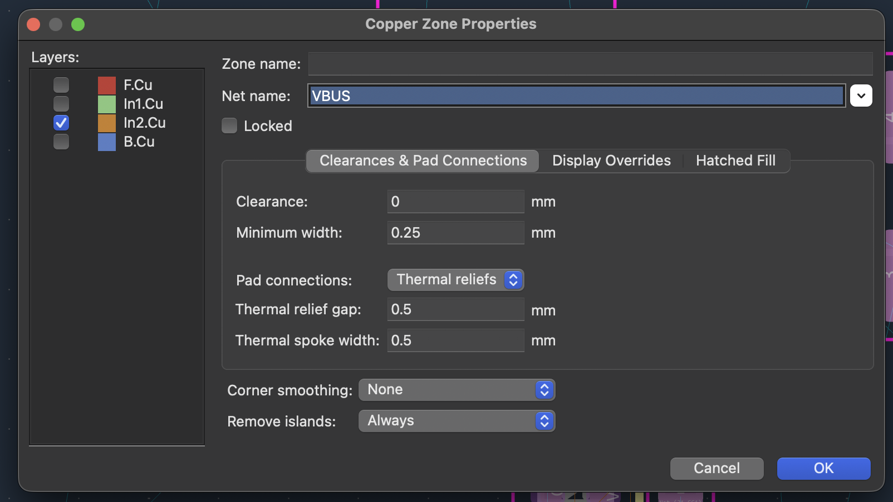

*The dialog that opens on the first click of a new zone. Net `VBUS`,
clearance 0.5 mm, pad connections solid, islands removed. Note the layer
list on the left: the dialog preselects the layer that was active when
you started, here `In1.Cu`.*

**What to look for.** The layer tick is the one setting in this dialog
that is easy to get wrong and expensive to miss. Untick `In1.Cu` and tick
`In2.Cu` before pressing OK. A `VBUS` zone left on `In1.Cu` would carve a
5 V island out of the middle of the ground plane: exactly the slot that
section 4.2 warns about, and one that DRC will not report, because
nothing about it breaks a rule.

- **There is no priority field.** In KiCad 10, priority is set only in
  the Zone Manager (below).
- **Pad connections** decides how pads of the zone's net join the
  copper. *Solid* joins them with full copper. *Thermal reliefs* joins
  them through a few narrow spokes, so that the plane does not pull heat
  away from the joint while you solder it. On `In2.Cu` this only matters
  for through-hole pads, because SMD pads sit on the outer layers and
  reach the plane through vias, which always connect solidly. The VBUS
  island contains no through-hole pads, so *Solid* is fine. The
  +3.3 V island contains the header pins J2-1 and J2-8, which you solder
  by hand, so it uses *Thermal reliefs*.
- **Remove islands: Always** deletes any piece of the fill that is not
  connected to anything of its net. That is why an island without vias
  vanishes (see *Common problems* below).

#### Drawing the VBUS island

The VBUS island does not have to be drawn as one polygon. The easiest
way to get its shape is to draw several simple rectangles on `In2.Cu`,
each covering one group of VBUS pads. Ours is four:

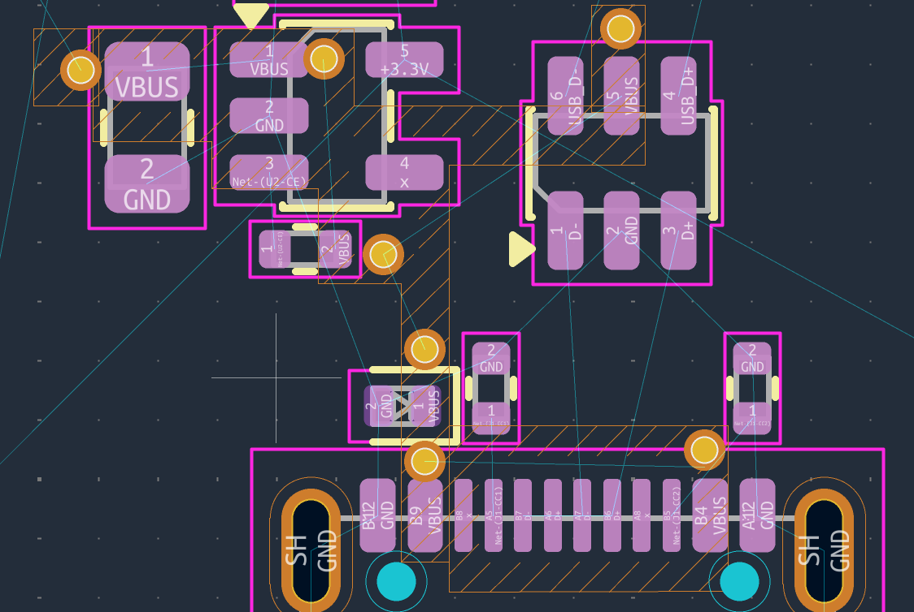

*The finished VBUS outlines, shown hatched: one around the input
capacitor and the regulator's pin 1, a vertical strip down to the
connector, one along the connector's VBUS pads, and one under the
USBLC6's pin 5. The orange circles are the VBUS fanout vias.*

**What to look for.**

- **Every rectangle contains at least one via**: next to the input
  capacitor, the LDO's pin 1, the CE resistor, the USBLC6's pin 5, the
  protection diode, and both of the connector's VBUS pad groups (B9 and
  B4). Without them the island would be connected to nothing and the
  fill would remove it. Section 4.4 describes how these vias are placed.
- **The rectangles overlap.** Zones of the *same* net that overlap fill
  as one continuous piece of copper, so four easy rectangles give the
  same copper as one fiddly polygon.
- **Nothing on `In2.Cu` is drawn around the data lines.** D+ and D−
  stay on `F.Cu`, above the GND plane, and do not care what lies on
  `In2.Cu`.

The header's VBUS pins, J2-3 and J2-4, lie far from this cluster, on
the left edge of the board. They are not part of the island and are
connected to VBUS by a track.

**Keep the island small and close to the VBUS pads.** It might seem
safer to make it generous, but a large VBUS island is worse in three
ways:

- **It takes area from the +3.3 V island**, which matters more, because
  it feeds the module. VBUS carries a few hundred milliamps to the
  regulator, and a copper strip a few millimetres wide is ample for that.
- **Its boundary gets longer.** The gap between VBUS and +3.3 V is a
  break in the reference plane for every signal on `B.Cu` (section 4.2).
  The longer that gap, the more likely a bottom-layer trace is to cross
  it.
- **It tempts you to stretch it towards distant pins.** A pin far from
  the cluster, such as J2-3 and J2-4, is better reached by a track than
  by an island reaching halfway across the board.

Two things to watch while you shape it:

- **Do not make it too narrow.** Where the island links two groups of
  vias, like our vertical strip from the regulator down to the connector,
  keep it at least 1–2 mm wide.
- **Do not enclose pockets of +3.3 V copper.** If the VBUS island
  surrounds a piece of the +3.3 V zone on all sides, that piece is cut
  off from the rest of its net and *Remove islands: Always* deletes it.
  On our board the pocket around the CC resistors stays open to the
  right, so it survives. Check this again whenever you move an outline.

One branch of our island exists only to reach the USBLC6's pin 5, which
needs VBUS as a reference and draws almost no current. It could equally
be replaced by a short track on `F.Cu` to the nearest VBUS pad, which
would make the island more compact and its boundary shorter. Both
solutions work.

**Four zones, one island.** The rectangles remain four separate zones
in KiCad, even though they fill as one piece of copper. This has one
consequence, in the Zone Manager: each of them is listed there, and
**each must sit above the +3.3 V zone**. Name them `VBUS_1` to `VBUS_4`
so that they are easy to recognise in the list. If you prefer a single
zone, draw the island as one polygon instead, following the outline the
rectangles give you; the copper is the same either way.

#### Drawing the +3.3 V island

Repeat the procedure for the second zone: `In2.Cu`, net `+3.3V`, name
`3V3_plane`.

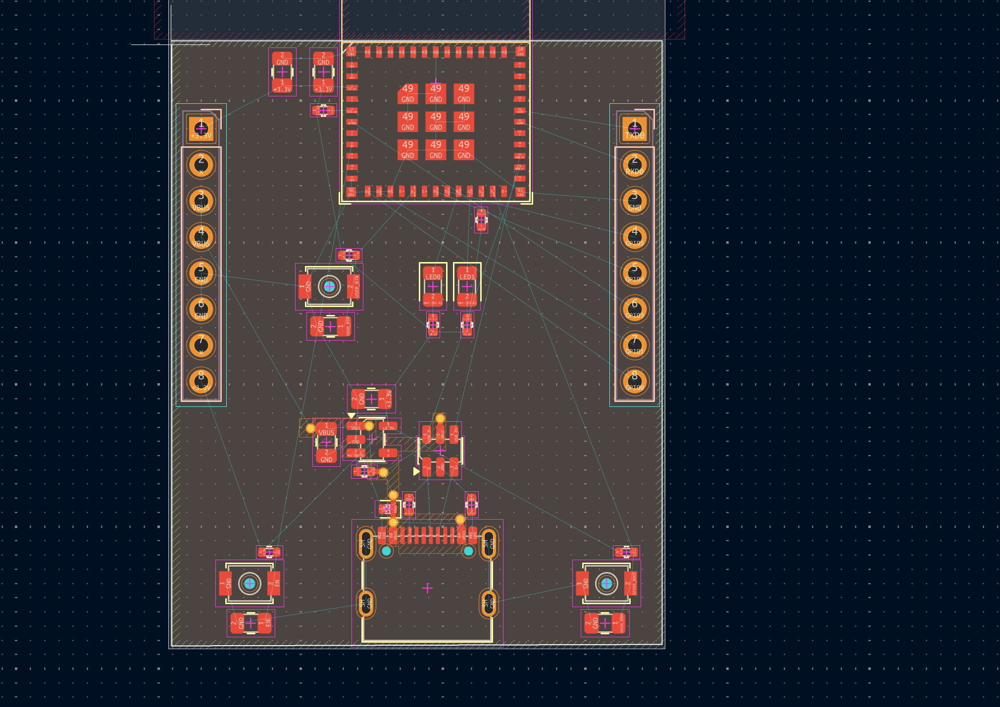

*The +3.3 V outline runs around the entire board just inside the edge,
straight across the VBUS rectangles.*

**What to look for.**

- **The outline ignores the VBUS rectangles completely.** It is drawn
  across them on purpose. Zone priority, set in the next step, decides
  which copper wins where they overlap.
- **It does not follow the board edge precisely**, because the fill
  always keeps the copper-to-edge clearance away from `Edge.Cuts`.
- **It does not avoid the antenna either.** The keepout rule area at the
  top removes copper there on every layer, whatever the zone outline
  says.

To edit a zone later, click its outline and press `E` for its
properties, or drag the square handles to move corners.

#### What if the two outlines overlap?

This is what **zone priority** is for. When two zones on the same layer
overlap, KiCad fills the **higher-priority** zone first. It then fills
the lower-priority zone everywhere *except* inside the higher-priority
zone's area plus clearance. The lower-priority copper is carved away
automatically.

So every `VBUS` zone must have **higher** priority than the large
`+3.3V` zone. You can then draw the `+3.3V` outline roughly across the
whole board, including over the VBUS area, and KiCad keeps `VBUS` intact
and clears the 3.3 V copper away from it. No pixel-perfect hand-drawing
required.

Priority only matters between zones on the **same layer** that
**overlap**. The GND plane on `In1.Cu` and the islands on `In2.Cu` never
interact, whatever their priorities are.

#### Setting the priority in KiCad 10: the Zone Manager

KiCad 10 no longer has a priority field in the zone properties dialog.
Priority is now simply the **order of the zones in the Zone Manager**:
the higher a zone is in the list, the higher its priority.

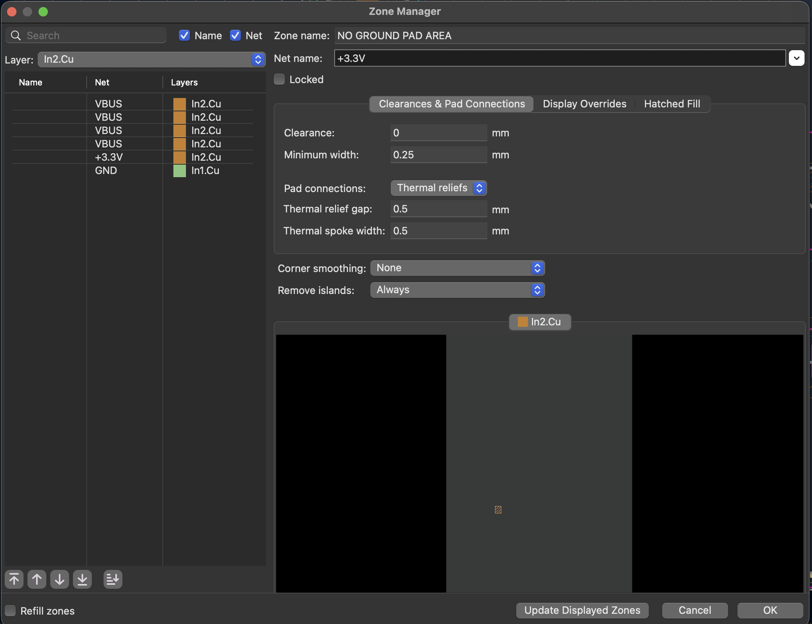

*The Zone Manager. Left: the list of zones, here filtered to `In2.Cu`.
Right: the properties of the selected zone, with a preview underneath.*

**What to look for.**

- **The order of the list is the priority.** The `VBUS` zones are at
  the top and the `+3.3V` zone below them, which is exactly the order we
  need. All four must stay above `+3.3V`: a single rectangle left below
  it would be flooded by 3.3 V copper. The GND zone on `In1.Cu` at the bottom does not matter here,
  because it lies on a different layer.
- **The buttons under the list move the selected zone**: ⤒ to the top,
  ↑ one place up, ↓ one place down, ⤓ to the bottom.
- **The *Layer* filter at the top** shows only the zones on one layer.
  Priority only matters within a layer, so this is the view to work in.
- **The right-hand side is the same set of properties** as the Copper
  Zone Properties dialog, so you can check nets, clearances and pad
  connections of all zones in one place without closing the manager.
- **The *Name* column is empty** because these zones were never named.
  On a small board that is still readable; on a board with twenty zones,
  names like `VBUS_1` and `3V3_plane` are what make the list
  usable.

The procedure:

1. Open **Tools → Zone Manager**. (The zone properties dialog also has a
   button that opens it.)
2. Set the *Layer* filter to `In2.Cu`.
3. Select each VBUS zone in turn and press ⤒, until all four are above
   `3V3_plane`.
4. Tick **Refill zones** and press **OK**, or press OK and then `B`.

Every zone in KiCad 10 has its own place in the list, even zones on
different layers or nets. You do not need to arrange them all. Only the
relative order of zones that overlap on the same layer has any effect.

> **KiCad 9 and earlier** had a numeric **Priority** field directly in
> the zone properties dialog (default 0). There you would simply give
> the VBUS zones priority 1 and leave `3V3_plane` at 0. If you open
> an older tutorial and cannot find the field, this is why.

#### The result

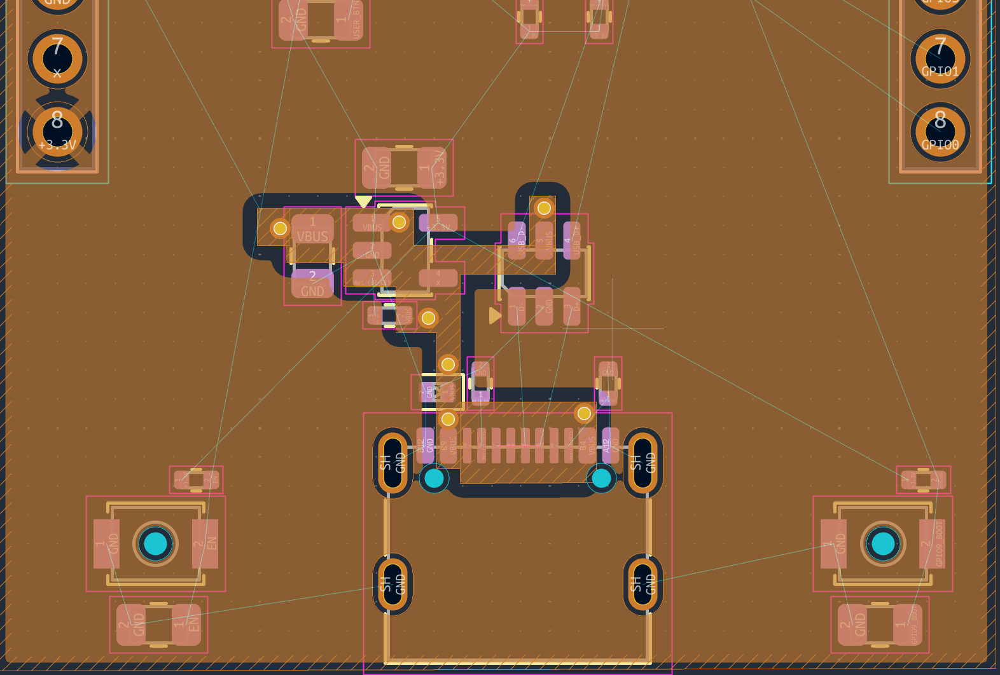

*`In2.Cu` after pressing `B`. Orange copper is the +3.3 V island; the
VBUS island sits in the middle of it, surrounded by a dark clearance
gap.*

**What to look for.**

- **The VBUS rectangles have filled as one island**, with one outline
  of clearance around it. Nowhere does it touch the +3.3 V copper.
- **The +3.3 V copper flows around the VBUS island** instead of across
  it. That is priority at work: the +3.3 V outline still runs over the
  VBUS area, but its fill gives way.
- **Dark rings around the through-hole pads** that belong to other nets
  (the USB-C shield slots, the button pegs, header pin J2-7) are
  antipads: the plane is cut back so it does not touch them.
- **Header pin J2-8 (+3.3 V) is joined by four thin spokes**, not by
  solid copper. These are the thermal reliefs set in the zone
  properties.

#### Common problems

- **The VBUS island disappears after filling.** An inner-layer zone
  connects only to what reaches it through vias. If nothing on the `VBUS`
  net has a via into `In2.Cu` yet, KiCad treats the whole fill as an
  unconnected island and removes it. Place the fanout vias first
  (section 4.4), then refill.
- **The +3.3 V copper floods over the VBUS area**, or over part of it.
  The order in the Zone Manager is the wrong way round. Move the VBUS
  zone above the +3.3 V zone and refill. If only part of the island is
  flooded, one of the VBUS rectangles is still below `+3.3V` in the
  list: move it up.
- **A piece of +3.3 V copper has vanished.** The VBUS island has closed
  it off on all sides, and island removal deleted it. Reshape the VBUS
  outline so the pocket opens to the rest of the +3.3 V zone.
- **A zone ended up on the wrong layer.** Check the *Layers* column in
  the Zone Manager. It is quicker than inspecting the board layer by
  layer.
- **Overlapping zones of the same net leave odd notches or DRC
  warnings.** Check that the rectangles genuinely overlap rather than
  just touching at an edge. If the notches persist, redraw the island as
  one polygon.
- **Something looks wrong but DRC is clean**, or the other way round.
  Press `B` first. An unrefilled zone shows the state before your last
  edit.

<a id="sec-4-4"></a>
### 4.4 Vias: connecting pins, layers and planes

A via is a plated hole joining copper on different layers. On our board
every via is a **through via**, drilled from `F.Cu` to `B.Cu`. It passes
through all four layers but **connects only to copper of its own net**.
On every other layer the copper is cut back around it, leaving an
antipad (section 4.2). A `+3.3V` via therefore joins the +3.3 V island
on `In2.Cu` and passes through the GND plane on `In1.Cu` without
touching it.

That one rule covers the four jobs vias do on this board:

| Job | From | To |
|---|---|---|
| power pin to its island | pad on `F.Cu` | `VBUS` or `+3.3V` zone on `In2.Cu` |
| ground pin to the plane | pad on `F.Cu` | GND zone on `In1.Cu` |
| signal changes layer | track on `F.Cu` | track on `B.Cu` |
| stitching | GND pours on `F.Cu` and `B.Cu` | GND plane on `In1.Cu` |

Through-hole pads need none of this. The header pins, the USB-C shield
slots and the button pegs are plated holes themselves, so they connect
to the zone of their net on every layer directly.

#### Before you start: via size

Via diameter and drill are set per net class in **File → Board Setup →
Design Rules → Net Classes**. Our board uses a 0.7 mm via with a 0.4 mm
drill, the same as the global minimum in section 5.1, which any
four-layer fabricator builds without a query. Smaller vias such as
0.6 mm / 0.3 mm are widely available too, but check them against your
manufacturer's standard capabilities first: smaller drills can cost extra.

#### Power pins to their island

Every pad on the `VBUS` or `+3.3V` net needs its own path down to
`In2.Cu`. On our board that means:

- **VBUS**: the connector's VBUS pads, the protection diode, the LDO
  input (pin 1), the input capacitor, the CE resistor and the USBLC6's
  pin 5 (the finished result is shown in section 4.3, image
  *VBUS-zones-finished*);
- **+3.3V**: the LDO output (pin 5), the output capacitor, the module's
  pin 3 and its decoupling capacitors, the LED resistors and every
  pull-up.

The procedure is the same for each pad:

1. Make `F.Cu` the active layer.
2. Hover over the pad and press `X` to start routing. The track takes
   the pad's net.
3. Move out 0.3–0.5 mm, away from neighbouring pads, and press `V`. A
   via now hangs on the end of the track.
4. Click to fix the via. The router continues on the other layer; press
   `Esc` to stop. The short stub and the via stay.
5. Press `B` to refill the zones. The ratsnest line from that pad to the
   zone disappears once the via lands in the filled island.

Use the router for these vias, not the free-via tool. A via created
while routing inherits the net of the pad you started from, so it cannot
end up on the wrong net.

**Use more than one via on the power path.** The LDO input and output,
and the connector's VBUS pads, should each get two vias rather than one.
Two vias in parallel have roughly half the inductance of one, provided
they are at least a couple of via diameters apart. Placed
shoulder-to-shoulder they share their magnetic field and the gain
shrinks. Given `u = L·di/dt` from section 2.9, halving *L* halves the
voltage that appears across that connection during a current burst,
such as a Wi-Fi transmission. The reason is inductance, not current: a
single via of this size carries far more current than this whole board draws.
It is the cheapest improvement available anywhere on a board: one extra
via, no extra components, no extra cost.

#### Ground pins to the plane

Exactly the same procedure, on the GND net: every GND pad on `F.Cu` gets
**its own via**, right beside the pad, down to `In1.Cu`. Return current
then has the shortest possible path home. Do not collect several GND
pads with traces into one shared via. Each trace adds loop area, which
is exactly what the plane exists to avoid.

The GND pour on `F.Cu` touches many of these pads directly, but that is
no substitute for the via. Traces and pads cut the top pour into narrow
fragments, so the via is the pad's real, short connection to ground.

Place vias **beside** small SMD pads, not inside them. An open via inside
a pad draws solder paste down the hole during reflow and leaves a weak
joint.

Two places deserve extra care:

- **Decoupling capacitors.** When the module needs a burst of current,
  it comes from the nearby capacitor, not from the regulator. That
  current flows in a loop: from the capacitor's `+3.3V` pad to the
  module's supply pin, through the module to its GND pin, and back to
  the capacitor's GND pad. The loop's inductance grows with the area it
  encloses. In order of importance:

  1. **Place the capacitor as close to the supply pin as possible.**
     This fixes most of the loop. Never move a capacitor away from the
     pin just to make room for a via.
  2. **Put its GND via as close to its GND pad as possible**, beside the
     pad rather than inside it.
  3. **If there is room, put that via on the side facing the module.**
     The return current in the plane then reaches it by the shortest
     route. If there is no room, the side of the pad is fine: the
     difference is about a millimetre of loop length.

  On our board there is an even better option. The module's pins 1 and
  2 are GND, right next to pin 3 (+3.3 V). Connect the capacitor's GND
  pad to pin 1 or 2 with a short, wide track on `F.Cu`. The whole loop
  then closes on the top layer within a few millimetres, without
  involving the plane at all. The capacitor still gets its own GND via
  down to `In1.Cu`, but the via's exact position no longer matters much.
- **The module's ground array** (the nine `49 GND` squares). Place vias
  in the gaps between the squares, several of them. This array is the
  module's main return path and its main route for heat.

#### A signal from `F.Cu` to `B.Cu`

When a track has to cross another one, it can dive to the bottom layer
and come back up:

1. Start the track on `F.Cu` with `X`, as usual.
2. At the point where you want to change layers, press `V` and click.
   Routing continues on the other layer of the active layer pair, which
   is `F.Cu`/`B.Cu` by default. To pick the target layer explicitly, use
   `<` instead of `V`.
3. Continue on `B.Cu` and click the destination pad to finish. To come
   back up, press `V` again.

A via placed this way belongs to the track: if the track's net ever
changes, the via changes with it.

**Mind the return path.** On `F.Cu` a signal's return current flows in
the GND plane on `In1.Cu`. On `B.Cu` it flows in the power islands on
`In2.Cu`. At the via, the return current has to hop from one plane to
the other, and the only path between them is through the nearest
decoupling capacitor. For slow signals (buttons, LEDs, GPIOs to the
headers) this does not matter, and they may change layers freely. The
USB pair should **not change layers at all**: route `D+` and `D−`
entirely on `F.Cu`, above the solid ground.

#### Stitching vias

Stitching vias are GND vias that belong to no pad. They tie the GND
copper on different layers together, here the pours on `F.Cu` and
`B.Cu` to the plane on `In1.Cu`.

They are needed because traces and pads chop the outer-layer pours into
fragments. A fragment connected to ground at one point only behaves like
a small antenna. A fragment connected nowhere is either removed by the
zone fill or left floating. Stitching turns all GND copper into one
low-impedance structure.

Where to put them:

- **Every pour fragment** on `F.Cu` or `B.Cu` gets at least two, one at
  each end. A through via reaches both outer layers, so one via often
  stitches a top and a bottom fragment at the same time.
- **Along the board edges** and **around the edge of the antenna
  keepout**. (Not inside it: no copper and no vias there.)
- **Near the USB connector** and around the module's ground.
- **Elsewhere**, a loose grid of roughly 5 mm is plenty for this board.

The usual rule of thumb is spacing below 1/20 of the wavelength of the
highest frequency present. For 2.4 GHz that is about 3 mm in FR4, which
is why the spacing gets denser near the antenna.

In KiCad 10:

1. Select **Add Free-Standing Via** in the right toolbar, or press
   `Ctrl`+`Shift`+`X`.
2. Click on the GND pour. A free via placed on a zone takes the zone's
   net and keeps it even if you move it later.
3. **Check the net.** On our board the GND plane and the +3.3 V island
   overlap almost everywhere, so select the via and confirm in the
   Properties panel that its net is `GND`. Change it there if it is not.
4. For many vias, copy a correct GND via (`Ctrl`+`C`, `Ctrl`+`V`), or
   select it and use **Create Array** (`Ctrl`+`T`) for a grid. Then delete
   the ones that land on other copper; DRC will point them out.
5. Press `B` and run DRC.

Every stitching via also perforates the +3.3 V island on `In2.Cu` with
an antipad. Keep them spaced rather than in tight rows, so that the
antipads do not merge into a slot (section 4.2).

#### When you are done

- Press `B`. There should be no ratsnest lines left on the `GND`,
  `VBUS` or `+3.3V` nets.
- Run DRC and check for *unconnected items* and *isolated copper*.
- Hide all layers except `In1.Cu` (`Ctrl`+`H` cycles the display modes)
  and look at the plane: it should be one piece, perforated by antipads
  but not sliced by them.

---

<a id="sec-5"></a>
## 5. Routing

<a id="sec-5-1"></a>
### 5.1 Net classes

Not all connections are equal. Power carries current and needs wider traces; USB is a differential pair with its own rules; ordinary GPIO is undemanding.

`Board Setup → Design Rules → Net Classes`

| Class | Nets | Track width | Clearance |
|---|---|---|---|
| **Default** | GPIO, buttons, LEDs | 0.25 mm | 0.2 mm |
| **POWER** | `VBUS`, `+3.3V`, `GND` | 0.4 mm | 0.2 mm |
| **USB** | `USB_D+`, `USB_D−` | 0.2 mm, pair gap 0.25 mm | 0.2 mm |

Global minimums, checked by DRC regardless of class: track 0.15 mm, via 0.7 mm with 0.4 mm drill, copper-to-board-edge 0.5 mm. These are chosen so that any four-layer fabricator, including the cheapest, can build the board without a query.

Think of net classes as *what I want by default*, and the Constraints tab as *the hard floor I never want to cross by accident.*

Once classes are configured, the router applies the correct width automatically. No manual switching, no forgotten thin power traces.

<a id="sec-5-2"></a>
### 5.2 Differential pair routing

USB does not travel on one wire but two: `D+` and `D−` carry the same information in opposite phase, and the receiver looks at the **difference** between them. Interference that strikes both traces equally cancels in the subtraction.

For that to work the traces must be:

- **equal in length** — otherwise the signals are no longer in phase;
- **routed in parallel** at a constant separation;
- **over uninterrupted ground** — no slots in `In1.Cu` beneath them;
- **free of unnecessary vias** — each via is a discontinuity.

In KiCad:

1. **Name the nets so KiCad recognises the pair.** KiCad auto-detects pairs from matching suffixes — `+`/`-` or `_P`/`_N`. Our `USB_D+` / `USB_D-` already qualify. Type the minus as a plain ASCII hyphen. This handbook prints it as a typographic minus (−) for readability, but KiCad matches the character literally, and a pasted `−` produces a net the pair router will not recognise.
2. **Set the pair's width and gap** in the net class.
3. **Route both traces together** with the differential pair router (hotkey `6`). KiCad draws both simultaneously, holding the gap and mitring corners symmetrically.
4. **Match lengths afterwards if needed** — `Route → Tune Differential Pair Skew` adds small meanders to equalise them.

> **A mitigating circumstance.** USB 2.0 Full Speed at 12 Mbit/s is relatively forgiving, and the path on our board is short. Respect the rules, but do not be paralysed by them — this is not USB 3.0 at 5 Gbit/s, and matching within a few millimetres is more than sufficient here.

<a id="sec-5-3"></a>
### 5.3 Routing order

1. **Fanout.** Give every power and ground pad its short stub and via down to its plane (section 4.4). On a board with planes, power and ground are not routed as traces from part to part; each pad simply drops a via into its plane, and that *is* the power routing. Do it first, because these vias must sit right beside their pads. Once signal traces have taken that space, there is no room left for them.
2. Traces from each decoupling capacitor to its supply pin — these should be the shortest on the whole board.
3. The USB differential pair, entirely on `F.Cu`.
4. Everything else.

<a id="sec-5-4"></a>
### 5.4 Pours and stitching vias

Covered in detail in sections 4.3 and 4.4: the GND pours on `F.Cu` and `B.Cu` fill the free area outside the antenna keepout, and **stitching vias** tie them to the plane on `In1.Cu`. Pour and stitch after routing, because every new trace on an outer layer changes where the pour's fragments lie.

<a id="sec-5-5"></a>
### 5.5 DRC

`Inspect → Design Rules Checker`

DRC checks physics: clearances, whether every schematic connection has actually been routed, whether anything crosses the board outline. Typical findings include traces closer than your clearance setting, drills below your minimum, unrouted ratsnest lines, and net mismatches inside zones — for example a via without a net assignment sitting inside a GND pour, which KiCad reports as a violation because it sees the via as foreign copper rather than part of the ground.

**Run DRC repeatedly while routing**, not once at the end. Catching a problem three traces after you made it is far easier than after the board is finished.

Routing is not done when it looks good. It is done when DRC reports **zero violations and zero unrouted connections**. A board with unresolved DRC errors should never be ordered.

If you find a violation you do not understand, click it — the tool takes you to the exact location. Every message means something specific.

---

<a id="sec-6"></a>
## 6. Manufacturing outputs

<a id="sec-6-1"></a>
### 6.1 What the fabricator receives

Not your KiCad project, but:

| Files | Contents |
|---|---|
| Gerber (`.gbr`) | each layer separately: copper, mask, silkscreen, outline |
| Drill (`.drl`) | position and diameter of every hole |
| BOM (`.csv`) | which components, and how many |
| CPL / Pick&Place (`.csv`) | position and rotation of every component |

Gerber is an old, textual and surprisingly simple format — essentially a list of *"move here, draw this"* commands. Open one in a text editor; it is worth seeing what you actually send.

<a id="sec-6-2"></a>
### 6.2 Export

`File → Fabrication Outputs → Gerbers`

Export `F.Cu`, `In1.Cu`, `In2.Cu`, `B.Cu`, `F.Mask`, `B.Mask`, `F.Silkscreen`, `B.Silkscreen`, `F.Paste`, `B.Paste`, `Edge.Cuts`. Then `Generate Drill Files`.

<a id="sec-6-3"></a>
### 6.3 Look at what you are sending

**Never send Gerbers you have not viewed.** Open them in a viewer — GerbView ships with KiCad — and check layer by layer:

- is the outline closed?
- is the ground plane genuinely continuous?
- does the silkscreen cover any solder pads?
- is there any copper under the antenna?
- are all the holes where they should be?

This is the equivalent of reading your code before committing it. It takes ten minutes and saves three weeks of waiting for the wrong board.

<a id="sec-6-4"></a>
### 6.4 The BOM

A BOM is not merely a list. For assembly, every line must identify **one and only one** component — hence the catalogue numbers alongside the values. "10 µF" says nothing about voltage rating, dielectric or package. A catalogue number says everything.

> **Check particularly** the components whose polarity or orientation is not obvious: LEDs, protection diodes, the regulator, the connector. A part fitted backwards is not the fabricator's mistake if that is how you submitted it.

<a id="sec-6-5"></a>
### 6.5 DFM: talking to the fabricator

Every fabricator has its own limits: minimum track width, minimum clearance, minimum via diameter, minimum annular ring. You need these numbers **before** routing, not after.

| Criterion | What to compare |
|---|---|
| price | the bare board, separately from assembly |
| lead time | days to weeks |
| DFM limits | whether your rules fit inside theirs |
| assembly | whether they stock the parts or you supply them |
| four-layer surcharge | with some vendors, substantially more than two-layer |

---

<a id="sec-7"></a>
## 7. Bringing the board up

<a id="sec-7-1"></a>
### 7.1 Before plugging in USB

A faulty board can damage the USB port on your computer.

1. **Visual inspection** — all components present, correctly oriented, no solder bridges. Look particularly at the USB-C connector and the module.
2. **Ohmmeter check** — resistance between `+3.3V` and `GND`, and between `VBUS` and `GND`. If either is close to zero, you have a short. **Do not plug it in.**
3. Only then, USB.

<a id="sec-7-2"></a>
### 7.2 Sequence

1. The board appears as a serial device: `/dev/ttyACM0` on Linux, `/dev/cu.usbmodem*` on macOS, a `COM` port on Windows.
2. Confirm the chip responds and is indeed an ESP32-C3.
3. Upload a program.
4. The LED blinks.

When it blinks, you have reached the goal: a program running on a RISC-V core, on a board you drew yourself.

> **A consequence worth remembering.** Because the board has no CP2102 or CH340 converter — the ESP32-C3's USB controller is built in and connected directly to GPIO18/19 — the port appears differently from most development boards. It is a USB CDC device: `/dev/ttyACM0` on Linux and `/dev/cu.usbmodem*` on macOS. A great many online tutorials specify `/dev/ttyUSB0` or `/dev/cu.usbserial*`; those are written for boards with a converter chip and will mislead you.

Instructions for installing the toolchain are provided separately.

<a id="sec-7-3"></a>
### 7.3 First program

```c
#define LED0        6    /* green  */
#define LED1        7    /* yellow */
#define USER_BTN   10

#define LED_ON(pin)   gpio_set_level((pin), 0)   /* active low! */
#define LED_OFF(pin)  gpio_set_level((pin), 1)
```

Sensible first exercises on your own board:

1. Alternate the two LEDs.
2. Read the button, with debouncing.
3. Connect anything at all to the headers. From here the board is yours.

---

<a id="appendix-a"></a>
## Appendix A: Common mistakes

| Mistake | Symptom | Prevention |
|---|---|---|
| missing 5.1 kΩ CC resistors | board completely dead, 0 V on VBUS | check it in the schematic |
| one decoupling capacitor per IC | random resets, instability | one capacitor per **supply pin** |
| copper under the antenna | very short Wi-Fi range | keepout on every layer |
| ground plane cut by a trace | interference, USB problems | no signal traces on `In1.Cu` |
| wrong USB-C footprint | connector does not fit | footprint for the exact part purchased |
| forgotten LED inversion | LED on when it should be off | `LED_ON` / `LED_OFF` macros |
| regulator capacitors chosen by feel | oscillation on the 3.3 V rail | values from the datasheet table |
| missing CE pull-up | regulator dead, 0 V out | CE must be held high |
| loaded strapping pin | board will not start | keep GPIO2/8/9 off the headers, as on this board |
| silkscreen over pads | poor solder joints at assembly | set `min_silk_clearance` and run DRC |

---

<a id="appendix-b"></a>
## Appendix B: How to select a capacitor

Beyond the nominal value, three parameters matter.

<a id="appendix-b-1"></a>
### B.1 Capacitance

Match the value called for by the datasheet or your calculation. Going *higher* is usually safe for bulk and decoupling capacitors; going *lower* than a specified value can break stability, as with the LDO in section 2.8.

<a id="appendix-b-2"></a>
### B.2 Voltage rating — and why to derate

Always choose a rated voltage **comfortably above** the actual working voltage; a good rule of thumb is **at least 2×**.

This matters because of an effect specific to ceramic capacitors called **DC bias derating**: their *effective* capacitance under real DC voltage is measurably lower than the nominal, zero-volt rating — and the closer the working voltage is to the rated voltage, the worse it gets.

A 10 µF part rated at 6.3 V, used on a 5 V rail, may deliver noticeably less than 10 µF in practice. The same nominal 10 µF rated at 16 V, on that same 5 V rail, stays much closer to its printed value. This is why our 5 V and 3.3 V rails specify **16 V** parts even though the circuit never exceeds 5 V.

<a id="appendix-b-3"></a>
### B.3 Dielectric class

| Dielectric | Stability | Typical use |
|---|---|---|
| **C0G / NP0** | extremely stable, ~0 ppm/°C | precision analogue, timing, RF |
| **X7R** | good, ±15% over −55 to +125 °C | **recommended default** |
| **X5R** | good, ±15% over −55 to +85 °C | very common, narrower range |
| **Y5V / Z5U** | poor, −80% / +22% swing | avoid where capacitance matters |

Every capacitor on this board is X5R or X7R. Avoid Y5V and Z5U even though they are often the cheapest option; the swing under temperature and bias can be severe enough to undermine exactly the stability the capacitor is there to provide.

<a id="appendix-b-4"></a>
### B.4 Checklist before adding a part to the BOM

1. Capacitance meets or exceeds the requirement
2. Voltage rating ≥ 2× the working voltage
3. Dielectric is X5R or X7R
4. Package matches the intended assembly method

---

<a id="appendix-c"></a>
## Appendix C: Bill of materials

Part data checked against LCSC/JLCPCB in September 2026. Stock changes
weekly: always check availability before ordering.

| Ref(s) | Qty | Value / Part | Package | LCSC | Purpose | Key specifications | A substitute must have |
|---|---|---|---|---|---|---|---|
| U3 | 1 | ESP32-C3-MINI-1-N4 | module 13.2 × 16.6 mm | C2838502 | RISC-V Wi-Fi/BLE module, 4 MB flash | 3.0–3.6 V supply, up to 350 mA during Wi-Fi TX, PCB antenna, −40…85 °C | Same footprint: only the ESP32-C3-MINI-1 family (e.g. the 105 °C variant ESP32-C3-MINI-1-H4). Any other module needs a new footprint. |
| U2 | 1 | XC6220B331MR (TDSEMIC) ⚠ | SOT-23-5 (SOT-25) | C22466451 | 3.3 V, 1 A LDO | 3.3 V out, 1 A, V<sub>IN</sub> 1.6–6 V, dropout 655 mV at 1 A, CE enable pin, over-current and thermal protection | Same pinout (1 VIN, 2 GND, 3 CE, 4 NC, 5 VOUT), 3.3 V, ≥ 500 mA, V<sub>IN</sub> max ≥ 6 V, stable with ceramic capacitors. Re-check C1 and C2 against its datasheet. |
| U1 | 1 | USBLC6-2SC6 | SOT-23-6 | C7519 | USB data-line ESD protection | 2 lines, V<sub>RWM</sub> 5.25 V, V<sub>BR</sub> 6 V, clamp 17 V, 3.5 pF per line, IEC 61000-4-2 | Same pinout (I/O on 1/3/4/6, GND 2, VBUS 5), line capacitance ≤ 5 pF for USB Full Speed. |
| D1 | 1 | PESD5V0L1ULD,315 ⚠ | DFN1006D-2 (SOD-882D) | C552557 | VBUS ESD protection | Unidirectional, 5 V working voltage, 12 V clamp, 3.5 A (8/20 µs) | Unidirectional, V<sub>RWM</sub> 5–5.5 V (lower leaks on VBUS), same 1006 footprint, cathode on VBUS. Low capacitance is not needed on VBUS. |
| J1 | 1 | GT-USB-7010ASV | USB-C 16P, SMD | C2988369 | USB-C power and data | USB 2.0 receptacle, 16 pins, right angle, 3 A, 24 V, 10 000 cycles, shell pegs through-hole | Not a drop-in part: any other 16-pin receptacle needs its own footprint. Compare pad and peg positions. |
| J2, J3 | 2 | Conn_01x08 | 2.54 mm THT | — | GPIO / UART breakout (DNP) | 1 × 8 pin header, 2.54 mm pitch | Any 2.54 mm header: straight, angled or female. |
| BOOT1, RESET1, USER1 | 3 | B3U-1000P-B | SMD 3.0 × 2.5 mm | C231330 | boot / reset / user switches | SPST-NO, 12 V / 50 mA, 1.6 mm high, 153 gf actuation | Same footprint, including the locating boss of the "-B" variant. |
| D2 | 1 | KT-0805G, green | 0805 | C2297 | `LED0`, GPIO6 | Emerald green, 525 nm, V<sub>F</sub> 2.6–3.1 V | Any 0805 LED. A lower V<sub>F</sub> gives more current through R9: recompute R = (3.3 V − V<sub>F</sub>) / I. |
| D3 | 1 | KT-0805Y, yellow | 0805 | C2296 | `LED1`, GPIO7 | Yellow, ≈ 590 nm, V<sub>F</sub> 1.8–2.4 V | Any 0805 LED; same resistor rule as D2. |
| C1 | 1 | 10 µF | 0805 | C15850 | LDO input capacitor (C<sub>IN</sub>) | Samsung CL21A106KAYNNNE: 25 V, X5R, ±10 % | ≥ 10 µF, X5R or X7R, **≥ 16 V** (it sits on 5 V, and DC bias reduces the real capacitance). |
| C2 | 1 | 4.7 µF | 0805 | C597439 ⚠ | LDO output capacitor (C<sub>L</sub>) | not verified, see notes | 4.7 µF, X5R or X7R, ≥ 10 V, value per the regulator's datasheet table. |
| C7 | 1 | 10 µF | 0805 | C15850 | module bulk capacitance | as C1 | ≥ 10 µF, X5R or X7R, ≥ 10 V. |
| C6 | 1 | 100 nF | 0805 | C49678 ⚠ | module decoupling | Yageo CC0805KRX7R9BB104: 50 V, X7R, ±10 % | 100 nF, X7R (or X5R), ≥ 10 V. |
| C3, C4, C5 | 3 | 100 nF | 0805 | C49678 ⚠ | RC debounce for RESET, BOOT, USER | as C6 | 100 nF, X7R or X5R, ≥ 10 V. |
| R1, R2 | 2 | 5.1 kΩ | 0402 | C25905 ⚠ | USB-C CC1/CC2 sink resistors | UNI-ROYAL 0402WGF5101TCE: ±1 %, 62.5 mW, thick film | 5.1 kΩ, ±1 % or ±5 %, 0402. |
| R3 | 1 | 4.7 kΩ | 0402 | C105871 | LDO `CE` pull-up | Yageo RC0402FR-074K7L: ±1 %, 62.5 mW, 50 V | Any 0402 resistor of this value, ±1 % or ±5 %. |
| R4 | 1 | 10 kΩ | 0402 | C60490 | `EN` pull-up | Yageo RC0402FR-0710KL: ±1 %, 62.5 mW, 50 V | as R3 |
| R5, R6, R7 | 3 | 10 kΩ | 0402 | C60490 | strapping pull-ups: GPIO9, GPIO2, GPIO8 | as R4 | as R3 |
| R8 | 1 | 10 kΩ | 0402 | C60490 | `USER_BTN` pull-up | as R4 | as R3 |
| R9, R10 | 2 | 330 Ω | 0402 | C105875 | LED series resistors | Yageo RC0402FR-07330RL: ±1 %, 62.5 mW | as R3; adjust the value if you change the LEDs. |

**Notes on the entries marked ⚠**

- **C3–C6: LCSC code corrected.** The earlier code C380332 is a
  **10 µF**, 16 V, X5R capacitor, not 100 nF. Fitted by an assembler, it
  would have made the RC debounce and EN delay a hundred times slower and
  replaced the module's 100 nF decoupling capacitor with a second bulk
  capacitor. C49678 is a 100 nF, 50 V, X7R part in 0805. Correct the LCSC
  field in the KiCad symbols too, or the exported BOM will still carry the
  old code.
- **R1, R2: LCSC code corrected.** The earlier code C2907044 is a 5.1 kΩ
  resistor in **0603**, while the footprint is 0402. C25905 is the same
  value in 0402.
- **U2** is a TDSEMIC part carrying the Torex name XC6220B331MR. The
  capacitor requirements in section 2.7 come from the **Torex** datasheet
  (XC6220B331MR-G, LCSC C86534). If you use the TDSEMIC version, check
  its own datasheet for the input and output capacitor requirements.
- **D1** was out of stock at LCSC when this BOM was checked. Use the
  substitute rule in the table.
- **C2 (C597439)** could not be verified against LCSC. Check the part
  page before ordering and make sure it is a 4.7 µF X5R or X7R ceramic
  capacitor in 0805, rated at least 10 V.

**General rules for substitutes**

- **The footprint decides first.** A substitute must fit the same
  footprint: 0402 is not 0603, and SOT-23-5 regulators with a different
  pin order do not work even though they fit.
- **Ceramic capacitors: X5R or X7R, never Y5V or Z5U.** Y5V and Z5U lose
  most of their capacitance with temperature and DC voltage.
- **Voltage rating: at least twice the working voltage** for capacitors
  of a few µF. A 10 µF capacitor rated 6.3 V on a 5 V rail may deliver
  only a fraction of its nominal value, because of DC bias.
- **Resistors are the easiest**: any thick-film resistor of the same
  value and size, ±1 % or ±5 %, rated at least 1/16 W.
- **Check the manufacturer's datasheet**, not only the distributor's
  summary line. Clones and second sources sometimes share a part number
  but not every specification.

---

<a id="appendix-d"></a>
## Appendix D: Where to go next

- **I²C sensors** — `GPIO4` and `GPIO5` are on the header. I²C is open-collector: devices can only pull the line low, so the bus needs pull-up resistors, typically 4.7 kΩ. A digital temperature or pressure sensor is the natural next step.
- **CAN bus** — the ESP32-C3 has a TWAI controller, compatible with CAN 2.0. With an external transceiver the board can talk to automotive and industrial equipment.
- **Current measurement** — a sense resistor and some measurement, to see what transmitting over Wi-Fi actually costs.
- **Your own revision of this board** — you learn most from the second one. Add whatever you found missing.

---

<a id="appendix-e"></a>
## Appendix E: Reference material

| Document | Source |
|---|---|
| ESP32-C3-MINI-1 & MINI-1U Datasheet v2.2 | Espressif — pinout, boot configuration, land pattern |
| ESP32-C3 Technical Reference Manual | Espressif |
| ESP Hardware Design Guidelines — PCB Layout | Espressif — stackup and power-plane principles |
| XC6220 series datasheet | Torex — the C<sub>IN</sub>/C<sub>L</sub> compensation table |
| USBLC6-2SC6 datasheet | STMicroelectronics |
| PESD5V0L1ULD datasheet | Nexperia |
| KiCad documentation | docs.kicad.org |


---

### KiCad PCB Design Workshop ###
### Faculty of Computer and Information Science, University of Ljubljana ###
### Pa3cio ###
